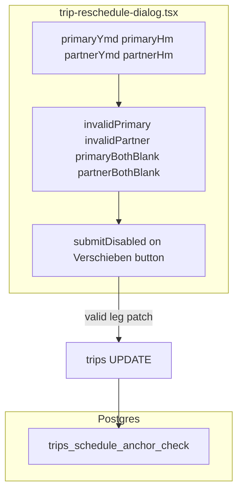

# v4d Phase 2: Reschedule Guard + CHECK Constraint

## Prerequisites

- Phase 1 complete: anchorless count = 0 ([`20260624120000_repair_anchorless_return_legs.sql`](supabase/migrations/20260624120000_repair_anchorless_return_legs.sql))
- Audit gap: [`docs/plans/v4d-requested-date-audit.md`](docs/plans/v4d-requested-date-audit.md) Q9 — both-blank submit yields `{ scheduled_at: null, requested_date: null }` via `buildLeg` L67–70 → `legToPatch` L78

## Scope (4 files only)

| File | Change |
|------|--------|
| [`trip-reschedule-dialog.tsx`](src/features/trips/trip-reschedule/components/trip-reschedule-dialog.tsx) | Both-blank submit guard + inline errors |
| `supabase/migrations/[timestamp]_trips_schedule_anchor_check.sql` | CHECK constraint |
| [`docs/plans/v4d-implementation.md`](docs/plans/v4d-implementation.md) | Append Phase 2 |
| [`docs/plans/v4d-requested-date-audit.md`](docs/plans/v4d-requested-date-audit.md) | Append Phase 2 Resolution |

**Out of scope:** `buildLeg`, `legToPatch`, [`reschedule.actions.ts`](src/features/trips/trip-reschedule/api/reschedule.actions.ts), Phase 1 files, cron, widgets, Fahrten table, invalidation.



---

## Current state (from file read)

**Validation today** ([`trip-reschedule-dialog.tsx`](src/features/trips/trip-reschedule/components/trip-reschedule-dialog.tsx) L313–324):

```typescript
const invalidPrimary = Boolean(primaryHmTrim) && !primaryYmdTrim;
const invalidPartner = Boolean(paired) && Boolean(partnerHmTrim) && !partnerYmdTrim;
const submitDisabled = Boolean(
  saving || !eligible || recurring || invalidPrimary || invalidPartner
);
```

- **Timed:** `hm` set → `buildLeg` requires `ymd` → blocked by `invalidPrimary` / `invalidPartner`
- **Timeless:** `ymd` set, `hm` empty → valid (`requestedDate = ymd`)
- **Both blank:** NOT blocked — `buildLeg` returns both null (L67–70)

**Error display gap:** `invalidPrimary` / `invalidPartner` only disable the button — **no inline error is rendered today**. New both-blank errors should use the trips form pattern: `<p className='text-destructive text-xs'>` (see [`schedule-section.tsx`](src/features/trips/components/create-trip/sections/schedule-section.tsx) L103).

**Copy conflict:** Help text L402–406 says *"Ohne Datum und ohne Zeit ist die Fahrt vollständig offen."* — contradicts Option A. Update this line in Step 1 to state that at least a date is required (keep timeless-with-date explanation).

**Do not change:** [`reschedule.actions.ts`](src/features/trips/trip-reschedule/api/reschedule.actions.ts) `rowFromLeg` L28–42 — guard stays UI-only per spec.

---

## Step 1 — Reschedule empty-submit guard

**File:** [`trip-reschedule-dialog.tsx`](src/features/trips/trip-reschedule/components/trip-reschedule-dialog.tsx)

**Add derived flags** (after L320, before `submitDisabled`):

```typescript
// WHY: buildLeg returns { scheduledAt: null, requestedDate: null } when both
// ymd and hm are blank — violates schedule anchor invariant (v4d audit Q9).
// Option A: block submit; user must provide at least a date.
const primaryBothBlank = !primaryYmdTrim && !primaryHmTrim;
const partnerBothBlank =
  Boolean(paired) && !partnerYmdTrim && !partnerHmTrim;
```

**Extend `submitDisabled`:**

```typescript
const submitDisabled = Boolean(
  saving ||
    !eligible ||
    recurring ||
    invalidPrimary ||
    invalidPartner ||
    primaryBothBlank ||
    partnerBothBlank
);
```

**Inline errors** (German: `"Bitte mindestens ein Datum angeben."`):

- After primary date/time row (~L401): show when `primaryBothBlank`
- After partner date/time row (~L458): show when `partnerBothBlank` only — `partnerBothBlank` already includes `Boolean(paired)`, so `&& paired` in the render condition is redundant noise.
- Pattern: `<p className='text-destructive text-xs' role='alert'>…</p>`

Optional consistency (same message, same styling): show for `invalidPrimary` / `invalidPartner` under respective legs — spec only requires both-blank copy; at minimum implement both-blank messages.

**Help text update** (L402–406): Remove/replace the "vollständig offen" both-blank sentence; clarify date-only (Zeitabsprache) remains valid.

**Invariants preserved:**

| Input shape | Submit | Patch |
|-------------|--------|-------|
| Date + time | Enabled | `scheduled_at` set |
| Date only | Enabled | `requested_date` set |
| Time only | Disabled | (unchanged) |
| Both blank | **Disabled** | No save |

**Build gate:** `bun run build`

---

## Step 2 — CHECK constraint migration

**Create:** `supabase/migrations/20260624140000_trips_schedule_anchor_check.sql` (use current UTC timestamp at implementation)

**File contents** (preview + constraint + verify comments in-file):

```sql
-- Pre-apply verify: must return 0 before constraint lands.
-- SELECT COUNT(*) FROM trips
-- WHERE scheduled_at IS NULL AND requested_date IS NULL;
-- Expected: 0

-- WHY: Enforces schedule anchor invariant at DB level. Both-null rows repaired
-- in 20260624120000_repair_anchorless_return_legs.sql. Write paths hardened v4d P1+P2.

ALTER TABLE trips
  ADD CONSTRAINT trips_schedule_anchor_check
  CHECK (scheduled_at IS NOT NULL OR requested_date IS NOT NULL);

-- Post-apply verify:
-- SELECT conname FROM pg_constraint
-- WHERE conrelid = 'trips'::regclass AND contype = 'c'
--   AND conname = 'trips_schedule_anchor_check';
-- Expected: 1 row
```

**Before apply:** Run pre-apply SELECT via Supabase SQL — **must return 0**. If &gt; 0, STOP and report (missed write path).

**Apply:** `supabase db push` or MCP `apply_migration`.

**Note:** `requested_date` is native **DATE** in Postgres (confirmed Phase 1 repair); constraint works on NULL semantics only.

**Build gate:** `bun run build`

---

## Step 3 — Docs (mandatory)

**a)** WHY comments on `primaryBothBlank`, `partnerBothBlank`, extended `submitDisabled`, migration header.

**b)** Append to [`docs/plans/v4d-implementation.md`](docs/plans/v4d-implementation.md):

- `## v4d Phase 2: Reschedule Guard + CHECK Constraint`
- Gap 3 root cause + fix (both-blank guard, inline error copy)
- CHECK migration name + pre-apply verify
- `### v4d fully closed`

**c)** Append to [`docs/plans/v4d-requested-date-audit.md`](docs/plans/v4d-requested-date-audit.md):

```markdown
## v4d Phase 2 Resolution
Date: 2026-06-24
Status: FULLY CLOSED
Gap 3 (reschedule both-blank): FIXED
CHECK constraint: APPLIED
v4d complete.
```

Update Phase 1 section "What is not fixed (Phase 2)" → mark items done or remove stale deferral list.

**Final build gate:** `bun run build`

---

## Hard rules checklist

- UI guard only — no changes to `buildLeg`, `legToPatch`, `reschedule.actions.ts`
- Pre-apply anchorless count = 0 before CHECK
- Four files only
- No Phase 1 file edits
- Build gate between steps

---

## Manual test plan

1. Primary both blank → submit disabled + error visible
2. Partner both blank (when paired) → same
3. Date only, no time → submit enabled; save sets `requested_date`
4. Date + time → submit enabled; save sets `scheduled_at`
5. Time without date → submit disabled (`invalidPrimary` unchanged)
6. Direct `INSERT … NULL, NULL` → constraint violation
7. Pre-populated existing trips → display + valid saves unchanged

---

## Deferred

None — v4d fully closed after this ships. Next: v5a (separate plan).
