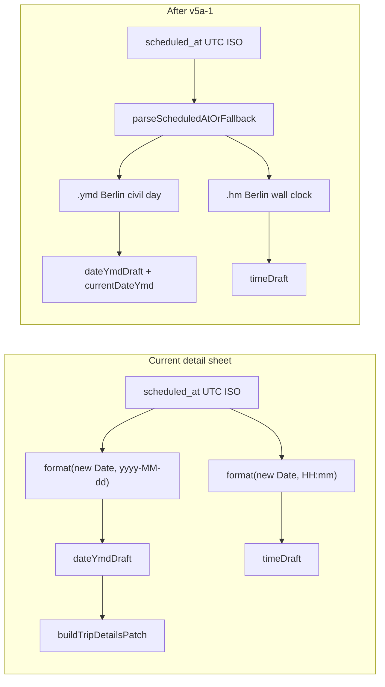

# v5a-1: TZ Display Consistency Fix

Audit reference: [docs/plans/v5-tz-audit.md](docs/plans/v5-tz-audit.md) (§ v5a-1 Pre-Plan Findings)

## Problem (verified in code)



| Gap | File | Lines | Risk |
|-----|------|-------|------|
| Date draft init | [trip-detail-sheet.tsx](src/features/trips/trip-detail-sheet/trip-detail-sheet.tsx) | 536–537 | **Write-back** — wrong Berlin day near midnight UTC |
| Dirty baseline | same | 934–936 | Must match init or `detailsDirty` fires on open (L979) |
| Time draft init | same | 471, 481 | Runtime-local hm; split-brain vs `applyTimeToScheduledDate` (Berlin, L987) |
| Driver trip time | [driver-trip-card.tsx](src/features/driver-portal/components/shared/driver-trip-card.tsx) | 63–68, 223 | Display-only; device TZ risk |
| Shift times | [shift-history-row.tsx](src/features/driver-portal/components/shift-history-row.tsx) | 33–38 | Display-only; `formatDate` (L25–30) **deferred to v5a-2** |

**Canonical helper** ([trip-time.ts](src/features/trips/lib/trip-time.ts) L189–197): `parseScheduledAtOrFallback(iso)` → `{ ymd: string; hm: string } | null` via `getTripsBusinessTimeZone()`.

**Out of scope (do not touch):** [build-trip-details-patch.ts](src/features/trips/trip-detail-sheet/lib/build-trip-details-patch.ts), reschedule dialog, Fahrten columns, kanban/mobile/widgets, `formatDate` in shift-history-row.

---

## Step 1 — Detail sheet ([trip-detail-sheet.tsx](src/features/trips/trip-detail-sheet/trip-detail-sheet.tsx))

### Part A — Import (L32)

Extend existing import (single line, no duplicate):

```typescript
import { TripTimeError, parseScheduledAtOrFallback } from '@/features/trips/lib/trip-time';
```

### Part B — Date draft init (L536–542)

Replace **only** the `scheduled_at` branch:

```typescript
setDateYmdDraft(parseScheduledAtOrFallback(trip.scheduled_at)?.ymd ?? '');
```

Keep `requested_date` / `''` branches unchanged. Add WHY comment per spec.

### Part C — `currentDateYmd` (L934–936)

```typescript
const currentDateYmd = trip?.scheduled_at
  ? (parseScheduledAtOrFallback(trip.scheduled_at)?.ymd ?? '')
  : (trip?.requested_date ?? '');
```

Add WHY comment. **Must match Part B derivation.**

### Part D — Time draft (L471, L481)

Replace both `format(new Date(trip.scheduled_at), 'HH:mm')` with:

```typescript
parseScheduledAtOrFallback(trip.scheduled_at)?.hm ?? ''
```

Add WHY comment on each branch.

### Verify (no edits)

- L979: `dateYmdDraft !== currentDateYmd` — unchanged
- L1041–1042: `dateYmdDraft` / `currentDateYmd` still passed to `buildTripDetailsPatch` — unchanged
- DatePicker binding (L1181–1182) — unchanged
- L547–554 effect deps — **unchanged intentionally** (see Deferred below)

**Critical:** Parts B + C + D land in **one commit**.

**Build gate:** `bun run build`

---

## Step 2 — Driver portal

### File A — [driver-trip-card.tsx](src/features/driver-portal/components/shared/driver-trip-card.tsx)

Add import:

```typescript
import { parseScheduledAtOrFallback } from '@/features/trips/lib/trip-time';
```

Replace `formatTime` (L63–68):

```typescript
function formatTime(isoString: string | null): string {
  return parseScheduledAtOrFallback(isoString)?.hm ?? '--:--';
}
```

Call site L223 (`formatTime(trip.scheduled_at)`) — no change.

### File B — [shift-history-row.tsx](src/features/driver-portal/components/shift-history-row.tsx)

Add same import. Replace `formatTime` (L33–38):

```typescript
function formatTime(iso: string): string {
  return parseScheduledAtOrFallback(iso)?.hm ?? '--:--';
}
```

**Leave `formatDate` (L25–30) unchanged** — v5a-2.

**Build gate:** `bun run build`

---

## Step 3 — Docs (mandatory)

### a) WHY comments

Confirm at all five edit sites (Parts B, C, D ×2, driver formatTime ×2).

### b) Create [docs/plans/v5a-implementation.md](docs/plans/v5a-implementation.md)

- `## v5a-1: TZ Display Consistency Fix` (2026-06-25)
- Gap 1: detail sheet ymd (L537, L935) + hm (L471, L481) — DONE
- Gap 2: driver portal `formatTime` — DONE
- Deferred to v5a-2: `formatDate`, kanban, mobile, widgets, print, linked-partner-callout, detail sheet date-init effect deps (L547–554)

### c) Append to [docs/plans/v5-tz-audit.md](docs/plans/v5-tz-audit.md)

```markdown
## v5a-1 Resolution
Date: 2026-06-25
Status: CLOSED
Gap 1 (detail sheet date + time draft): FIXED
Gap 2 (driver portal formatTime): FIXED
v5a-2 (remaining legacy surfaces): DEFERRED
```

**Final build gate:** `bun run build`

---

## Files changed (exactly 5)

| File | Change |
|------|--------|
| [trip-detail-sheet.tsx](src/features/trips/trip-detail-sheet/trip-detail-sheet.tsx) | Gap 1 |
| [driver-trip-card.tsx](src/features/driver-portal/components/shared/driver-trip-card.tsx) | Gap 2 |
| [shift-history-row.tsx](src/features/driver-portal/components/shift-history-row.tsx) | Gap 2 |
| [v5a-implementation.md](docs/plans/v5a-implementation.md) | New |
| [v5-tz-audit.md](docs/plans/v5-tz-audit.md) | Resolution append |

---

## Manual test checklist

1. **Daytime trip** — sheet date/time match Fahrten Datum/Zeit; open → not dirty
2. **Midnight edge** — trip with `scheduled_at` 22:00–00:00 UTC; sheet date = Berlin civil day, matches Fahrten column
3. **Date-only** — `requested_date` only; draft unchanged
4. **Time-only save** — change hm only; DB `scheduled_at` correct (regression on existing patch logic)
5. **Driver card** — time matches sheet
6. **Shift history** — start/end/break times Berlin-correct
7. **Fahrten table** — unchanged regression check

---

## Hard rules

1. Only the 5 files above
2. B + C + D atomic (one commit)
3. No changes to `buildTripDetailsPatch`, DatePicker, save path, or effect deps (L547–554 — deferred; see below)
4. Use `parseScheduledAtOrFallback` only — no custom TZ math
5. Build gate after each step

---

## Deferred (v5a-2 and follow-ups)

**Detail sheet useEffect dep array (L547–554):** `trip.scheduled_at` / `trip.requested_date` not listed. Stale draft possible after schedule update on same `trip.id`. Deferred — behaviour change requires dedicated test. Track in v5a-2 or separate ticket.

Also deferred to v5a-2 (display-only / consistency pass):

- `formatDate` in [shift-history-row.tsx](src/features/driver-portal/components/shift-history-row.tsx) (L25–30)
- [linked-partner-callout.tsx](src/features/trips/trip-detail-sheet/components/linked-partner-callout.tsx)
- Kanban, mobile list, widgets, print, share-utils, overview trip-row, passenger-search-overlay
