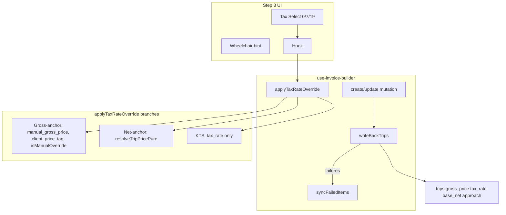

# Wheelchair Tax Rate — Step 3 Override + Write-Back

## Context (verified in codebase)

| Area | Current state |
|------|----------------|
| [`tax-calculator.ts`](src/features/invoices/lib/tax-calculator.ts) | `TAX_RATES` = 7% / 19% only; `resolveTaxRate` distance-based |
| [`BuilderLineItem`](src/features/invoices/types/invoice.types.ts) | No `is_wheelchair`, no `isManualTaxRateOverride` |
| [`fetchTripsForBuilder`](src/features/invoices/api/invoice-line-items.api.ts) | Does not select `is_wheelchair` |
| [`step-3-line-items.tsx`](src/features/invoices/components/invoice-builder/step-3-line-items.tsx) | `tax_rate` read-only in expanded panel; `grid-cols-[auto_1fr_auto_auto]` |
| [`use-invoice-builder.ts`](src/features/invoices/hooks/use-invoice-builder.ts) L851–869 / L963–981 | Fire-and-forget write-back; all `trip_id` rows; `gross_price` = `manualGrossTotal ?? price_resolution.gross` (transport-only for net-anchor + Anfahrt) |
| [`calculateInvoiceTotals`](src/features/invoices/api/invoice-line-items.api.ts) | Already buckets by `item.tax_rate` — 0% lines need no engine change, only tests + `TAX_RATES.ZERO` |
| [`index.tsx`](src/features/invoices/components/invoice-builder/index.tsx) | Step 3 props wired L665–687; no sync dialog yet |

**User choice:** Edit-mode wheelchair icon uses **batch-fetch** `trips.is_wheelchair` (not default `false`).

**Audit addendum (not in user Step 4 text, required for correctness):** Gross-anchor tax repricing must also cover **`item.isManualOverride`** (combined brutto via `manualGrossTotal` / `applyGrossOverrideToResolution`), per [`reprice-gross-anchor-audit.md`](docs/plans/reprice-gross-anchor-audit.md).

### Plan revisions (user flags)

| Flag | Resolution |
|------|------------|
| **Retry must use invoiced values** | At write-back failure time, snapshot `buildTripWriteBackPatch(item)` into `FailedSyncItem.patch`. `retrySyncFailedItems` calls `updateTrip(trip_id, patch)` — never recomputes from live `lineItems`. |
| **Storno write-back** | **Verified — no action.** [`storno.ts`](src/features/invoices/lib/storno.ts) copies `tax_rate` onto negated line items and persists via `create_storno_invoice` RPC only; no `updateTrip` / trip write-back. 0% wheelchair invoices storno correctly. Opted-out filter N/A. |
| **Visual smoke (Step 7)** | Repo has **no Storybook or Playwright** today. Add Step 7b: minimal Storybook + stories for collapsed-row fixtures; fallback manual QA checklist in test plan if init is deferred. |

---

## Architecture



---

## Implementation sequence (build gate after each step)

### Step 1 — `TAX_RATES.ZERO`

**File:** [`src/features/invoices/lib/tax-calculator.ts`](src/features/invoices/lib/tax-calculator.ts)

- Add `ZERO: 0` with JSDoc (§4 Nr. 17b UStG; dispatcher override only; never auto-assigned).
- **Do not** change `resolveTaxRate`.
- Gate: `bun run build`.

---

### Step 2 — Types

**File:** [`src/features/invoices/types/invoice.types.ts`](src/features/invoices/types/invoice.types.ts)

- `TripForInvoice.is_wheelchair: boolean`
- `BuilderLineItem.is_wheelchair` (required) + `isManualTaxRateOverride?` (JSDoc per spec)
- `TripWriteBackPatch` — exact payload shape passed to `tripsService.updateTrip` (same fields as today’s write-back: `gross_price`, `tax_rate`, `base_net_price`, `approach_fee_net`, optional `manual_gross_price`, `manual_distance_km`; never `net_price` or pricing-relevant fields).
- `FailedSyncItem` — display fields for the dialog **plus** immutable snapshot:

```typescript
export interface FailedSyncItem {
  trip_id: string;
  position: number;
  client_name: string | null;
  line_date: string | null;
  gross_price: number | null;  // display only (from patch.gross_price)
  tax_rate: number;            // display only (from patch.tax_rate)
  /** why: captured at invoice save time — retry must not re-read builder state */
  patch: TripWriteBackPatch;
}
```

Gate: types file valid; TS errors at construction sites expected until Step 3.

---

### Step 3 — Fetch + mapper + edit hydration

**3a — Create flow:** [`invoice-line-items.api.ts`](src/features/invoices/api/invoice-line-items.api.ts)

- Add `is_wheelchair` to `fetchTripsForBuilder` select.
- `buildLineItemsFromTrips`: `is_wheelchair: trip.is_wheelchair ?? false` + snapshot “why” comment.
- Confirm `lineItemToInsertRow` omits `is_wheelchair`.

**3b — Edit flow (batch-fetch):** [`use-invoice-builder.ts`](src/features/invoices/hooks/use-invoice-builder.ts)

Add small API helper (e.g. `fetchTripWheelchairFlags(tripIds: string[])` in `invoice-line-items.api.ts` or trips service): `select id, is_wheelchair from trips where id in (...)`.

Mirror the **edit rules** pattern (L210–213): hydration `useEffect` waits until wheelchair flags resolve, then seeds once:

```typescript
is_wheelchair: flagsByTripId[row.trip_id] ?? false
```

Extend [`map-line-item-row-to-builder-line-item.ts`](src/features/invoices/utils/map-line-item-row-to-builder-line-item.ts) `base` object with `is_wheelchair: false` placeholder only if needed for TS before merge (prefer setting only in hydration effect to avoid false flash).

Update test factories in [`map-line-item-row-to-builder-line-item.test.ts`](src/features/invoices/utils/__tests__/map-line-item-row-to-builder-line-item.test.ts) and [`calculate-invoice-totals.test.ts`](src/features/invoices/api/__tests__/calculate-invoice-totals.test.ts) with `is_wheelchair: false`.

Gate: `bun run build` — all `BuilderLineItem` sites satisfied.

---

### Step 4 — Tax override logic (extract + hook)

**Recommended:** Pure function in new [`src/features/invoices/lib/apply-tax-rate-override.ts`](src/features/invoices/lib/apply-tax-rate-override.ts) (same pattern as [`applyGrossOverrideToResolution`](src/features/invoices/lib/resolve-trip-price.ts)) — keeps hook thin and makes Step 8 tests straightforward.

**`patchLineItemForTaxRateOverride(item, newRate): BuilderLineItem`**

| Branch | Condition | Behavior |
|--------|-----------|----------|
| **Gross-anchor** | `source === 'manual_gross_price'` OR `source === 'client_price_tag'` OR `isManualOverride` | Fixed gross: taxameter/tag → `price_resolution.gross`; manual override → `manualGrossTotal` + `manualApproachFeeGross` via **`applyGrossOverrideToResolution`** with `newRate`. Tag/taxameter-only: set `net = gross/(1+r)`, update `tax_rate`, keep `gross`. **No** `resolveTripPricePure`. |
| **Net-anchor** | else, not KTS | `resolveTripPricePure(tripInputFromLineItem(item), newRate, resolved_rule)`; refresh `unit_price`, `approach_fee_*`, `price_resolution`. |
| **KTS** | `kts_override` | Update `tax_rate` (+ `price_resolution.tax_rate`) only. |

After patch:

- `isManualTaxRateOverride = newRate !== resolveTaxRate(item.effective_distance_km).rate`
- `validateLineItem(patched)`

**Hook:** [`use-invoice-builder.ts`](src/features/invoices/hooks/use-invoice-builder.ts)

- `applyTaxRateOverride(position, newRate)` → `setLineItems` map + pure patcher
- `resetTaxRateOverride(position)` → auto rate from `effective_distance_km`
- Export on hook return object; wire to [`index.tsx`](src/features/invoices/components/invoice-builder/index.tsx) → Step 3 props

**Invariants:** No km / `PRICING_RELEVANT_FIELDS` changes; independent from `applyKmOverride`.

Gate: `bun run build`; add hooks test path to [`package.json`](package.json) `"test"` script:

```json
"test": "bun test src/features/invoices/lib/__tests__ src/features/invoices/hooks/__tests__ src/features/trips/lib/__tests__"
```

---

### Step 5 — Write-back fixes + sync state

**Shared helper** (e.g. [`trip-write-back.ts`](src/features/invoices/lib/trip-write-back.ts)): `buildTripWriteBackPatch(item): TripWriteBackPatch` — single source for create, update, failure capture, and retry.

```typescript
// Filter: trip_id && billingInclusion.included
gross_price: item.manualGrossTotal ?? lineItemGrossTotalForDisplay(item)  // combined brutto
tax_rate, base_net_price, approach_fee_net, optional manual_gross_price / manual_distance_km
// Never net_price or PRICING_RELEVANT_FIELDS
```

**Mutations:** Replace `void Promise.allSettled` with **await**. For each included line, compute `patch = buildTripWriteBackPatch(item)` once, then `updateTrip(trip_id, patch)`. On rejection, push:

```typescript
{
  trip_id, position, client_name, line_date,
  gross_price: patch.gross_price ?? null,
  tax_rate: patch.tax_rate,
  patch  // frozen at save time — not recomputed on retry
}
```

**State + retry:**

- `syncFailedItems` + `setSyncFailedItems`
- `retrySyncFailedItems`: `Promise.allSettled` over `syncFailedItems.map(({ trip_id, patch }) => updateTrip(trip_id, patch))` — **replays stored `patch` only**; remove successes from list; toast when empty
- Inline comment on `patch` field: why builder state must not be used after save
- `console.error` + TODO for Option B (`has_sync_warning`) per spec

**Toast gating:** Keep invoice-created/saved navigation; only show success toast when `syncFailures.length === 0` (dialog subtext already says invoice was created). Adjust `createMutation` / `updateMutation` `onSuccess` accordingly (return `syncFailures` from `mutationFn`).

Gate: `bun run build` + `bun test`.

---

### Step 5b — Storno (verification only, no code)

**Finding:** [`createStornorechnung`](src/features/invoices/lib/storno.ts) mirrors `tax_rate: item.tax_rate` (L90) and negates monetary snapshots; persistence is **`create_storno_invoice` RPC only** — no trip row updates.

**Action:** None for this feature. Document in Step 9 (`invoices-module.md`) that Storno inherits line-level `tax_rate` from the original invoice; trip write-back applies only to builder create/update save paths.

**Does not block shipping.**

---

---

### Step 6 — `TripSyncFailureDialog`

**New:** [`src/features/invoices/components/invoice-builder/trip-sync-failure-dialog.tsx`](src/features/invoices/components/invoice-builder/trip-sync-failure-dialog.tsx)

- Props per spec; read-only list; primary retry + ghost close (Option A comment on close).
- Wire in [`index.tsx`](src/features/invoices/components/invoice-builder/index.tsx): `open={syncFailedItems.length > 0}`, `onClose` clears state.

Gate: `bun run build`.

---

### Step 7 — Step 3 UI redesign

**File:** [`step-3-line-items.tsx`](src/features/invoices/components/invoice-builder/step-3-line-items.tsx)

- Two-row collapsed layout (checkbox spans rows); relocate badges without removing any control.
- Centre column: `Select` with `String(TAX_RATES.ZERO|REDUCED|STANDARD)` — **not** inline `0` / `0.07` / `0.19`.
- Conditional ♿ when `is_wheelchair && tax_rate !== TAX_RATES.ZERO`.
- `MwSt manuell` badge + reset mirroring `KM manuell`.
- Props: `onApplyTaxRateOverride`, `onResetTaxRateOverride`.
- Expanded panel: keep read-only `formatTaxRate` as secondary display.

Gate: `bun run build`.

---

### Step 7b — Visual smoke (collapsed row)

**Context:** No Storybook or Playwright exists in the repo today; Step 7 is the highest visual-risk change.

**Recommended (before merge):**

1. **Extract** collapsed-row markup into a presentational component (e.g. `invoice-builder-line-item-collapsed-row.tsx`) accepting `item` + handler props — keeps `step-3-line-items.tsx` orchestration thin and makes stories isolated.
2. **One-time Storybook init** (Next.js + Tailwind theme provider wrapper mirroring app `globals.css` / active theme).
3. **Stories** (static fixtures, no Supabase):
   - Default included line (7%, no badges)
   - Wheelchair + 7% (amber ♿ visible)
   - Wheelchair + 0% (icon hidden)
   - `isManualTaxRateOverride` + `MwSt manuell` badge + reset
   - Opted-out (`billingInclusion.included === false`) — Select disabled, checkbox state
   - Gross-anchor / Taxameter badge row (relocated badges sanity check)

4. **Manual QA checklist** (in PR test plan / `docs/invoices-module.md`) if Storybook init is deferred: two-row alignment, checkbox row-span, Select width, badge positions, mobile narrow builder column.

**Script:** `bun run storybook` (add to `package.json` when initialized).

**Gate:** Stories render without runtime errors; dispatcher-facing layout reviewed in Storybook UI (or checklist signed off).

Does **not** block core logic steps 1–6, but should not ship Step 7 without Storybook stories **or** explicit checklist sign-off.

---

### Step 8 — Tests

| File | Cases |
|------|--------|
| [`trip-price-engine.test.ts`](src/features/trips/lib/__tests__/trip-price-engine.test.ts) | Wheelchair + `<50 km` → still 7%; wheelchair + `>=50 km` → still 19% (documents `computeTripPrice` ignores wheelchair) |
| [`calculate-invoice-totals.test.ts`](src/features/invoices/api/__tests__/calculate-invoice-totals.test.ts) | 0%+7%, 0% only (`tax: 0`, `net === gross`), mixed 0/7/19% three buckets |
| **New** [`apply-tax-rate-override.test.ts`](src/features/invoices/hooks/__tests__/apply-tax-rate-override.test.ts) | All repricing branches + reset; use pure `patchLineItemForTaxRateOverride` |

Gate: `bun run build` + `bun test`.

---

### Step 9 — Docs

- Inline “why” comments on all new paths (per spec list).
- [`docs/invoices-module.md`](docs/invoices-module.md): Tax Rate Override + Write-Back Failure Handling (incl. `FailedSyncItem.patch` immutability) + Storno note (no trip write-back).
- [`docs/price-calculation-engine.md`](docs/price-calculation-engine.md): `applyTaxRateOverride` entry + repricing table column.
- Mark implemented in [`tax-rate-audit.md`](docs/plans/tax-rate-audit.md), [`invoice-taxrate-ui-writeback-audit.md`](docs/plans/invoice-taxrate-ui-writeback-audit.md), [`reprice-gross-anchor-audit.md`](docs/plans/reprice-gross-anchor-audit.md) status tables.

---

## Hard rules checklist (from spec)

1. `TAX_RATES.ZERO` only for 0% VAT literals in UI/logic.
2. `resolveTaxRate` unchanged.
3. Never write `net_price` on trips.
4. Never write `PRICING_RELEVANT_FIELDS` in write-back.
5. Step 3: no controls removed.
6. Tax override independent of km override.
7. Sync dialog read-only; no Step 3 row reuse.
8. `bun run build` after every step.

## Deferred (out of scope)

Auto 0% for wheelchair, `has_sync_warning` on invoices, controlling VAT reporting, PDF route-grouping by `tax_rate`.
