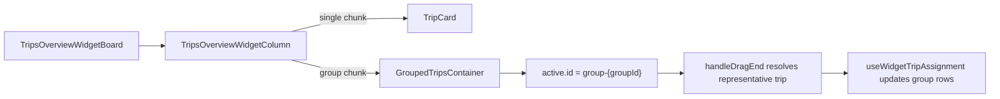

# Widget Grouped Trips Plan

## Scope

Implement in these code paths:

- [src/features/trips/components/kanban/kanban-group-container.tsx](src/features/trips/components/kanban/kanban-group-container.tsx)
- [src/features/trips/components/trips-overview-widget/trips-overview-widget-board.tsx](src/features/trips/components/trips-overview-widget/trips-overview-widget-board.tsx)
- [src/features/trips/components/trips-overview-widget/trips-overview-widget-column.tsx](src/features/trips/components/trips-overview-widget/trips-overview-widget-column.tsx)
- [docs/plans/widget-grouped-container-audit.md](docs/plans/widget-grouped-container-audit.md)
- [docs/kanban-view.md](docs/kanban-view.md), if present

## Steps

1. Add `hideUngroupAction?: boolean` to `GroupedTripsContainer`.
   - Keep default falsy so the main Kanban remains unchanged.
   - Wrap only the group header `×` button with `!hideUngroupAction`.
   - Add the requested `// why` prop comment.
   - Run `bun run build`.

2. Update `TripsOverviewWidgetBoard.handleDragEnd` to understand both trip drags and `group-{id}` drags.
   - Preserve the current single-card path: Fremdfirma rows and individual grouped cards still return early.
   - Resolve drop targets defensively from either a column id or `trip-{id}` via `resolveWidgetColumnId(targetTrip)`.
   - For group drags, find a non-Fremdfirma representative trip with matching `group_id` and call `onAssign(representativeTrip, newDriverId)`.
   - Rely on `useWidgetTripAssignment`, which already updates all rows with the same `group_id`.
   - Add the requested `// why` comment on the group branch.
   - Run `bun run build`.

3. Update `TripsOverviewWidgetColumn` rendering.
   - Keep the existing single-card rendering path for `chunk.type === 'single'`, including Fremdfirma badge, click wrapper, and disable-drag behavior.
   - Render `GroupedTripsContainer` for `chunk.type === 'group'` with `hideUngroupAction={true}`, `activeDragColumnId={null}`, no-op time/order/ungroup callbacks, and the existing `groupLabels` map.
   - Add the requested `// why` comment on `activeDragColumnId={null}`.
   - Run `bun run build`.

4. Update documentation.
   - Mark [docs/plans/widget-grouped-container-audit.md](docs/plans/widget-grouped-container-audit.md) as implemented and note the changed files.
   - If [docs/kanban-view.md](docs/kanban-view.md) exists, add a short note that the overview widget now renders grouped trips with `GroupedTripsContainer`, `hideUngroupAction`, and no-op edit callbacks.
   - Run final `bun run build` and check lints on changed files.

## Flow

## Non-Goals

- Do not change DnD sensors or `pointerWithin`.
- Do not change `useWidgetTripAssignment`.
- Do not alter main Kanban board rendering or `KanbanColumnView`.
- Defer active drag column highlight parity and DragOverlay label polish for group drags.