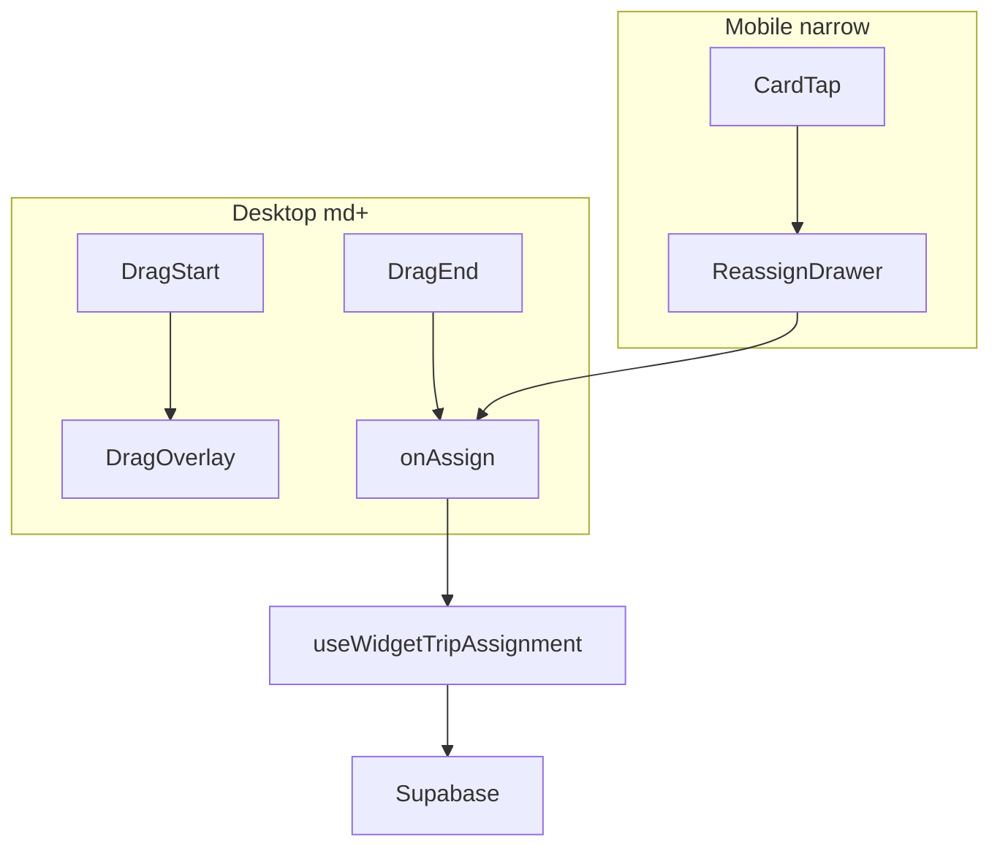

# TripsOverviewWidget v2 — Drag-and-Drop Reassignment

## Current state (validated)

| File | Today |
|------|--------|
| [`trips-overview-widget-board.tsx`](src/features/trips/components/trips-overview-widget/trips-overview-widget-board.tsx) | Inert `<DndContext sensors={[]}>`, v2 stub at L32–34, computes `groupLabels` for columns only |
| [`trips-overview-widget-column.tsx`](src/features/trips/components/trips-overview-widget/trips-overview-widget-column.tsx) | All cards `disableDrag`, no `useDroppable`, v2 stub at L34 |
| [`trips-overview-widget-dialog.tsx`](src/features/trips/components/trips-overview-widget/trips-overview-widget-dialog.tsx) | No `useWidgetTripAssignment`, no `useIsNarrowScreen`, no mobile drawer |
| [`use-widget-trip-assignment.ts`](src/features/trips/hooks/use-widget-trip-assignment.ts) | Ready — **do not modify** |

Confirmed constants/patterns:
- **`resolveWidgetColumnId` already exported** in [`widget-columns.ts`](src/features/trips/lib/widget-columns.ts) L72–78 — routes Fremdfirma → `'unassigned'`, else `trip.driver_id ?? 'unassigned'`. Used by `buildWidgetItemsByColumn`. **Import it in the board; do not inline or duplicate.**
- **`groupLabels` prop is live** in [`trips-overview-widget-column.tsx`](src/features/trips/components/trips-overview-widget/trips-overview-widget-column.tsx) L80 — passed to `TripCard` as `groupLabel` for grouped trips (`Gruppe N`). Board must keep threading `groupLabels={groupLabels}`; only `DragOverlay` uses `groupLabels={{}}`.
- Unassigned column id: `'unassigned'` ([`widget-columns.ts`](src/features/trips/lib/widget-columns.ts) `UNASSIGNED_COLUMN_ID`)
- Driver display field: `driver.name` ([`driver-select-cell.tsx`](src/features/trips/components/trips-tables/driver-select-cell.tsx))
- Narrow breakpoint: `useIsNarrowScreen(768)` from [`src/hooks/use-is-narrow-screen.ts`](src/hooks/use-is-narrow-screen.ts)
- `TripCard` has no `onClick` prop — wrap with `<div onClick>` for mobile tap path ([`kanban-trip-card.tsx`](src/features/trips/components/kanban/kanban-trip-card.tsx) L56–61)
- `TripCard` registers `useDroppable({ id: \`trip-${trip.id}\` })` — **cannot modify**; board `handleDragEnd` must resolve `trip-*` drops to a column id (see Step 2 note)

## Architecture after v2



## Out of scope (hard)

- Group drag, column reorder, `KeyboardSensor`
- Any edits to: `kanban-board.tsx`, `kanban-trip-card.tsx`, `kanban-column.tsx`, `kanban-driver-column-header.tsx`, `use-kanban-pending-store.ts`, `use-widget-trip-assignment.ts`, `use-trips-overview-widget.ts`
- **`widget-columns.ts`:** read-only import of `resolveWidgetColumnId` only — no structural changes expected (see Step 2 pre-check)
- No imports of `useKanbanPendingStore`, `refreshTripsPage`, `useTripsRscRefresh`, `TripDetailSheet` in widget files

---

## Step 1 — CREATE `trips-overview-widget-reassign-drawer.tsx`

**Path:** [`src/features/trips/components/trips-overview-widget/trips-overview-widget-reassign-drawer.tsx`](src/features/trips/components/trips-overview-widget/trips-overview-widget-reassign-drawer.tsx)

**Props interface** (exactly as spec):

```ts
interface TripsOverviewWidgetReassignDrawerProps {
  trip: Trip | null;
  drivers: Driver[]; // Pick<accounts Row, 'id' | 'name'> matches dialog/board
  onAssign: (trip: Trip, newDriverId: string | null) => void;
  isPending: boolean;
  open: boolean;
  onOpenChange: (open: boolean) => void;
}
```

**Implementation checklist:**
- Early return `null` when `!trip` or `isTripFremdfirma(trip)` (import from [`trip-assignee.ts`](src/features/trips/lib/trip-assignee))
- Controlled `<Drawer open={open} onOpenChange={onOpenChange} repositionInputs={false}>` + `<DrawerContent>` (bottom default via vaul; mirror [`pending-assignments-popover.tsx`](src/features/trips/components/pending-assignments/pending-assignments-popover.tsx))
- Header: `resolvePassengerLabel(trip)` + `format(new Date(trip.scheduled_at), 'HH:mm', { locale: de })`
- shadcn `Select`: options = all `drivers` (`driver.name`) + `"Nicht zugewiesen"` value `'unassigned'`
- Internal `selectedDriverId` state, reset via `useEffect` when `trip?.id` changes; init `trip.driver_id ?? 'unassigned'`
- Footer: `Abbrechen` (outline → `onOpenChange(false)`), `Zuweisen` (disabled when `isPending` → `onAssign(trip, selected === 'unassigned' ? null : selected)` then close)
- Inline **why** comment: focused dispatch quick-assign vs `TripDetailSheet` RSC coupling

**Build gate:** `bun run build`

---

## Step 2 — MODIFY [`trips-overview-widget-board.tsx`](src/features/trips/components/trips-overview-widget/trips-overview-widget-board.tsx)

### Pre-check (mandatory before `handleDragEnd`)

Read [`widget-columns.ts`](src/features/trips/lib/widget-columns.ts) fully.

**Current repo state:** `resolveWidgetColumnId` **already exists** and is exported (L72–78):

```ts
export function resolveWidgetColumnId(trip: KanbanTrip): string {
  if (isTripFremdfirma(trip)) {
    return UNASSIGNED_COLUMN_ID;
  }
  return trip.driver_id ?? UNASSIGNED_COLUMN_ID;
}
```

→ Import `{ resolveWidgetColumnId }` in the board. **Do not inline** `trip.driver_id ?? 'unassigned'` — that would miss Fremdfirma routing and duplicate logic already used by `buildWidgetItemsByColumn`.

**If the export is ever missing** (e.g. on another branch): add the function above to `widget-columns.ts` as a pure utility, then import it. Do not duplicate the logic inside `handleDragEnd`.

### Pre-check: `groupLabels` prop threading

Confirmed: [`trips-overview-widget-column.tsx`](src/features/trips/components/trips-overview-widget/trips-overview-widget-column.tsx) uses `groupLabels[trip.group_id]` → `TripCard groupLabel`. Keep `groupLabels={groupLabels}` on each column in board JSX. The board's existing `groupLabels` useMemo stays; only `KanbanDragPreview` in `DragOverlay` passes `groupLabels={{}}`.

---

**New props** on `TripsOverviewWidgetBoardProps`:

```ts
onAssign: (trip: KanbanTrip, newDriverId: string | null) => void;
onCardClick?: (trip: KanbanTrip) => void;
```

**Imports/state/handlers** — copy sensor config exactly from spec; add `useState` for `activeDragId`; import `KanbanDragPreview` from [`kanban-drag-preview.tsx`](src/features/trips/components/kanban/kanban-drag-preview.tsx).

**`handleDragEnd`** — implement spec logic **plus required `trip-*` resolution** (TripCard droppables are always active):

```ts
const handleDragEnd = (event: DragEndEvent) => {
  setActiveDragId(null);
  const { active, over } = event;
  if (!over) return;

  const tripId = String(active.id);
  const trip = trips.find((t) => t.id === tripId);
  if (!trip) return;
  if (isTripFremdfirma(trip) || trip.group_id) return; // safety — cards should not drag

  let targetColumnId = String(over.id);
  if (targetColumnId.startsWith('trip-')) {
    const targetTrip = trips.find((t) => t.id === targetColumnId.replace(/^trip-/, ''));
    if (!targetTrip) return;
    targetColumnId = resolveWidgetColumnId(targetTrip); // from widget-columns.ts — see pre-check
  }

  const newDriverId = targetColumnId === 'unassigned' ? null : targetColumnId;
  if (trip.driver_id === newDriverId) return;
  onAssign(trip, newDriverId);
};
```

**JSX** — replace inert context; keep Fix 4 scroll layout intact:

```tsx
<DndContext sensors={...} collisionDetection={pointerWithin} onDragStart={...} onDragEnd={...}>
  <div className='min-h-0 flex-1 overflow-x-auto overflow-y-auto'>
    <div className='inline-flex min-h-full w-max flex-row gap-3 px-1 pb-2'>
      {columns.map((column) => (
        <TripsOverviewWidgetColumn
          key={column.id}
          column={column}
          items={itemsByColumn[column.id] ?? []}
          groupLabels={groupLabels}
          onCardClick={onCardClick}
        />
      ))}
    </div>
  </div>
  <DragOverlay dropAnimation={null}>
    {activeDragId ? (
      <KanbanDragPreview activeId={activeDragId} effectiveTrips={trips} groupLabels={{}} />
    ) : null}
  </DragOverlay>
</DndContext>
```

**Comments to add:**
- Replace v2 stub with why `groupLabels={{}}` is safe (`KanbanDragPreview` only reads `groupLabels` when `activeId.startsWith('group-')`)
- Why `DragOverlay` is sibling to scroll div (portal + DndContext tree position)

Remove unused stub comment; keep existing `groupLabels` useMemo — required for column `TripCard` group labels (see pre-check above).

**Build gate:** `bun run build`

---

## Step 3 — MODIFY [`trips-overview-widget-column.tsx`](src/features/trips/components/trips-overview-widget/trips-overview-widget-column.tsx)

**Add `useDroppable`** on the card-list container (`flex min-h-0 flex-1 flex-col gap-2 …` div — **not** column root):

```ts
const droppableId = column.id ?? 'unassigned'; // column.id is always 'unassigned' or driver UUID
const { setNodeRef, isOver } = useDroppable({ id: droppableId });
```

Apply `ref={setNodeRef}` and `cn(..., isOver && 'ring-2 ring-primary/40')` on that div.

**Drag rules:**

```ts
const isNonDraggable = isTripFremdfirma(trip) || Boolean(trip.group_id);
// TripCard: disableDrag={isNonDraggable}
```

**Mobile tap wrapper** (only when `onCardClick` provided and trip is draggable):

```tsx
<div
  className={cn(onCardClick && !isNonDraggable && 'cursor-pointer md:cursor-default')}
  onClick={onCardClick && !isNonDraggable ? () => onCardClick(trip) : undefined}
>
  <TripCard ... />
</div>
```

Replace v2 stub with **why** comment on `group_id` exclusion (group integrity; v3 group drag).

**Build gate:** `bun run build`

---

## Step 4 — MODIFY [`trips-overview-widget-dialog.tsx`](src/features/trips/components/trips-overview-widget/trips-overview-widget-dialog.tsx)

**Wire assignment hook** (lives here, not in board):

```ts
const { assignDriver, isAssigning } = useWidgetTripAssignment();
const isNarrow = useIsNarrowScreen(768);
const [selectedTrip, setSelectedTrip] = useState<KanbanTrip | null>(null);

const handleCardClick = (trip: KanbanTrip) => {
  if (!isNarrow) return; // desktop: drag primary; tap would conflict
  setSelectedTrip(trip);
};
```

**Board props:**

```tsx
<TripsOverviewWidgetBoard
  ...
  onAssign={(trip, newDriverId) => assignDriver({ trip, newDriverId })}
  onCardClick={handleCardClick}
/>
```

**Mount drawer** as sibling inside the flex column (below board wrapper, not inside board):

```tsx
<TripsOverviewWidgetReassignDrawer
  trip={selectedTrip}
  drivers={drivers}
  onAssign={(trip, newDriverId) => {
    assignDriver({ trip, newDriverId });
    setSelectedTrip(null);
  }}
  isPending={isAssigning}
  open={selectedTrip !== null}
  onOpenChange={(open) => { if (!open) setSelectedTrip(null); }}
/>
```

Inline **why** comment on desktop no-op in `handleCardClick`.

**Build gate:** `bun run build`

---

## Step 5 — Docs + verification (mandatory)

**Update [`docs/features/trips-overview-widget.md`](docs/features/trips-overview-widget.md):**
- Change status line to v2 (DnD + mobile drawer)
- Fix stale component tree (remove `WidgetDriverSelect`; add `TripsOverviewWidgetReassignDrawer`)
- Add `## v2 — Drag-and-Drop Reassignment` covering:
  - Desktop: MouseSensor + TouchSensor, `KanbanDragPreview`, immediate save via `useWidgetTripAssignment`
  - Mobile: tap → drawer → Select → same mutation
  - Why `groupLabels={{}}` is safe
  - Why grouped + Fremdfirma trips are not draggable
  - MODAL SCROLL RISK: bump TouchSensor delay to 200–250ms in board if QA finds conflicts
  - v3 deferred: group drag, column reorder
- Update mermaid data-flow to include DnD path

**[`index.ts`](src/features/trips/components/trips-overview-widget/index.ts):** no public export change (internal drawer only)

**Final gates:**
- `bun run build`
- `bun test` (358 tests)
- Lint touched files via `read_lints`

---

## Risk note: modal scroll vs touch drag

The audit ([`trips-widget-v2-dnd-audit.md`](docs/plans/trips-widget-v2-dnd-audit.md)) flags horizontal scroll inside Radix Dialog competing with `TouchSensor` (120ms). Ship with identical Kanban sensors first; document the delay bump escape hatch in board comment + docs — do not change sensors preemptively.

## Files touched summary

| Action | File |
|--------|------|
| CREATE | `trips-overview-widget-reassign-drawer.tsx` |
| MODIFY | `trips-overview-widget-board.tsx` |
| MODIFY | `trips-overview-widget-column.tsx` |
| MODIFY | `trips-overview-widget-dialog.tsx` |
| MODIFY | `docs/features/trips-overview-widget.md` |
| NO CHANGE | `index.ts` (unless lint-only) |
