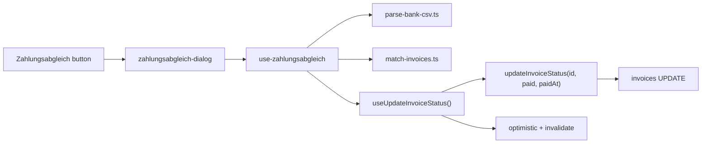

# Zahlungsabgleich — Bank CSV Import Plan

## Scope correction (from iteration)

- **Add** [`src/features/invoices/hooks/use-invoice.ts`](src/features/invoices/hooks/use-invoice.ts) to allowed files.
- **Remove** [`src/features/invoices/hooks/use-invoices.ts`](src/features/invoices/hooks/use-invoices.ts) from modifications — it is list-only; no status mutation lives there.
- Batch writes **must** go through `useUpdateInvoiceStatus`, not `updateInvoiceStatus` directly, to preserve optimistic list patches + `invoiceKeys.all` / `invoiceKeys.revenueTotal` invalidation.

## Architecture



## Allowed files (final)

| File | Action |
|------|--------|
| [`src/features/invoices/api/invoices.api.ts`](src/features/invoices/api/invoices.api.ts) | Modify (`updateInvoiceStatus` paidAt + `getInvoicesByNumbers`) |
| [`src/features/invoices/hooks/use-invoice.ts`](src/features/invoices/hooks/use-invoice.ts) | Modify |
| [`src/features/bank-reconciliation/lib/parse-bank-csv.ts`](src/features/bank-reconciliation/lib/parse-bank-csv.ts) | Create |
| [`src/features/bank-reconciliation/lib/match-invoices.ts`](src/features/bank-reconciliation/lib/match-invoices.ts) | Create |
| [`src/features/bank-reconciliation/types/reconciliation.types.ts`](src/features/bank-reconciliation/types/reconciliation.types.ts) | Create |
| [`src/features/bank-reconciliation/components/zahlungsabgleich-dialog.tsx`](src/features/bank-reconciliation/components/zahlungsabgleich-dialog.tsx) | Create |
| [`src/features/bank-reconciliation/components/review-table.tsx`](src/features/bank-reconciliation/components/review-table.tsx) | Create |
| [`src/features/bank-reconciliation/components/warning-rows-dialog.tsx`](src/features/bank-reconciliation/components/warning-rows-dialog.tsx) | Create |
| [`src/features/bank-reconciliation/hooks/use-zahlungsabgleich.ts`](src/features/bank-reconciliation/hooks/use-zahlungsabgleich.ts) | Create |
| [`src/features/invoices/components/invoice-list-table/index.tsx`](src/features/invoices/components/invoice-list-table/index.tsx) | Modify |
| [`docs/bank-reconciliation-module.md`](docs/bank-reconciliation-module.md) | Create |
| [`docs/invoices-module.md`](docs/invoices-module.md) | Modify (cross-link only) |

**Do not touch** any file outside this list.

---

## Step 1 — API + hook: optional `paidAt` (build gate)

### 1a. [`invoices.api.ts`](src/features/invoices/api/invoices.api.ts)

Add optional third param `paidAt?: string` to `updateInvoiceStatus`. **Preserve existing per-transition timestamp logic** — do not null `paid_at` on `sent`/`cancelled` (the spec pseudo-code was incorrect):

```typescript
export async function updateInvoiceStatus(
  id: string,
  status: InvoiceStatusTransition,
  paidAt?: string
): Promise<InvoiceRow> {
  const now = new Date().toISOString();
  const timestampUpdate =
    status === 'sent'
      ? { sent_at: now }
      : status === 'paid'
        ? { paid_at: paidAt ?? now }  // why: bank import records Buchungstag, not click time
        : { cancelled_at: now };
  // ... unchanged .update({ status, ...timestampUpdate, updated_at: now })
}
```

Inline comment on `paidAt ?? now`: backward-compatible for all existing callers.

### 1b. [`use-invoice.ts`](src/features/invoices/hooks/use-invoice.ts) — read fully before editing

Refactor mutation variables to support **both** existing single-invoice call sites and batch Zahlungsabgleich:

```typescript
export type UpdateInvoiceStatusInput =
  | InvoiceStatusTransition
  | {
      status: InvoiceStatusTransition;
      paidAt?: string;
      invoiceId?: string;       // required when hook has no bound id
      suppressToast?: boolean;  // batch: avoid N success toasts
    };
```

**Signature change:** `useUpdateInvoiceStatus(invoiceId?: string)` — `invoiceId` becomes optional.

- **Existing call sites** ([`invoice-actions.tsx`](src/features/invoices/components/invoice-detail/invoice-actions.tsx), [`abrechnung-recent-invoices.tsx`](src/features/invoices/components/abrechnung-overview/abrechnung-recent-invoices.tsx)): **no changes required** — they keep `useUpdateInvoiceStatus(invoice.id)` and `mutate('paid' | 'sent' | 'cancelled')`.
- **Normalizer** resolves `{ id, status, paidAt?, suppressToast? }`:
  - string var + bound `invoiceId` → `{ id: invoiceId, status, paidAt: undefined }`
  - object var → `{ id: vars.invoiceId ?? invoiceId!, status, paidAt, suppressToast }`
- **`mutationFn`:** `updateInvoiceStatus(id, status, paidAt)`
- **`onMutate`:** optimistic patch uses resolved `id` + `status` (same list predicate as today)
- **`onSuccess`:** skip toast when `suppressToast === true` (batch path); existing paths unchanged
- **`onSettled`:** unchanged — still `invalidateQueries(invoiceKeys.all)` + `invoiceKeys.revenueTotal` once per mutation call; batch loops `mutateAsync` but **single invalidation per call is OK** — plan batch confirm to call `mutateAsync` sequentially and rely on final invalidation (document: last call's onSettled refreshes list; optional micro-optimization: debounce invalidation — **not in scope**, sequential is fine)

### 1c. [`invoices.api.ts`](src/features/invoices/api/invoices.api.ts) — `getInvoicesByNumbers`

Add a new exported function alongside `updateInvoiceStatus`:

```typescript
getInvoicesByNumbers(numbers: string[]): Promise<MatchedInvoice[]>
```

- Queries `invoices` by `invoice_number` using `.in('invoice_number', numbers)` across **all statuses** (not just `sent`).
- Returns the fields needed for the lookup `Map`: `id`, `invoice_number`, `total`, `status`, and payer name.
- Import `MatchedInvoice` from [`reconciliation.types.ts`](src/features/bank-reconciliation/types/reconciliation.types.ts) (or map inline in the API and return a shape compatible with `MatchedInvoice` — implementer chooses the cleaner import direction without creating a circular dependency).

**Why:** every other Supabase call in the invoices feature lives in `invoices.api.ts`. An inline raw query inside a hook breaks this pattern, is hard to discover six months later, and cannot be reused or tested in isolation.

**Build gate:** `bun run build` before Step 2.

---

## Step 2 — Types ([`reconciliation.types.ts`](src/features/bank-reconciliation/types/reconciliation.types.ts))

Define types from spec plus shared constants:

```typescript
export const AMOUNT_TOLERANCE = 0.01;
```

Types: `BankRow`, `ReconciliationBucket`, `MatchedInvoice`, `WarningReason`, `MatchedRow` — as specified.

Export `INVALID_BANK_CSV_FORMAT` error class or typed error code for parse failures.

**Build gate:** `bun run build`.

---

## Step 3 — Parse + extract ([`parse-bank-csv.ts`](src/features/bank-reconciliation/lib/parse-bank-csv.ts))

Pure functions, no Supabase/React.

Constants:
- `NOON_UTC_SUFFIX = 'T12:00:00.000Z'` — comment: avoids Berlin TZ display edge on date-only bank values
- `INVOICE_NUMBER_REGEX = /\bRE-\d{4}-\d{2}-\d{4}\b/g` — comment: word boundaries, no fuzzy; legacy `RE-YYYY-NNNN` noted in comment only

**Papa Parse:** `delimiter: ';'`, `header: false`, `skipEmptyLines: true`.

**Header guard:** row 0 col 0 must be `Auftragskonto` else throw `INVALID_FORMAT`.

**Column map (0-indexed):** 1 Buchungstag, 4 Verwendungszweck, 11 Beguenstigter/Zahlungspflichtiger, 14 Betrag.

**Betrag:** German parse — strip `.` thousands, replace `,` with `.`, `parseFloat`; keep only `betrag > 0` (comment: outflows are not invoice payments).

**Date:** `DD.MM.YY` / `DD.MM.YYYY` → ISO `YYYY-MM-DD` + `NOON_UTC_SUFFIX`.

**`extractInvoiceNumbers`:** `[...verwendungszweck.matchAll(REGEX)].map(m => m[0])` (dedupe optional).

Export `parseBankCsv(file: File): Promise<BankRow[]>` wrapping Papa in Promise.

**Build gate:** `bun run build`.

---

## Step 4 — Match ([`match-invoices.ts`](src/features/bank-reconciliation/lib/match-invoices.ts))

Pure function:

```typescript
export function matchInvoices(
  bankRows: BankRow[],
  sentInvoices: MatchedInvoice[],
  invoiceLookup: Map<string, MatchedInvoice>  // all statuses, keyed by invoice_number
): MatchedRow[]
```

Per-row logic (as spec):

| Condition | Bucket | Reasons |
|-----------|--------|---------|
| 0 numbers | `ignored` | — |
| 2+ numbers | `warning` | `multi_invoice` |
| 1 number, not in lookup | `warning` | `not_found` |
| 1 number, in lookup, `status !== 'sent'` | `warning` | `already_paid` (or draft/cancelled) |
| 1 number, sent, `\|betrag - total\| > AMOUNT_TOLERANCE` | `warning` | `amount_mismatch` |
| 1 number, sent, amount OK | `ready` | — |

`sentInvoices` used for ready-path; `invoiceLookup` disambiguates `not_found` vs `already_paid`.

**Build gate:** `bun run build`.

---

## Step 5 — Orchestration hook ([`use-zahlungsabgleich.ts`](src/features/bank-reconciliation/hooks/use-zahlungsabgleich.ts))

**State:** `DialogStep = 'idle' | 'loading' | 'reviewing' | 'confirming' | 'done'`

**Hooks used:**
- `useUpdateInvoiceStatus()` — **no bound invoiceId** (batch mode)
- `useQuery` lazy on dialog open: `listInvoices({ status: 'sent' })` → map to `MatchedInvoice[]`
- After parse, collect all extracted numbers → call `getInvoicesByNumbers(numbers)` from [`invoices.api.ts`](src/features/invoices/api/invoices.api.ts) to build `invoiceLookup` Map (enables `already_paid`). **No raw Supabase client calls inside the hook.**

**Flow:**
1. `onFileDrop` → set step to `'loading'` immediately (before any async work)
2. `parseBankCsv` → `listInvoices({ status: 'sent' })` (if not already cached) → `getInvoicesByNumbers(extractedNumbers)` → `matchInvoices` → set step to `'reviewing'`
3. On parse or fetch error (e.g. `INVALID_FORMAT`, network failure): return step to `'idle'`, surface error so admin can retry
4. Track `selectedReadyIds: Set<string>` (bank row keys, e.g. index or composite) — all ready rows pre-selected
5. `onConfirm` → `confirming` → for each selected ready row:
   ```typescript
   await updateStatus.mutateAsync({
     invoiceId: row.matchedInvoice!.id,
     status: 'paid',
     paidAt: row.bankRow.buchungstagISO,
     suppressToast: true,
   });
   ```
   Collect per-row outcome in `results` as `{ invoiceId: string; invoiceNumber: string; success: boolean; error?: string }` for every `mutateAsync` call; **do not abort batch** on single error
6. `done` — list refreshes via hook invalidation; dialog renders outcome from `results` (see Step 8)

**Expose:** `{ step, matchedRows, selectedReadyIds, toggleRow, onFileDrop, onConfirm, onReset, readyCount, warningCount, ignoredCount, error, results }`

Comment: why hook not raw API — optimistic + invalidation.

**Build gate:** `bun run build`.

---

## Step 6 — Warning sub-dialog ([`warning-rows-dialog.tsx`](src/features/bank-reconciliation/components/warning-rows-dialog.tsx))

Read-only `Dialog` / nested view. Props: `rows: MatchedRow[]`, `open`, `onOpenChange`.

German labels + explanations per reason (table in spec). Show raw `Verwendungszweck`, bank amount, extracted numbers. **No writes.** "Schließen" only.

**Build gate:** `bun run build`.

---

## Step 7 — Review table ([`review-table.tsx`](src/features/bank-reconciliation/components/review-table.tsx))

Props-only UI for `ready` rows + summary counts.

Columns: checkbox, Buchungsdatum, Beguenstigter, Rechnungsnummer, Rechnungsbetrag, Bankbetrag, Differenz (`tabular-nums`).

Footer: summary line, "Manuelle Prüfung anzeigen" (if warnings), primary confirm, ghost cancel.

**Build gate:** `bun run build`.

---

## Step 8 — Dialog shell ([`zahlungsabgleich-dialog.tsx`](src/features/bank-reconciliation/components/zahlungsabgleich-dialog.tsx))

Controlled `Dialog` (`open` / `onOpenChange`). **Lazy mount:** render `{open && <DialogContent>…}` or equivalent so hook/query only run when open — document choice in module doc.

Composes `FileUploader` ([`file-uploader.tsx`](src/components/file-uploader.tsx)) pattern from [`bulk-upload-dialog.tsx`](src/features/trips/components/bulk-upload-dialog.tsx): `accept={{ 'text/csv': ['.csv'] }}`, `maxFiles={1}`, `onUpload={onFileDrop}`.

Steps:
- `idle` → upload (`FileUploader`)
- `loading` → centered spinner + label **"Wird analysiert…"** (matches confirming-step pattern for visual consistency)
- `reviewing` → `ReviewTable`
- `confirming` → spinner + **"Wird gespeichert…"**
- `done` → outcome summary + close (never a generic success when any row failed):
  - **Full success:** `"X Rechnungen wurden als bezahlt markiert."`
  - **Partial failure:** `"Y von X erfolgreich. Z Fehler — bitte manuell prüfen:"` followed by a list of failed invoice numbers (from `results` where `success === false`). The done screen **must not** show a generic success message when any row failed.

`max-w-4xl`. On close: `onReset()` clears state.

Only hook call: `useZahlungsabgleich(open)`.

**Build gate:** `bun run build`.

---

## Step 9 — Wire button ([`invoice-list-table/index.tsx`](src/features/invoices/components/invoice-list-table/index.tsx))

Add beside existing header actions (outline, left of "Neue Rechnung"):

```tsx
const [zahlungsabgleichOpen, setZahlungsabgleichOpen] = useState(false);
// ...
<Button variant="outline" onClick={() => setZahlungsabgleichOpen(true)}>
  Zahlungsabgleich
</Button>
{zahlungsabgleichOpen && (
  <ZahlungsabgleichDialog open={zahlungsabgleichOpen} onOpenChange={setZahlungsabgleichOpen} />
)}
```

**Hard rule:** filters, table, columns unchanged.

**Build gate:** `bun run build`.

---

## Step 10 — Docs + comments (mandatory)

1. Create [`docs/bank-reconciliation-module.md`](docs/bank-reconciliation-module.md): UX flow, CSV column map, regex + legacy note, buckets/warnings, deferred items, file map, **why batch uses `useUpdateInvoiceStatus` not raw API**.
2. Inline "why" comments at: regex, `betrag > 0`, noon UTC, `paidAt ?? now`, `suppressToast`, single invalidation pattern.
3. Add cross-link in [`docs/invoices-module.md`](docs/invoices-module.md) §API or new subsection pointing to bank-reconciliation module.

**Final build gate:** `bun run build`.

---

## Deferred (explicitly out of scope)

- Multi-invoice auto-split / auto-mark
- Amount mismatch auto-mark
- Phase 2 RPC `mark_invoices_paid`
- `database.types.ts` regen
- Audit/import batch table
- Legacy `RE-YYYY-NNNN` regex handling (comment only)

## Reference

Prior audit: [`docs/plans/bank-csv-reconciliation-audit.md`](docs/plans/bank-csv-reconciliation-audit.md)
