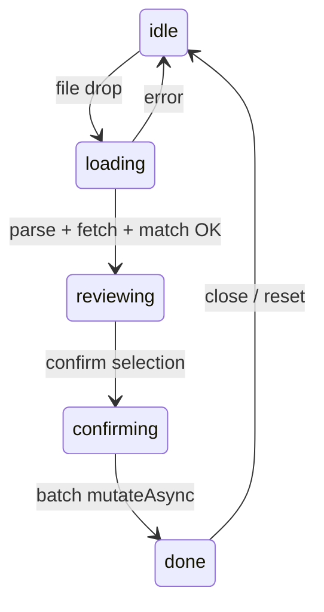

# Bank reconciliation (Zahlungsabgleich)

Admin feature on `/dashboard/invoices` to import a German bank CSV (Sparkasse / CAMT052 semicolon export), match invoice numbers in `Verwendungszweck` against open (`status = sent`) invoices, and mark confirmed rows as paid with the bank **Buchungstag** as `paid_at`.

## UX flow



1. **idle** — upload CSV via `FileUploader`
2. **loading** — spinner “Wird analysiert…” (parse, fetch sent invoices, lookup by number, match)
3. **reviewing** — checkbox table for **ready** rows; warnings in actionable sub-dialog (see below)
4. **confirming** — spinner “Wird gespeichert…”
5. **done** — full success or partial failure list (never generic success if any row failed)

Dialog is **lazy-mounted** when the user opens it (`zahlungsabgleichOpen && <ZahlungsabgleichDialog />`) so the orchestration hook and sent-invoice query only run while open.

## CSV column map (0-indexed)

| Index | Header (row 0) | Used |
|-------|----------------|------|
| 0 | `Auftragskonto` | Header guard only |
| 1 | Buchungstag | Yes → `paid_at` (noon UTC) |
| 2 | Valutadatum | Ignored |
| 3 | Buchungstext | Ignored |
| 4 | Verwendungszweck | Yes → regex extract `RE-YYYY-MM-NNNN` |
| 11 | Beguenstigter/Zahlungspflichtiger | Display only |
| 14 | Betrag | Yes → inflows only (`> 0`) |

Parser: `Papa.parse` with `delimiter: ';'`, `header: false`. Invalid if first cell ≠ `Auftragskonto`.

## Invoice number regex

```regex
\bRE-\d{4}-\d{2}-\d{4}\b
```

Word boundaries — **exact** token match, no fuzzy matching. Legacy `RE-YYYY-NNNN` is **not** handled (comment only in `parse-bank-csv.ts`).

PDF / SEPA **Verwendungszweck** is the bare number (e.g. `RE-2026-05-0008`); payers may add prefixes like `RNR:` in bank text.

## Buckets and warning reasons

| Bucket | Meaning |
|--------|---------|
| `ready` | One number, found as `sent`, amount within €0.01 |
| `warning` | Manual review required |
| `ignored` | No extractable invoice number |

| Reason | When |
|--------|------|
| `multi_invoice` | 2+ numbers in one bank row |
| `amount_mismatch` | `\|bank − invoice.total\| > 0.01` |
| `already_paid` | Number exists but `status !== sent` |
| `not_found` | Number not in DB |

Warning and ignored rows are **never** auto-marked on import. Rows in the warning sub-dialog can still be marked paid manually after review (see **Manuelle Prüfung**).

## Manuelle Prüfung (warning sub-dialog)

Opened from the main review table when warning rows exist. Layout matches the main dialog: fixed header/footer, scrollable table body (`max-h-[90vh]`, `flex-1 min-h-0 overflow-y-auto`).

| Row type | Checkbox | Action |
|----------|----------|--------|
| `amount_mismatch` (with matched invoice) | Yes | Single `mutateAsync` per row |
| `multi_invoice` (auto-resolved, exactly 2 numbers) | Yes | `mutateAsync` for **each** invoice in `matchedInvoices`, same `paidAt` |
| `multi_invoice` (unresolved) | No — `multiInvoiceBlockReason` | Manual handling outside dialog |
| `not_found` | No | Manual handling outside dialog |
| `already_paid` | Hidden from table | Muted skip hint only |

- Selection state: `selectedWarningIds` (`Set<string>`), keyed by stable `rowKey` (CSV row index string).
- Confirm: **“X ausgewählte Rechnungen als bezahlt markieren”** — `onConfirmWarning()` with `suppressToast: true`; per-row inline success/failure icons; dialog stays open until the admin closes it.
- **Schließen** always works, including during confirmation.
- Confirmed warning rows are removed from `matchedRows` so counts update; the main ready-row table is unaffected.

## Multi-invoice auto-resolution

When a bank row contains **exactly two** invoice numbers, `match-invoices.ts` may set `multiInvoiceResolved: true` so the warning dialog can mark both invoices paid in one action.

All of the following must pass (evaluated once at match time; UI/hook read `multiInvoiceResolved` / `multiInvoiceBlockReason` only):

| Guard | Why |
|-------|-----|
| Exactly **2** extracted numbers | Three or more splits need human allocation — always `multiInvoiceBlockReason`: “Mehr als zwei Rechnungsnummern…” |
| Both numbers in `invoiceLookup` | Cannot confirm payment if an invoice is missing |
| Both `status === 'sent'` | Marking draft or already-paid rows would corrupt data |
| Same **payer** (`payerName` on `MatchedInvoice`; lookup does not load `payerId` yet) | Bulk Krankenkasse payments can share amounts across different payers |
| `\|invoice1.total + invoice2.total − \|bank.betrag\|\| ≤ AMOUNT_TOLERANCE` | Financial reconciliation |

On success: `matchedInvoice` = first invoice, `matchedInvoices` = both (hook marks each with the same `buchungstagISO`). On failure: `multiInvoiceResolved: false` and a specific German `multiInvoiceBlockReason`.

## Write path

Batch confirm calls **`useUpdateInvoiceStatus()`** (no bound invoice id) with `{ invoiceId, status: 'paid', paidAt: buchungstagISO, suppressToast: true }` per selected ready row.

**Why not `updateInvoiceStatus` directly:** the hook applies optimistic list patches and invalidates `invoiceKeys.all` + `invoiceKeys.revenueTotal` so the invoice list updates without a manual refresh.

`paid_at` uses bank booking date (`T12:00:00.000Z` on parsed Y-M-D) — not `now()`.

## File map

| File | Role |
|------|------|
| [`parse-bank-csv.ts`](../src/features/bank-reconciliation/lib/parse-bank-csv.ts) | CSV + date/amount parsing, regex extract |
| [`match-invoices.ts`](../src/features/bank-reconciliation/lib/match-invoices.ts) | Pure bucketing |
| [`reconciliation.types.ts`](../src/features/bank-reconciliation/types/reconciliation.types.ts) | Shared types, `AMOUNT_TOLERANCE` |
| [`use-zahlungsabgleich.ts`](../src/features/bank-reconciliation/hooks/use-zahlungsabgleich.ts) | Orchestration, batch via mutation hook |
| [`zahlungsabgleich-dialog.tsx`](../src/features/bank-reconciliation/components/zahlungsabgleich-dialog.tsx) | Dialog shell (`max-w-5xl`, `max-h-[90vh]`, scrollable body, fixed footer) |
| [`review-table.tsx`](../src/features/bank-reconciliation/components/review-table.tsx) | Ready rows + confirm |
| [`warning-rows-dialog.tsx`](../src/features/bank-reconciliation/components/warning-rows-dialog.tsx) | Warning rows: checkboxes, batch mark-paid, inline results |
| [`invoices.api.ts`](../src/features/invoices/api/invoices.api.ts) | `getInvoicesByNumbers`, `updateInvoiceStatus(..., paidAt?)` |
| [`use-invoice.ts`](../src/features/invoices/hooks/use-invoice.ts) | `useUpdateInvoiceStatus` with optional `paidAt` / batch vars |

## Deferred

- Amount mismatch auto-mark
- RPC `mark_invoices_paid` (atomic batch)
- `database.types.ts` regeneration
- Import audit / batch logging table
- Legacy `RE-YYYY-NNNN` regex handling

See also: [`docs/plans/bank-csv-reconciliation-audit.md`](plans/bank-csv-reconciliation-audit.md)
