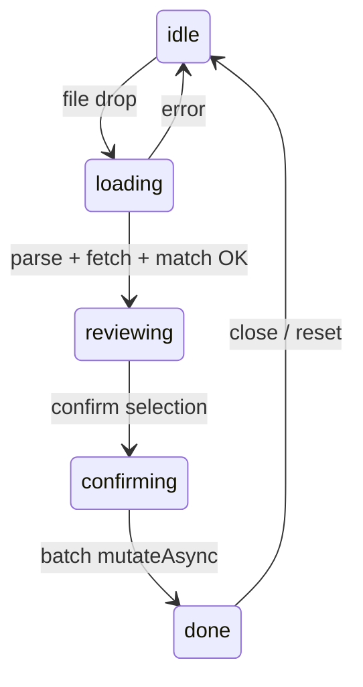

# Bank reconciliation (Zahlungsabgleich)

Admin feature on `/dashboard/invoices` to import a German bank CSV (Sparkasse / CAMT052 semicolon export), match invoice numbers in `Verwendungszweck` against open (`status = sent`) invoices, and mark confirmed rows as paid with the bank **Buchungstag** as `paid_at`.

## UX flow



1. **idle** — upload CSV via `FileUploader`
2. **loading** — spinner "Wird analysiert…" (parse, fetch sent invoices, lookup by number, match)
3. **reviewing** — checkbox table for **ready** rows; warnings in actionable sub-dialog (see below)
4. **confirming** — spinner "Wird gespeichert…"
5. **done** — full success or partial failure list (never generic success if any row failed)

Dialog is **lazy-mounted** when the user opens it (`zahlungsabgleichOpen && <ZahlungsabgleichDialog />`) so the orchestration hook and sent-invoice query only run while open.

## CSV column map (0-indexed)

| Index | Header (row 0) | Used |
|-------|----------------|------|
| 0 | `Auftragskonto` | Header guard only |
| 1 | Buchungstag | Yes → `paid_at` (noon UTC) |
| 2 | Valutadatum | Ignored |
| 3 | Buchungstext | Ignored |
| 4 | Verwendungszweck | Yes → regex extract `RE-YYYY-MM-NNNN` |
| 11 | Beguenstigter/Zahlungspflichtiger | Display only |
| 14 | Betrag | Yes → inflows only (`> 0`) |

Parser: `Papa.parse` with `delimiter: ';'`, `header: false`. Invalid if first cell ≠ `Auftragskonto`.

## Invoice number extraction and normalisation

`extractInvoiceNumbers()` in `parse-bank-csv.ts` delegates to `extractAndNormaliseInvoiceNumbers()` in `normalise-invoice-number.ts`. All downstream code (matcher, hook, UI) only ever sees **canonical** `RE-YYYY-MM-NNNN` strings.

### Supported input formats → canonical output

| Input example | Canonical output |
|---|---|
| `RE-2026-04-0004` | `RE-2026-04-0004` (canonical, unchanged) |
| `R:2026-04-0004` | `RE-2026-04-0004` |
| `RE 2026-04-0004` | `RE-2026-04-0004` |
| `RE2026-04-0004` | `RE-2026-04-0004` |
| `RE2026040004` | `RE-2026-04-0004` (Branch B — no separators) |
| `re2026040004` | `RE-2026-04-0004` (case-insensitive) |

### Regex branches

**Branch B** (no-separator, evaluated first — more specific):

```regex
\b[Rr][Ee](\d{4})(\d{2})(\d{4})\b
```

**Branch A** (separated variants, evaluated second):

```regex
\b[Rr][Ee]?[-:\s]?(\d{4}-\d{2}-\d{4})\b
```

Both branches return results as deduplicated `RE-YYYY-MM-NNNN` strings. Branch B is evaluated before Branch A so that the 10-digit run is consumed by the more specific pattern first.

`INVOICE_NUMBER_REGEX` in `parse-bank-csv.ts` is **deprecated** — kept for backward compatibility; use `extractAndNormaliseInvoiceNumbers()` directly instead.

## Buckets and warning reasons

| Bucket | Meaning |
|--------|---------|
| `ready` | One number, found as `sent`, amount within €0.01 — **or** N ≥ 2 numbers that all pass Sammelzahlung guards (see below) |
| `warning` | Manual review required |
| `ignored` | No extractable invoice number |

| Reason | When |
|--------|------|
| `multi_invoice` | 2+ numbers in one bank row **and** auto-resolution failed (guards did not pass) |
| `amount_mismatch` | bank vs invoice.total difference > €0.01 (single-invoice rows only) |
| `already_paid` | Number exists but `status !== sent` |
| `not_found` | Number not in DB |

Warning and ignored rows are **never** auto-marked on import. Rows in the warning sub-dialog can still be marked paid manually after review (see **Manuelle Prüfung**).

## Manuelle Prüfung (warning sub-dialog)

Opened from the main review table when warning rows exist. Layout matches the main dialog: fixed header/footer, scrollable table body (`max-h-[90vh]`, `flex-1 min-h-0 overflow-y-auto`).

| Row type | Checkbox | Action |
|----------|----------|--------|
| `amount_mismatch` (with matched invoice) | Yes | Single `mutateAsync` per row |
| `multi_invoice` (unresolved) | No — `multiInvoiceBlockReason` shown | Manual handling outside dialog |
| `not_found` | No | Manual handling outside dialog |
| `already_paid` | Hidden from table | Muted skip hint only |

- Selection state: `selectedWarningIds` (`Set<string>`), keyed by stable `rowKey` (CSV row index string).
- Confirm: **"X ausgewählte Rechnungen als bezahlt markieren"** — `onConfirmWarning()` with `suppressToast: true`; per-row inline success/failure icons; dialog stays open until the admin closes it.
- **Schließen** always works, including during confirmation.
- Confirmed warning rows are removed from `matchedRows` so counts update; the main ready-row table is unaffected.

## Multi-invoice auto-resolution (Sammelzahlung)

When a bank row contains **N ≥ 2** invoice numbers, `match-invoices.ts` calls `resolveMultiInvoiceTransaction()` to check whether all invoices can be auto-confirmed as a single group payment. Resolved groups are promoted to the **ready bucket** and expanded into N individual rows (one per invoice) by the hook before rendering.

All of the following guards must pass (evaluated once at match time in `resolve-multi-invoice-transaction.ts`):

| Guard | Why |
|-------|-----|
| All numbers in `invoiceLookup` | Cannot confirm payment if any invoice is missing |
| All invoices in `sentByNumber` | Uses the authoritative "currently open" set; not `lookupInvoice.status` which fetches all statuses |
| Same **payer** (`payerId` — UUID comparison, not display name string) | Bulk Krankenkasse payments can share amounts across different payers |
| `sum(invoice.total)` === `bank.betrag` within `AMOUNT_TOLERANCE` | Financial reconciliation |

**On success:** row promoted to `ready` bucket, `matchedInvoices` contains all invoices, `multiInvoiceResolved: true`, `groupKey` set to CSV row index. The hook (`use-zahlungsabgleich.ts`) expands the group row into N individual ready rows — each with its own `matchedInvoice`, `groupPosition`, `groupSize`, and a unique `rowKey` (`${groupKey}:${invoice.id}`).

**On failure:** `bucket: 'warning'`, `warningReasons: ['multi_invoice']`, `multiInvoiceBlockReason` contains a specific German explanation.

### ReviewTable group rendering

`ReviewTable` builds typed display groups via `buildReadyDisplayGroups()`:

| `kind` | Relationship | Math |
|---|---|---|
| `single` | one bank row → one invoice | unchanged |
| `multiInvoice` | one bank row → many invoices (Sammelzahlung) | `bankAmount = firstRow.betrag`; `invoiceAmount = sum(child.total)` |
| `splitPayment` | many bank rows → one invoice (Eigenanteil) | `bankAmount = sum(row.betrag)`; `invoiceAmount = firstRow.matchedInvoice.total` |

All group kinds share the same visual pattern: a **group header row** + child rows behind a chevron toggle.

**Collapse behaviour:**
- All groups start **collapsed** by default so the table is scannable at a glance.
- A `ChevronDown` button at the far right of every group header expands/collapses the children. The chevron rotates 180° when expanded (`transition-transform duration-200`).
- The button carries `aria-label` and `aria-expanded` for accessibility.
- Single rows are never affected by collapse state.

**Sammelzahlung groups (multiInvoice):**
- Header shows booking date from the shared bank row, beneficiary, `N Rechnungen`, invoice sum, bank amount, diff.
- Each child shows position indicator (`1/4`, `2/4`, …), invoice number, invoice amount.
- One checkbox selects the whole group; confirms all N invoices with the same `buchungstagISO`.

**Split-payment groups (splitPayment):**
- Header shows the latest booking date (`splitPaymentPaidAt` formatted via `formatBuchungstag()`), `—` for beneficiary, the shared invoice number, invoice total, sum of partial payments, diff.
- Each child shows individual bank transaction: booking date, beneficiary, position indicator, partial bank amount.
- One checkbox selects all rows in the group; confirmation fires one DB update (deduped by invoice ID in `markRowsPaid()`).

**Selection and count model:**
- `selectionKeyFor()` returns `row.groupKey ?? row.splitPaymentKey ?? row.rowKey`.
- `countSelectedInvoices()` deduplicates by `groupKey` (adding `groupSize`) and by `splitPaymentKey` (adding 1 per group, not per row).
- The confirm button shows the **invoice count**: selecting one Sammelzahlung of 4, one split-payment group, and two singles reads "7 Rechnungen als bezahlt markieren".

**Column alignment:** the table has 8 columns. The 8th column is always the chevron cell for group headers/child rows, or an empty cell for single rows, so all rows align.

## Split-payment matching (Eigenanteil)

When a **single invoice** appears across multiple bank rows (the payer splits the settlement across several transactions), the system auto-resolves the group and marks the invoice paid once on confirmation.

### Pre-pass in `match-invoices.ts`

Before the per-row bucketing loop, a pre-pass groups bank rows by invoice number. Only rows that:
- extract **exactly one** invoice number, **and**
- that invoice exists in `invoiceLookup` with `status === 'sent'`

…are candidates. Groups of size ≥ 2 are resolved by `resolveSplitPayment()`.

### `resolveSplitPayment()` guards

| Guard | Why |
|-------|-----|
| ≥ 2 bank rows in group | A lone row is handled by the normal single-invoice path |
| Invoice `status === 'sent'` | Cannot mark a non-open invoice |
| `sum(betrag)` === `invoice.total` within `AMOUNT_TOLERANCE` | Financial settlement must be exact |

On success, `paidAt` is the **latest** `buchungstagISO` in the group (the date the last partial payment arrived).

### Ready-row metadata for split groups

Each bank row in a resolved split group is emitted as an individual `ready` row carrying:

| Field | Value |
|-------|-------|
| `splitPaymentKey` | `split:<invoiceNumber>` — shared identifier for the group |
| `splitPaymentPosition` | 1-based index of this row within the group |
| `splitPaymentSize` | Total number of rows in the group |
| `splitPaymentPaidAt` | ISO string of the latest booking date in the group |

### Confirmation deduplication

`markRowsPaid()` in `use-zahlungsabgleich.ts` deduplicates by **invoice ID** before firing DB updates. Split-payment rows all reference the same `matchedInvoice`, so exactly **one** `useUpdateInvoiceStatus` call is made. `paidAt` is `splitPaymentPaidAt` when set; otherwise falls back to `bankRow.buchungstagISO`.

### ReviewTable rendering

Split-payment groups are rendered as collapsible `splitPayment` display groups. See the **ReviewTable group rendering** section above for full detail.

### Already-paid split groups

If both partial payments arrive in a CSV re-upload but the invoice is already paid, the `status === 'sent'` guard in the pre-pass correctly excludes them from split resolution. They fall through to the **existing** single-invoice `already_paid` / `amount_mismatch` routing unchanged — no special handling is added.

## Write path

Batch confirm calls **`useUpdateInvoiceStatus()`** (no bound invoice id) with `{ invoiceId, status: 'paid', paidAt, suppressToast: true }` per **unique invoice** in the selection.

`paidAt` is:
- **Split-payment rows:** `splitPaymentPaidAt` (latest partial-payment booking date in the group)
- **All other rows:** `bankRow.buchungstagISO`

**Why not `updateInvoiceStatus` directly:** the hook applies optimistic list patches and invalidates `invoiceKeys.all` + `invoiceKeys.revenueTotal` so the invoice list updates without a manual refresh.

## File map

| File | Role |
|------|------|
| [`parse-bank-csv.ts`](../src/features/bank-reconciliation/lib/parse-bank-csv.ts) | CSV + date/amount parsing; delegates extraction to normaliser |
| [`normalise-invoice-number.ts`](../src/features/bank-reconciliation/lib/normalise-invoice-number.ts) | Regex normalisation — all variant formats → canonical `RE-YYYY-MM-NNNN` |
| [`resolve-multi-invoice-transaction.ts`](../src/features/bank-reconciliation/lib/resolve-multi-invoice-transaction.ts) | Pure N-invoice Sammelzahlung guard helper |
| [`resolve-split-payment.ts`](../src/features/bank-reconciliation/lib/resolve-split-payment.ts) | Pure split-payment guard helper (one invoice, multiple bank rows) |
| [`match-invoices.ts`](../src/features/bank-reconciliation/lib/match-invoices.ts) | Pure bucketing; split-payment pre-pass + multi-invoice + single-invoice paths |
| [`reconciliation.types.ts`](../src/features/bank-reconciliation/types/reconciliation.types.ts) | Shared types, `AMOUNT_TOLERANCE`, `MultiInvoiceResolution`, `splitPayment*` fields |
| [`use-zahlungsabgleich.ts`](../src/features/bank-reconciliation/hooks/use-zahlungsabgleich.ts) | Orchestration; group expansion; invoice-count selection; confirmation deduplication |
| [`zahlungsabgleich-dialog.tsx`](../src/features/bank-reconciliation/components/zahlungsabgleich-dialog.tsx) | Dialog shell (`max-w-5xl`, `max-h-[90vh]`, scrollable body, fixed footer) |
| [`review-table.tsx`](../src/features/bank-reconciliation/components/review-table.tsx) | Ready rows; group header + child row rendering |
| [`warning-rows-dialog.tsx`](../src/features/bank-reconciliation/components/warning-rows-dialog.tsx) | Warning rows: checkboxes, batch mark-paid, inline results |
| [`invoices.api.ts`](../src/features/invoices/api/invoices.api.ts) | `getInvoicesByNumbers` (selects `payer_id`), `updateInvoiceStatus(..., paidAt?)` |
| [`use-invoice.ts`](../src/features/invoices/hooks/use-invoice.ts) | `useUpdateInvoiceStatus` with optional `paidAt` / batch vars |

## Deferred

- Amount mismatch auto-mark
- RPC `mark_invoices_paid` (atomic batch)
- `database.types.ts` regeneration
- Import audit / batch logging table (`payment_imports` + `payment_allocations`)
- Legacy `RE-YYYY-NNNN` regex handling (4-segment without month)
- Partial payment / credit note logic
- Dedicated split-payment group rendering in `ReviewTable` — **shipped** (see Split-payment matching section)

See also: [`docs/plans/bank-csv-reconciliation-audit.md`](plans/bank-csv-reconciliation-audit.md)
