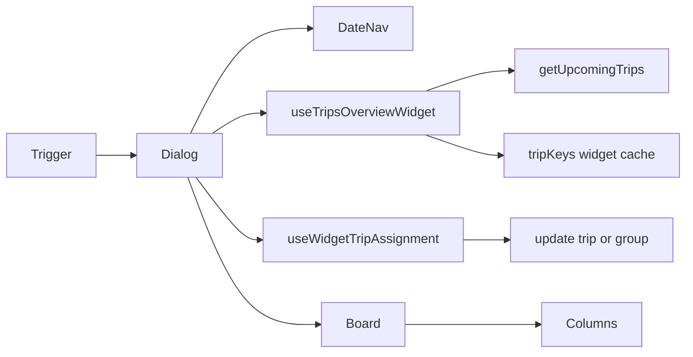

# Trips Overview Widget

**Status:** v1 implemented (header trigger + dialog board, inline reassignment, no DnD).

## Purpose

The **Trips Overview Widget** gives dispatchers a day-scoped Kanban view from anywhere in the admin dashboard. It mounts in the global header (`CalendarClock` icon) and opens a modal with driver columns, inline driver reassignment (immediate save), and Berlin business-day navigation.

It is intentionally **decoupled** from:

- `/dashboard/trips` RSC refresh (`TripsRscRefreshProvider`, `refreshTripsPage`)
- Full Kanban pending-changes flow (`useKanbanPendingStore`)

## Component tree

```
TripsOverviewWidgetTrigger (header)
└── TripsOverviewWidgetDialog
    ├── TripsOverviewWidgetDateNav
    └── TripsOverviewWidgetBoard
        └── TripsOverviewWidgetColumn (× N drivers + „Nicht zugewiesen“)
            ├── KanbanDriverColumnHeader (reused, inert drag)
            ├── TripCard (reused, disableDrag)
            └── WidgetDriverSelect | TripAssigneeBadge (Fremdfirma)
```

**Mount point:** `src/components/layout/header.tsx` — immediately before `PendingAssignmentsPopover`.

## Data flow

| Layer | Module | Responsibility |
|-------|--------|----------------|
| Query | `useTripsOverviewWidget(dateYmd)` | TanStack Query key `[...tripKeys.all, 'widget', dateYmd]`; fetches via `tripsService.getUpcomingTrips` with Berlin day bounds |
| Realtime | `trips-overview-widget-sync` channel | Debounced invalidation via `createDebouncedInvalidateByQueryKey` |
| Mutation | `useWidgetTripAssignment()` | `buildAssignmentPatch` + group `.eq('group_id', …)` or `tripsService.updateTrip` |
| Columns | `buildWidgetColumns` / `buildWidgetItemsByColumn` | Adapter over `buildColumns`; Fremdfirma → „Nicht zugewiesen“ |



## Badge count

The header trigger always queries **today** (Berlin YMD). The badge shows:

```ts
trips.filter((t) => t.status !== 'cancelled').length
```

Only `cancelled` trips are excluded.

## Fremdfirma handling

Unlike the full Fahrten Kanban (which hides Fremdfirma trips), the widget **shows** them in the „Nicht zugewiesen“ column:

- `resolveWidgetColumnId()` routes `fremdfirma_id != null` → `unassigned`
- `tripsForColumnDefinitions()` clears `driver_id` before `buildColumns` so orphan driver buckets are not created
- Cards are read-only with `TripAssigneeBadge` (`Extern · …`)

## v1 constraints

- **No drag-and-drop reassignment** — board uses `<DndContext sensors={[]}>` only because `TripCard` still calls `useDraggable` / `useDroppable`
- **No column reordering**
- **No time / stop-order / ungroup saves** from the widget (noop callbacks on `TripCard`)
- **Backdrop click does not close** the dialog (`onInteractOutside` prevented); Escape still closes

## v2 DnD integration guide

1. Replace inert `DndContext` in `trips-overview-widget-board.tsx` with sensors + `collisionDetection` (mirror main Kanban).
2. Implement `onDragEnd` in the board — call `useWidgetTripAssignment().assignDriver({ trip, newDriverId })` for column drops (same patch path as the select).
3. Reuse `KanbanDragPreview` / column drop targets if desired; do **not** import `useKanbanPendingStore`.
4. Add keyboard DnD accessibility (`KeyboardSensor`) per `@dnd-kit` docs.
5. Optional: wire `TripCard` time/stop handlers to immediate-save mutations if product requires parity with full Kanban.

## Key files

| File | Role |
|------|------|
| `src/features/trips/hooks/use-trips-overview-widget.ts` | Date-scoped query + realtime |
| `src/features/trips/hooks/use-widget-trip-assignment.ts` | Immediate assignment mutation |
| `src/features/trips/lib/widget-columns.ts` | Column adapter + Fremdfirma routing |
| `src/features/trips/components/trips-overview-widget/*` | UI shell |

## Related docs

- [Kanban view](../kanban-view.md)
- [Trips date filter](../trips-date-filter.md)
- Audit (pre-implementation): [trips-widget-audit.md](../plans/trips-widget-audit.md), [trips-widget-audit-2.md](../plans/trips-widget-audit-2.md)
