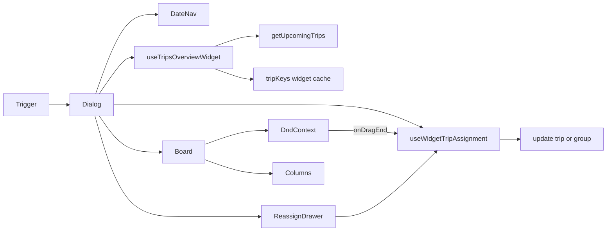

# Trips Overview Widget

**Status:** v2 implemented (header trigger + dialog board, DnD reassignment on desktop, tap-to-drawer on narrow viewports).

## Purpose

The **Trips Overview Widget** gives dispatchers a day-scoped Kanban view from anywhere in the admin dashboard. It mounts in the global header (`CalendarClock` icon) and opens a modal with driver columns, drag-and-drop driver reassignment (immediate save), and Berlin business-day navigation.

It is intentionally **decoupled** from:

- `/dashboard/trips` RSC refresh (`TripsRscRefreshProvider`, `refreshTripsPage`)
- Full Kanban pending-changes flow (`useKanbanPendingStore`)

## Component tree

```
TripsOverviewWidgetTrigger (header)
└── TripsOverviewWidgetDialog
    ├── TripsOverviewWidgetDateNav
    ├── WidgetDriverFilter (column visibility)
    ├── TripsOverviewWidgetBoard
    │   ├── DndContext (MouseSensor + TouchSensor, pointerWithin)
    │   ├── DragOverlay → KanbanDragPreview
    │   └── TripsOverviewWidgetColumn (× N drivers + „Nicht zugewiesen“)
    │       ├── KanbanDriverColumnHeader (reused, inert drag)
    │       ├── useDroppable column body (ring on isOver)
    │       ├── TripCard (draggable when not Fremdfirma / not grouped)
    │       └── TripAssigneeBadge (Fremdfirma read-only)
    └── TripsOverviewWidgetReassignDrawer (narrow viewport tap fallback)
```

**Mount point:** `src/components/layout/header.tsx` — immediately before `PendingAssignmentsPopover`.

## Data flow

| Layer | Module | Responsibility |
|-------|--------|----------------|
| Query | `useTripsOverviewWidget(dateYmd)` | TanStack Query key `[...tripKeys.all, 'widget', dateYmd]`; fetches via `tripsService.getUpcomingTrips` with Berlin day bounds |
| Realtime | `trips-overview-widget-sync` channel | Debounced invalidation via `createDebouncedInvalidateByQueryKey` |
| Mutation | `useWidgetTripAssignment()` | `buildAssignmentPatch` + group `.eq('group_id', …)` or `tripsService.updateTrip` |
| Columns | `buildWidgetColumns` / `buildWidgetItemsByColumn` / `resolveWidgetColumnId` | Adapter over `buildColumns`; Fremdfirma → „Nicht zugewiesen“ |



## Fremdfirma handling

Unlike the full Fahrten Kanban (which hides Fremdfirma trips), the widget **shows** them in the „Nicht zugewiesen“ column:

- `resolveWidgetColumnId()` routes `fremdfirma_id != null` → `unassigned`
- `tripsForColumnDefinitions()` clears `driver_id` before `buildColumns` so orphan driver buckets are not created
- Cards are read-only with `TripAssigneeBadge` (`Extern · …`) — not draggable, not tappable for reassignment

## v2 — Drag-and-Drop Reassignment

### Desktop (md+)

- `TripsOverviewWidgetBoard` uses `DndContext` with `MouseSensor` (distance 5) and `TouchSensor` (delay 120 ms, tolerance 8) — identical to full Kanban
- `collisionDetection={pointerWithin}`; column bodies are drop targets via `useDroppable({ id: column.id })`
- `onDragEnd` resolves target column (including `trip-{id}` card droppables via `resolveWidgetColumnId`) and calls `useWidgetTripAssignment().assignDriver` immediately — no pending store
- `DragOverlay` + `KanbanDragPreview` for drag feedback; `groupLabels={{}}` is safe because preview only reads `groupLabels` when `activeId.startsWith('group-')` (widget v2 drags plain trip UUIDs only)

### Mobile (narrow, &lt;768px)

- Card tap opens `TripsOverviewWidgetReassignDrawer` (bottom Drawer + driver `Select`)
- Same `useWidgetTripAssignment` mutation path as DnD
- Desktop `handleCardClick` is a no-op — drag is the primary interaction

### Not draggable in v2

| Case | Reason |
|------|--------|
| Fremdfirma trips | Reassignment requires clearing Fremdfirma fields — out of widget scope |
| Grouped trips (`group_id` set) | Individual card drag would break group integrity; group drag deferred to v3 |

### Modal scroll risk

The board scrolls horizontally inside a Radix `Dialog`. If touch scroll competes with drag activation, increase `TouchSensor` delay to 200–250 ms in `trips-overview-widget-board.tsx` (see audit).

### Deferred to v3

- Group drag (`GroupedTripsContainer` / `group-{id}` active ids)
- Column reordering
- Keyboard DnD (`KeyboardSensor`)

## Remaining v1 constraints

- **No time / stop-order / ungroup saves** from the widget (noop callbacks on `TripCard`)
- **Backdrop click does not close** the dialog (`onInteractOutside` prevented); Escape still closes

## Key files

| File | Role |
|------|------|
| `src/features/trips/hooks/use-trips-overview-widget.ts` | Date-scoped query + realtime |
| `src/features/trips/hooks/use-widget-trip-assignment.ts` | Immediate assignment mutation |
| `src/features/trips/lib/widget-columns.ts` | Column adapter + `resolveWidgetColumnId` |
| `src/features/trips/components/trips-overview-widget/*` | UI shell (board, column, dialog, reassign drawer) |

## Related docs

- [Kanban view](../kanban-view.md)
- [Trips date filter](../trips-date-filter.md)
- v2 DnD audit: [trips-widget-v2-dnd-audit.md](../plans/trips-widget-v2-dnd-audit.md)
- v1 audits: [trips-widget-audit.md](../plans/trips-widget-audit.md), [trips-widget-audit-2.md](../plans/trips-widget-audit-2.md)
