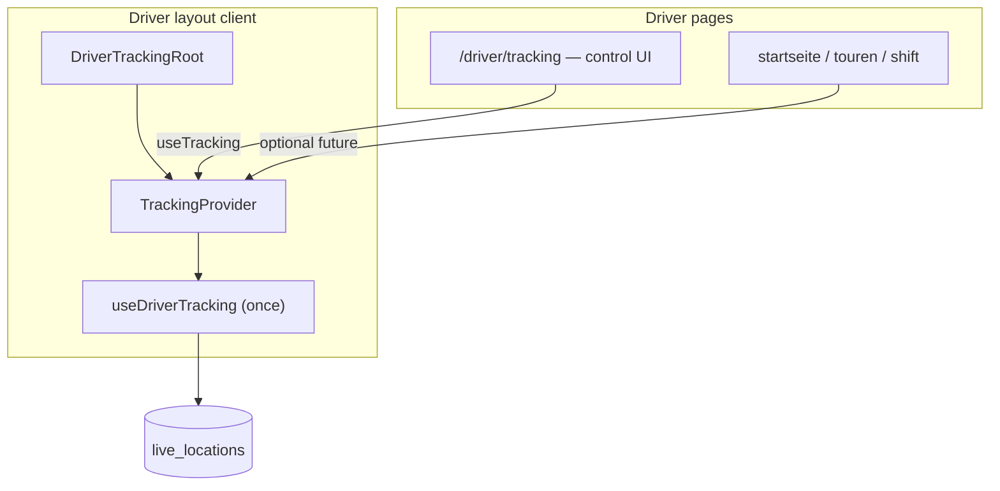

# Driver Location Tracking

> See [access-control.md](../access-control.md) for RLS and route guards.

## Purpose

Phase 1 provides continuous GPS tracking for drivers and a dispatcher fleet map:

- **Drivers:** `watchPosition` runs in the **driver layout** (`DriverTrackingRoot` / `TrackingContext`) on all `/driver/*` routes after consent
- **Drivers:** `/driver/tracking` — **control screen only** (consent, start/stop, speed/accuracy display); navigating away does not stop GPS
- **Admins:** `/dashboard/fleet` — Leaflet map with `postgres_changes` on `live_locations`

## Phase roadmap

| Phase | Scope |
| --- | --- |
| **1 (current)** | `live_locations` upsert, `postgres_changes`, Leaflet, NoSleep, sessionStorage consent |
| **2 (deferred)** | Realtime Broadcast (sub-second), PWA manifest/service worker, `tracking_consented` on `accounts`, route replay UI, geofencing, push notifications, background tracking |

## Data flow

```text
Driver taps "Tracking starten" on /driver/tracking
  → sessionStorage consent
  → TrackingContext.trackingEnabled = true (layout)
  → useDriverTracking (single mount in TrackingProvider)
  → watchPosition (browser) on any /driver/* page
  → throttle 5 s → upsert live_locations (driver_id PK)
  → Supabase Realtime postgres_changes
  → useFleetMap (admin) → FleetMap markers
```



## Schema: `live_locations`

| Column | Type | Notes |
| --- | --- | --- |
| `driver_id` | uuid PK | FK → `accounts.id` |
| `company_id` | uuid | FK → `companies.id`, tenant scope |
| `lat`, `lng` | double precision | Required on write |
| `speed_kmh` | numeric(5,1) | Nullable (m/s × 3.6) |
| `accuracy_m` | numeric(6,1) | Nullable (Geolocation accuracy) |
| `updated_at` | timestamptz | Set on each upsert |

Migration: `supabase/migrations/20260520120000_live_locations.sql`

Legacy columns (`status`, `vehicle_id`) may still exist in older databases; the Phase 1 app does not write them.

### Upsert strategy

One row per driver: `upsert(..., { onConflict: 'driver_id' })`. History is implicit via `updated_at` (no snapshots table in Phase 1).

### RLS

| Role | Access |
| --- | --- |
| Driver | ALL on own row (`driver_id = auth.uid()`, `company_id` matches helper) |
| Admin | SELECT company rows (`current_user_is_admin()` + `current_user_company_id()`) |

## Code layout

| Path | Role |
| --- | --- |
| `src/lib/tracking/constants.ts` | Tunables, table/channel names, FK embed hint |
| `src/lib/tracking/use-driver-tracking.ts` | `watchPosition` + upsert + NoSleep (called only from `TrackingProvider`) |
| `src/lib/tracking/tracking-context.tsx` | `DriverTrackingRoot`, `TrackingProvider`, `useTracking()` |
| `src/app/driver/layout.tsx` | Server: metadata + role guard; renders `DriverLayoutClient` |
| `src/app/driver/driver-layout-client.tsx` | Client shell: header + `DriverTrackingRoot` |
| `src/lib/tracking/use-fleet-map.ts` | Initial fetch + realtime + `DriverPosition` |
| `src/app/driver/tracking/page.tsx` | Consent + start/stop + status UI (no direct hook) |
| `src/components/fleet/fleet-map.tsx` | Leaflet (client-only) |
| `src/app/dashboard/fleet/page.tsx` | Admin fleet page |

PostgREST embed for driver names: `accounts!live_locations_driver_id_fkey` (see `TRACKING_ACCOUNTS_FK` in constants).

## Known Phase 1 limitations

1. **Update latency ~5 s** — driven by upsert throttle, not Broadcast.
2. **Foreground tracking** — tab must stay active; no service worker / background GPS. Tracking persists across `/driver/*` navigation but stops when the layout unmounts (leave driver app).
3. **sessionStorage consent** — not stored in DB. **iOS Safari** may clear `sessionStorage` after the tab is backgrounded for a long time; the driver may need to tap **"Tracking starten"** again (GPS permission usually remains).
4. **Offline detection** — no disconnect event in DB; admins see drivers as offline when `updated_at` is older than 60 s (`TRACKING_OFFLINE_AFTER_MS`).
5. **NoSleep** — best-effort screen wake; requires user gesture to enable.

## Phase 2 upgrade path

- Add `tracking_consented` on `accounts` (or sync consent to DB).
- Optional `localStorage` + migration for consent recovery.
- Supabase **Broadcast** channel for sub-second map updates without changing the upsert table.
- PWA install + manifest for home-screen use.
- Position history table if route replay is required.

Phase 1 clients can keep using `live_locations` + `postgres_changes`; Broadcast can be additive on the admin side.
