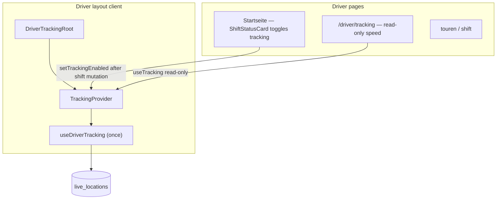

# Driver Location Tracking

> See [access-control.md](../access-control.md) for RLS and route guards.

## Purpose

Phase 1 provides continuous GPS tracking for drivers and a dispatcher fleet map:

- **Drivers:** `watchPosition` runs in the **driver layout** (`DriverTrackingRoot` / `TrackingContext`) automatically while shift status is `active` or `on_break`
- **Drivers:** `/driver/tracking` — **read-only** speed and GPS accuracy display (no nav entry; URL still works)
- **Admins:** `/dashboard/fleet` — Leaflet map with driver initial pins (grey / green / red), toolbar (subtitle, address search, online driver badges), and `postgres_changes` on `live_locations` + `trips`

## Consent

Tracking uses **implicit consent** on company-owned driver devices. There is no consent dialog, no sessionStorage flag, and no `tracking_consented` column. GPS starts when the driver begins a shift (or resumes with an active shift on reload). The browser may still prompt for geolocation permission on first use.

## Phase roadmap

| Phase | Scope |
| --- | --- |
| **1 (current)** | Shift-tied tracking, `live_locations` upsert, `postgres_changes`, Leaflet, NoSleep |
| **2 (deferred)** | Realtime Broadcast (sub-second), PWA manifest/service worker, route replay UI, geofencing, push notifications, background tracking |

## Data flow

```text
Driver taps "Schicht starten" on Startseite (ShiftStatusCard)
  → shifts row created (status active)
  → setTrackingEnabled(true) in ShiftStatusCard (after DB success)
  → useDriverTracking (layout) → watchPosition
  → throttle 5 s → upsert live_locations (driver_id PK)
  → Supabase Realtime postgres_changes (live_locations)
  → useFleetMap (admin) → FleetMap markers

Driver taps "Schicht beenden"
  → shifts.status → ended
  → setTrackingEnabled(false)
  → GPS stops; live_locations row ages out on fleet map (~60 s)

Layout reload with active shift
  → DriverTrackingRoot: getActiveShift → isShiftTrackable → tracking on

Driver taps Tour starten / Tour beenden
  → trips.status UPDATE (in_progress / completed)
  → useFleetMap updates is_busy immediately (no GPS tick required)
```

### Shift statuses that enable tracking

Defined in `TRACKING_ACTIVE_SHIFT_STATUSES` ([`constants.ts`](../../src/lib/tracking/constants.ts)):

| Status | Tracking |
| --- | --- |
| `active` | On |
| `on_break` | On (dispatcher sees location during breaks) |
| `ended` / no shift | Off |

Helper: `isShiftTrackable(status)`.

### `DriverPosition` (fleet map)

| Field | Meaning |
| --- | --- |
| `is_online` | `updated_at` within `TRACKING_OFFLINE_AFTER_MS` (60 s) |
| `is_busy` | Driver has an active tour: `trips.status` in `TRACKING_BUSY_TRIP_STATUSES` (`in_progress`, `driving`). Offline drivers always show `is_busy: false` on the map (grey icon). |

Busy state is loaded from a company-scoped `trips` query on init and kept in sync via a second realtime channel (`TRACKING_TRIPS_REALTIME_CHANNEL`).



## Schema: `live_locations`

| Column | Type | Notes |
| --- | --- | --- |
| `driver_id` | uuid PK | FK → `accounts.id` |
| `company_id` | uuid | FK → `companies.id`, tenant scope |
| `lat`, `lng` | double precision | Required on write |
| `speed_kmh` | numeric(5,1) | Nullable (m/s × 3.6) |
| `accuracy_m` | numeric(6,1) | Nullable (Geolocation accuracy) |
| `updated_at` | timestamptz | Set on each upsert |

Migration: `supabase/migrations/20260520120000_live_locations.sql`

### Upsert strategy

One row per driver: `upsert(..., { onConflict: 'driver_id' })`. History is implicit via `updated_at` (no snapshots table in Phase 1).

### RLS

| Role | Access |
| --- | --- |
| Driver | ALL on own row (`driver_id = auth.uid()`, `company_id` matches helper) |
| Admin | SELECT company rows (`current_user_is_admin()` + `current_user_company_id()`) |

## Code layout

| Path | Role |
| --- | --- |
| `src/lib/tracking/constants.ts` | Tunables, `TRACKING_ACTIVE_SHIFT_STATUSES`, `TRACKING_BUSY_TRIP_STATUSES`, FK embed hint |
| `src/lib/tracking/use-driver-tracking.ts` | `watchPosition` + upsert + NoSleep (called only from `TrackingProvider`) |
| `src/lib/tracking/tracking-context.tsx` | Profile + shift bootstrap, `TrackingProvider`, `useTracking()` |
| `src/features/driver-portal/components/startseite/shift-status-card.tsx` | Shift mutations → `setTrackingEnabled` / `setShiftStatus` |
| `src/app/driver/layout.tsx` | Server: metadata + role guard; renders `DriverLayoutClient` |
| `src/app/driver/driver-layout-client.tsx` | Client shell: header + `DriverTrackingRoot` |
| `src/lib/tracking/use-fleet-map.ts` | Initial fetch + dual realtime (`live_locations`, `trips`) + `DriverPosition` |
| `src/features/fleet/components/fleet-page-content.tsx` | Fleet toolbar (subtitle, address search, online badges) + dynamic `FleetMap` ref |
| `src/components/fleet/fleet-map.tsx` | Leaflet pins + route polylines; `FleetMapHandle` (flyTo, search pin, setRoutes) |
| `src/app/api/fleet/routes/route.ts` | Admin batch Directions proxy for fleet routing polylines |
| `src/app/dashboard/fleet/page.tsx` | Admin fleet page shell (`PageContainer`, title only) |
| `src/app/driver/tracking/page.tsx` | Read-only speed/accuracy UI |

PostgREST embed for driver names: `accounts!live_locations_driver_id_fkey` (see `TRACKING_ACCOUNTS_FK` in constants).

## Fleet page UI

`/dashboard/fleet` renders `FleetPageContent` inside a non-scrollable `PageContainer` (title **Flottenübersicht** only; subtitle lives in the toolbar).

### Toolbar

Two rows above the map:

1. **Subtitle + address search** — muted subtitle (“Aktuelle Positionen Ihrer Fahrer (ca. 2 Sek. Aktualisierung).”) and `AddressAutocomplete` (`w-72`, placeholder “Adresse auf Karte suchen...”).
2. **Online driver badges** — one chip per online driver (green = free, red = busy). Offline drivers appear as grey pins on the map only, not in the badge row. Empty state: “Keine Fahrer online”.

| Action | Map behaviour |
| --- | --- |
| Badge click | `flyTo(driver.lat, driver.lng, 16)` |
| Address select | `flyTo(result.lat, result.lng, 15)` + search pin + fetch routes for all online drivers |
| Clear search (×) | Clear input, remove search pin and all route polylines/labels; map view unchanged |

`FleetPageContent` holds a `ref` to the dynamically imported `FleetMap` (`.then(mod => mod.default)` so `forwardRef` is preserved).

### Driver routing (address search)

When an admin selects an address from the fleet search field:

1. `POST /api/fleet/routes` runs for **every online driver** (busy and free — no filter on `is_busy`).
2. Each successful route draws a coloured polyline (driver → destination) and a travel-time pill at the polyline midpoint.
3. Per-driver Google failure returns `{ durationSeconds: null, polylinePoints: [] }` — **no polyline and no label** for that driver (partial success; other drivers still render).
4. Routes and the indigo search pin clear when the admin presses **×**; the map pan/zoom is not reset.

Loading state: muted text “Routen werden berechnet…” below the toolbar while the batch request is in flight.

### `POST /api/fleet/routes`

Admin-only (`requireAdmin()`). Proxies Google Directions via `getRoutePolyline` (no DB cache).

**Request:**

```json
{
  "drivers": [{ "driver_id": "…", "name": "…", "lat": 53.14, "lng": 8.21 }],
  "destLat": 53.15,
  "destLng": 8.22
}
```

**Response:**

```json
{
  "routes": [{
    "driver_id": "…",
    "name": "…",
    "durationSeconds": 420,
    "polylinePoints": [{ "lat": 53.14, "lng": 8.21 }]
  }]
}
```

Uses `GOOGLE_MAPS_API_KEY` (Directions API). Parallel `Promise.all` per driver (max 20 in Zod schema).

### Fleet map imperative API

`FleetMap` is a `forwardRef` component exporting:

```typescript
export interface FleetMapHandle {
  flyTo: (lat: number, lng: number, zoom?: number) => void;
  setSearchPin: (lat: number, lng: number, label: string) => void;
  clearSearchPin: () => void;
  setRoutes: (routes: DriverRoute[]) => void;
  clearRoutes: () => void;
}
```

- Smooth pan via Leaflet `map.flyTo` (animate, 0.8 s duration). Default zoom **15** when omitted.
- `setSearchPin` / `clearSearchPin` — indigo destination marker.
- `setRoutes` clears previous route layers first, then draws polylines + midpoint labels. Skips drivers with empty `polylinePoints` entirely (single early return per driver).
- `clearRoutes` removes all route polylines and time labels.
- Driver marker loop, auto-`fitBounds` on online count change, pin colours, and popups are unchanged.

## Known Phase 1 limitations

1. **Position update latency ~5 s** — driven by GPS upsert throttle, not Broadcast. **Busy icon color** updates on `trips` UPDATE (Tour starten / Tour beenden), typically immediate.
2. **Foreground tracking** — tab must stay active; no service worker / background GPS. Tracking persists across `/driver/*` navigation but stops when the layout unmounts (leave driver app).
3. **No shift realtime** — tracking toggles on Startseite mutations and layout bootstrap; no `postgres_changes` on `shifts`.
4. **Offline detection** — no disconnect event in DB; admins see drivers as offline when `updated_at` is older than 60 s (`TRACKING_OFFLINE_AFTER_MS`).
5. **NoSleep** — best-effort screen wake; requires user gesture to enable.

## Phase 2 upgrade path

- Supabase **Broadcast** channel for sub-second map updates without changing the upsert table.
- PWA install + manifest for home-screen use.
- Position history table if route replay is required.
- Optional shift realtime subscription if multi-tab sync is needed.

Phase 1 clients can keep using `live_locations` + `postgres_changes`; Broadcast can be additive on the admin side.

## Doc backlog

Stale consent references may remain in [`driver-portal.md`](../driver-portal.md) and [`accounts-table.md`](../accounts-table.md) until updated in a follow-up PR.
