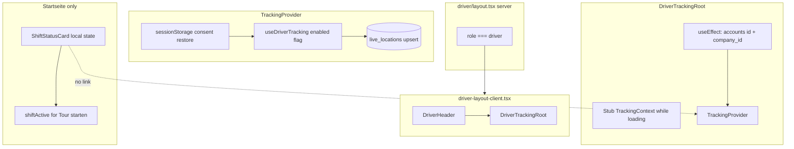

# Audit: Auto-tracking on Shift Status

**Date:** 2026-05-21  
**Mode:** Read-only (no code changes)  
**Scope:** How driver GPS tracking is wired today, how shift status is loaded, and what would need to connect for “auto-start tracking when shift is active.”

---

## Files reviewed

| File | Role |
| --- | --- |
| [`src/app/driver/driver-layout-client.tsx`](../../src/app/driver/driver-layout-client.tsx) | Client layout shell |
| [`src/app/driver/layout.tsx`](../../src/app/driver/layout.tsx) | Server layout (role guard only) |
| [`src/lib/tracking/tracking-context.tsx`](../../src/lib/tracking/tracking-context.tsx) | Profile load, consent restore, `TrackingProvider` |
| [`src/lib/tracking/use-driver-tracking.ts`](../../src/lib/tracking/use-driver-tracking.ts) | `watchPosition` + upsert (called from context) |
| [`src/features/driver-portal/api/shifts.service.ts`](../../src/features/driver-portal/api/shifts.service.ts) | `getActiveShift` and shift mutations |
| [`src/features/driver-portal/components/startseite/shift-status-card.tsx`](../../src/features/driver-portal/components/startseite/shift-status-card.tsx) | Startseite shift UI + local state |
| [`src/features/driver-portal/components/startseite/startseite-page-content.tsx`](../../src/features/driver-portal/components/startseite/startseite-page-content.tsx) | Parent callback for shift gating |
| [`src/app/driver/tracking/page.tsx`](../../src/app/driver/tracking/page.tsx) | Consent + control UI |
| [`src/lib/tracking/constants.ts`](../../src/lib/tracking/constants.ts) | Consent key + tunables |
| [`src/types/database.types.ts`](../../src/types/database.types.ts) | `shifts` table shape |

---

## 1. Layout client structure

### What `driver-layout-client.tsx` does

**It does not load `driverId` or `companyId`.** It is a thin client shell:

```tsx
<DriverHeader />
<DriverTrackingRoot>{children}</DriverTrackingRoot>
```

Profile loading lives entirely in **`DriverTrackingRoot`** ([`tracking-context.tsx`](../../src/lib/tracking/tracking-context.tsx)), not in `driver-layout-client.tsx`.

### Server layout (`layout.tsx`)

Server component only:

- Reads auth user
- Redirects non-`driver` roles to `/dashboard/overview`
- Renders `<DriverLayoutClient>{children}</DriverLayoutClient>`

No `driverId` / `companyId` props are passed from server to client.

### Profile load mechanism (`DriverTrackingRoot`)

| Aspect | Detail |
| --- | --- |
| Pattern | `useEffect` + `useState` (client-side) |
| Query | `supabase.auth.getUser()` → `accounts.select('id, company_id').eq('id', user.id).single()` |
| State | `driverId`, `companyId`, `profileLoading`, `profileError` |

### While profile is loading

`DriverTrackingRoot` still renders **`children`** (header + page content) inside a stub `TrackingContext.Provider`:

| Field | Value during load |
| --- | --- |
| `profileLoading` | `true` |
| `trackingEnabled` | `false` |
| `setTrackingEnabled` | no-op `() => {}` |
| `status` | `'idle'` |
| GPS | **Not running** — `TrackingProvider` / `useDriverTracking` not mounted yet |

There is **no loading spinner at layout level**; pages render normally. Only `/driver/tracking` shows “Laden…” when `profileLoading` is true.

### Duplicate profile fetches

Several driver components independently fetch the same profile on mount:

- `DriverTrackingRoot` — `id`, `company_id`
- `ShiftStatusCard` — `id`, `company_id`
- `StartseitePageContent` — `first_name`, `name`
- Others (`shift-tracker`, `touren-page-content`, etc.) — own fetches

No shared profile context at layout level today.

---

## 2. TrackingProvider wiring

### Mount path

```text
DriverLayoutClient
  └── DriverTrackingRoot          ← loads profile
        └── TrackingProvider      ← only when driverId + companyId OK
              └── {children}      ← all /driver/* pages
```

### Props to `TrackingProvider`

| Prop | Source |
| --- | --- |
| `driverId` | `accounts.id` from profile fetch |
| `companyId` | `accounts.company_id` from profile fetch |
| `children` | Route page content |

### `trackingEnabled` today

1. **Initial state:** `useState(false)` in `TrackingProvider`
2. **Restore on mount:** `useEffect` calls `hasSessionConsent()` → if `sessionStorage[TRACKING_CONSENT_STORAGE_KEY] === '1'`, sets `trackingEnabled` to `true`
3. **User toggle:** `/driver/tracking` page calls `setTrackingEnabled(true|false)` and writes/removes sessionStorage

`useDriverTracking({ driverId, companyId, enabled: trackingEnabled })` runs only inside `TrackingProvider`.

### Context surface (`useTracking()`)

| Field | Meaning |
| --- | --- |
| `trackingEnabled` | User/consent gate for GPS |
| `setTrackingEnabled` | Start/stop from tracking page |
| `status` | `'idle' \| 'tracking' \| 'error'` |
| `error` | Geolocation / upsert error message |
| `lastPosition` | Latest fix (lat, lng, speed, accuracy) |
| `profileLoading` / `profileError` | From `DriverTrackingRoot` bootstrap |

**No shift-related fields** in tracking context today.

---

## 3. Shift status access

### `getActiveShift(driverId)`

**Location:** [`shifts.service.ts`](../../src/features/driver-portal/api/shifts.service.ts) lines 35–47.

**Query:**

```typescript
.from('shifts')
.select('*')
.eq('driver_id', driverId)
.neq('status', SHIFT_STATUSES.ENDED)  // 'ended'
.order('started_at', { ascending: false })
.limit(1)
.maybeSingle()
```

**Return type:** `Promise<Shift | null>`

**`Shift` shape** (`Database['public']['Tables']['shifts']['Row']`):

| Column | Type | Notes |
| --- | --- | --- |
| `id` | string | PK |
| `driver_id` | string \| null | FK → accounts |
| `company_id` | string \| null | FK → companies |
| `status` | string | **`active` \| `on_break` \| `ended`** (see `SHIFT_STATUSES`) |
| `started_at` | string | Required |
| `ended_at` | string \| null | Set on shift end |
| `vehicle_id` | string \| null | |
| `start_odometer` / `end_odometer` | number \| null | |
| `total_distance_km` / `total_earnings` | number \| null | |
| `created_at` | string \| null | |

**Yes — `status` is included** (`select('*')`). A non-null result means the driver has a **non-ended** shift; `status` distinguishes `active` vs `on_break`.

### Hook or context in driver layout tree?

**No.** Shift status is **not** exposed from the layout or tracking context.

| Location | What exists |
| --- | --- |
| Layout / `TrackingContext` | No shift state |
| `ShiftStatusCard` | Local `TrackerState`: `'loading' \| 'idle' \| 'active' \| 'on_break' \| 'ended'` |
| `StartseitePageContent` | Local `shiftActive: boolean` via `onShiftStateChange` callback — **Startseite only** |
| `/driver/shift` (`shift-tracker.tsx`) | Separate mount-time fetch + local state |

`onShiftStateChange` fires when card state changes:

```typescript
setShiftActive(state === 'active' || state === 'on_break')
```

Used only to gate **Tour starten** on Startseite — not wired to GPS tracking.

---

## 4. Shift status realtime

**Shift status is not kept live via Supabase Realtime.**

- No `postgres_changes` subscription on `shifts` or `shift_events` anywhere under `src/`
- No Broadcast channel for shifts
- `ShiftStatusCard` loads once on mount (`useEffect` with `[]` deps), then updates **only from local actions** (start shift, pause, end break, end shift)
- Navigating away and back to Startseite re-runs the mount fetch; there is no cross-tab sync

**Implication for auto-tracking:** If tracking were tied to shift status, either:

1. Subscribe to `shifts` UPDATE for the driver (new realtime channel), or  
2. Call `setTrackingEnabled` from the same handlers that mutate shift state (`handleStartShift`, `handleEndShift`, etc.), or  
3. Lift shift state into layout context and update it from those handlers

Today none of these exist for tracking.

---

## 5. `/driver/tracking` page

**Role:** Control screen only — GPS runs in layout via `TrackingProvider`, not on this page.

### Renders (in order)

| Section | Content |
| --- | --- |
| Profile gate | “Laden…” or error + link to Startseite |
| **Consent gate** (if no sessionStorage consent) | GDPR copy, “Tracking starten”, “Ablehnen” link |
| **Active UI** (after consent) | Pulsing green/grey status dot + “Tracking aktiv/inaktiv” |
| **Speed display** | Large monospace `lastPosition.speed_kmh` km/h |
| **Accuracy** | “Genauigkeit: X m” when available |
| **Error** | Geolocation/upsert error when `status === 'error'` |
| **Controls** | “Tracking beenden” or “Tracking fortsetzen” |

### Worth keeping?

| Feature | Keep? | Reason |
| --- | --- | --- |
| GDPR consent copy + first-time gate | **Yes** (legal/UX) unless consent moves elsewhere |
| Speed + accuracy live readout | **Useful** | Only place driver sees live GPS feedback |
| Manual stop (“Tracking beenden”) | **Product decision** | Conflicts with pure auto-on-shift unless overridden |
| Status indicator | **Optional** | Redundant if tracking is implicit during shift |

The page is **not purely a toggle** — it provides **live speed/accuracy feedback** worth preserving or relocating if auto-tracking removes the need for a dedicated visit.

---

## 6. `TRACKING_CONSENT_STORAGE_KEY`

**Definition:** [`constants.ts`](../../src/lib/tracking/constants.ts)

```typescript
export const TRACKING_CONSENT_STORAGE_KEY = 'taxigo_tracking_consent_v1';
```

**Storage:** `sessionStorage` only (not DB, not `localStorage`).

### Application code references

| File | Read | Write | Remove |
| --- | --- | --- | --- |
| [`src/lib/tracking/constants.ts`](../../src/lib/tracking/constants.ts) | — | defines key | — |
| [`src/lib/tracking/tracking-context.tsx`](../../src/lib/tracking/tracking-context.tsx) | `getItem === '1'` in `hasSessionConsent()` on `TrackingProvider` mount | — | — |
| [`src/app/driver/tracking/page.tsx`](../../src/app/driver/tracking/page.tsx) | `hasSessionConsent()` on mount | `'1'` on consent start + “Tracking fortsetzen” | on “Tracking beenden” |

**Flow:**

```text
First visit / no key
  → tracking page shows consent UI
  → user taps "Tracking starten"
  → sessionStorage.setItem(key, '1') + setTrackingEnabled(true)

Return visit (same tab/session)
  → TrackingProvider useEffect reads key → trackingEnabled true automatically
  → tracking page skips consent gate if consented

User taps "Tracking beenden"
  → removeItem(key) + setTrackingEnabled(false)
```

**Not referenced in:** `ShiftStatusCard`, `shifts.service`, fleet map, driver header.

---

## Architecture diagram (current)



---

## Senior summary for auto-tracking design

### What works today

- GPS already runs **layout-wide** once `trackingEnabled` is true — no need to stay on `/driver/tracking`
- `driverId` + `companyId` are available in `TrackingProvider` after profile load
- Shift mutations already update `shifts.status` (`active` → `on_break` → `active` → `ended`)

### Gaps for “auto-track when shift active”

| Gap | Detail |
| --- | --- |
| **No shift ↔ tracking link** | `setTrackingEnabled` only tied to sessionStorage + tracking page |
| **No layout-level shift state** | Shift known only inside `ShiftStatusCard` / Startseite callback |
| **No shift realtime** | Other tabs/devices won’t sync; remount re-fetches |
| **Consent still manual** | First GPS requires explicit consent on tracking page (or new flow) |
| **Duplicate profile loads** | Auto-tracking in layout may want one shared profile/shift bootstrap |

### Suggested integration points (implementation hints only)

1. **`TrackingProvider` or `DriverTrackingRoot`** — after consent exists, set `trackingEnabled` when `getActiveShift` returns `status IN ('active', 'on_break')`, clear when shift ends or absent.
2. **`ShiftStatusCard` handlers** — call `setTrackingEnabled(true)` on `handleStartShift`, `false` on `handleEndShift` (optional: keep running on `on_break` — product choice).
3. **Consent** — still need one-time GDPR acceptance before first auto-start; could show on first shift start instead of visiting `/driver/tracking`.
4. **Realtime (optional)** — `shifts` UPDATE subscription on `driver_id=eq.{id}` if shift can end from another device (unlikely in v1).

### Open product questions

1. Should tracking **stop on break** (`on_break`) or keep running?
2. Should driver retain **manual stop** on tracking page during an active shift?
3. Should **first consent** happen on Schicht starten instead of a separate Standort page?

---

## Reference index

| Topic | Primary file |
| --- | --- |
| Layout shell | `src/app/driver/driver-layout-client.tsx` |
| Profile + tracking mount | `src/lib/tracking/tracking-context.tsx` |
| GPS implementation | `src/lib/tracking/use-driver-tracking.ts` |
| Active shift query | `src/features/driver-portal/api/shifts.service.ts` → `getActiveShift` |
| Shift UI + local state | `src/features/driver-portal/components/startseite/shift-status-card.tsx` |
| Consent UI | `src/app/driver/tracking/page.tsx` |
| Consent key | `src/lib/tracking/constants.ts` → `TRACKING_CONSENT_STORAGE_KEY` |
| Shift status enum | `src/features/driver-portal/types.ts` → `SHIFT_STATUSES` |
