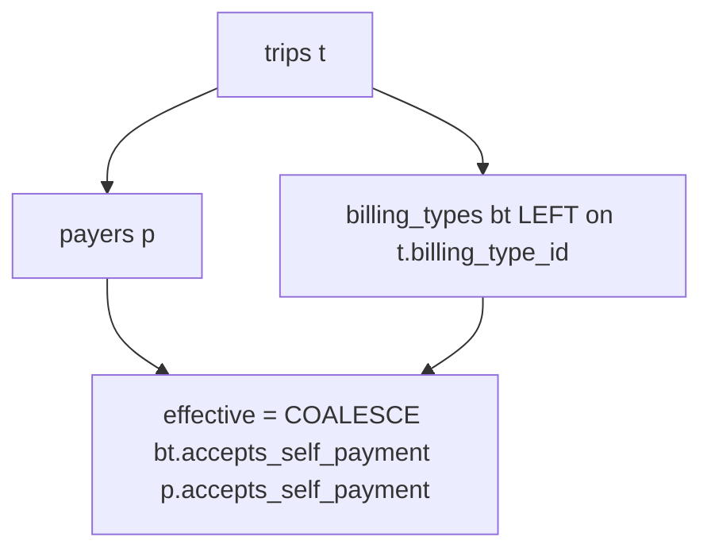

# Plan: `billing_types.accepts_self_payment` + Selbstzahler resolver

## Critical correction: RPC must keep single row per day

The SQL sketch in the request **changes `GROUP BY` to include `sr.id`, account fields, and `sr.confirmed_at`**, and replaces `BOOL_OR` / `MAX(...)` with non-aggregated expressions. That would **not** match the current contract of **one aggregate row per calendar day** and can yield **multiple rows per day** or wrong reconciliation fields.

**Keep the exact aggregation shape** from [supabase/migrations/20260502120000_get_shift_day_summaries.sql](supabase/migrations/20260502120000_get_shift_day_summaries.sql):

- `LEFT JOIN public.billing_types bt ON bt.id = t.billing_type_id`
- Replace every `p.accepts_self_payment` in `FILTER` / `WHERE`-like expressions with:  
  `COALESCE(bt.accepts_self_payment, p.accepts_self_payment)`  
  (this is the only SQL “effective self-pay” expression, per your hard rules)
- **Unchanged:** `BOOL_OR(sr.id IS NOT NULL)`, `MAX(CASE ... END)` for `reconciled_by_name`, `MAX(sr.confirmed_at)`, `GROUP BY` **only** `(t.scheduled_at AT TIME ZONE 'Europe/Berlin')::date`, `ORDER BY shift_date DESC`
- **Preserve** `GRANT EXECUTE` and **extend** `COMMENT ON FUNCTION` to document `COALESCE` and null handling

When `t.billing_type_id` is null, `bt` is missing → `bt.accepts_self_payment` is null → `COALESCE` uses payer (same as your invariant).

**Unconfigured semantics:** `unconfigured_count` counts rows where `COALESCE(...) IS NULL` — i.e. **both** family (or missing family with null column) and payer are null in the **effective** sense. With only inherit-at-family, family column null + payer set → **not** unconfigured (matches your rule).

---

## Step 1 — Migration

New file: `supabase/migrations/<timestamp>_billing_type_accepts_self_payment.sql`

1. `ALTER TABLE public.billing_types ADD COLUMN IF NOT EXISTS accepts_self_payment boolean DEFAULT NULL;` + `COMMENT` (as specified).
2. `CREATE OR REPLACE` `get_shift_day_summaries` with **`LEFT JOIN billing_types`**, `COALESCE` in all trip-classifying filters, **same** `GROUP BY` / `BOOL_OR` / `MAX` as current file; re-apply `GRANT` + updated `COMMENT`.

**Build:** `bun run build`

---

## Step 2 — Generated types

In [src/types/database.types.ts](src/types/database.types.ts), add `accepts_self_payment` to `billing_types` `Row` / `Insert` / `Update` (with TODO to regenerate from CLI when possible).

**Build:** `bun run build`

---

## Step 3 — Resolver

Add [src/features/trips/lib/resolve-accepts-self-payment.ts](src/features/trips/lib/resolve-accepts-self-payment.ts) with `resolveAcceptsSelfPayment(billingTypeValue, payerValue)` as specified (non-null / non-undefined family value wins; else payer; else `null`). **Invariant:** for “no `billing_type_id`”, the caller passes `undefined` (or `null`); both fall through to payer — **not** an error.

**Build:** `bun run build`

---

## Step 4 — Schichtzettel types + all classification entry points

[docs/plans/billing-types-selbstzahler-audit.md](docs/plans/billing-types-selbstzahler-audit.md) and your hard rules require **no** direct `payer.accepts_self_payment` reads in Schichtzettel UI.

1. [src/features/shift-reconciliations/types.ts](src/features/shift-reconciliations/types.ts):
   - Extend `ShiftTrip` with `billing_type_accepts_self_payment: boolean | null` (or `| undefined` if you want explicit “no embed” — then normalize in the mapper; resolver already treats `undefined` like missing tier-1).
   - Update `isSelfPay` / `isUnconfiguredPayer` to use `resolveAcceptsSelfPayment`.
   - Add a small **exported** helper for “invoice” rows if useful, e.g. `isInvoiceTrip(t)`: effective value is strictly `false` (avoids duplicating logic). Otherwise inline `resolveAcceptsSelfPayment(...) === false` in one place only.

2. [src/features/shift-reconciliations/components/shift-summary-bar.tsx](src/features/shift-reconciliations/components/shift-summary-bar.tsx) (currently line **37** uses `t.payer.accepts_self_payment === false`) — **must** switch to the same resolver / `isInvoiceTrip` so list totals stay consistent with [types.ts](src/features/shift-reconciliations/types.ts).

3. Grep the feature folder after edits to ensure **no** remaining `payer.accepts_self_payment` reads outside the mapped `payer` object and helpers.

**Build:** `bun run build`

---

## Step 5 — `getTripsForShift`

In [src/features/shift-reconciliations/api/shift-reconciliations.service.ts](src/features/shift-reconciliations/api/shift-reconciliations.service.ts):

- Add `billing_type_id` to the select only if needed for typing/debug; per your spec, **do not** put `billing_type_id` on `ShiftTrip` — only pass through `accepts_self_payment` from:  
  `billing_types!trips_billing_type_id_fkey(accepts_self_payment)` (use a **left** relationship so null `billing_type_id` does not drop rows; in PostgREST this is typically a **separate** embed name from `!inner` — mirror existing patterns in the repo such as [trips.service.ts](src/features/trips/api/trips.service.ts) which uses `!fkey` without `inner` for optional links).
- Map `billing_type_accepts_self_payment` from the embedded row; short **why-comment** on null vs missing object as you specified.

**Build:** `bun run build`

---

## Step 6 — Payers: data + family edit UI

**Placement:** The “Abrechnungsfamilie bearbeiten” form is **[edit-billing-family-dialog.tsx](src/features/payers/components/edit-billing-family-dialog.tsx)** (opened from [payer-details-sheet.tsx](src/features/payers/components/payer-details-sheet.tsx) — the sheet only lists families). Implement the **tri-state Select** (Vererben / Selbstzahler / Rechnung) **here** next to existing family fields (name, Rechnungsempfänger, pricing, color) for consistent layout.

1. [src/features/payers/types/payer.types.ts](src/features/payers/types/payer.types.ts) — add `accepts_self_payment` to the billing family type that backs `BillingFamilyWithVariants` (if not already on the row type used there).

2. [src/features/payers/api/payers.service.ts](src/features/payers/api/payers.service.ts) — add column to `getBillingFamiliesWithVariants` `select`; extend `updateBillingFamily` to accept optional `accepts_self_payment: boolean | null` and pass into `.update()`.

3. [src/features/payers/hooks/use-billing-types.ts](src/features/payers/hooks/use-billing-types.ts) — extend `updateFamilyMutation` / `PayersService.updateBillingFamily` call signature.

4. [src/features/payers/components/edit-billing-family-dialog.tsx](src/features/payers/components/edit-billing-family-dialog.tsx) — Zod + form default/reset from `family.accepts_self_payment`, submit to `updateBillingFamily`.

**Build:** `bun run build`

---

## Step 7 — Docs

- [docs/shift-reconciliations.md](docs/shift-reconciliations.md) — update “Data model” and any “derives from payer only” text to the **COALESCE / resolver** story; add deferred `billing_variants` note; Rückfahrt / null `billing_type_id` note.
- [docs/plans/billing-types-selbstzahler-audit.md](docs/plans/billing-types-selbstzahler-audit.md) — “Plan status: implemented” + date (per request).
- Inline comments: resolver, migration (COALESCE + unconfigured), mapper in service (as specified).

**Final:** `bun run build` and `bun test`.

Add a unit test file at `src/features/trips/lib/__tests__/resolve-accepts-self-payment.test.ts`. This test is mandatory — not optional. The resolver is a pure function that underpins the entire feature's payment classification. It must cover exactly these five cases:

1. `billingTypeValue` = `true` → returns `true` (family wins)
2. `billingTypeValue` = `false` → returns `false` (family wins)
3. `billingTypeValue` = `null`, `payerValue` = `true` → returns `true` (payer fallback)
4. `billingTypeValue` = `null`, `payerValue` = `false` → returns `false` (payer fallback)
5. `billingTypeValue` = `undefined`, `payerValue` = `true` → returns `true` (`undefined` = no `billing_type_id` on trip, same as null for tier-1)
6. `billingTypeValue` = `null`, `payerValue` = `null` → returns `null` (unconfigured)

Follow the test style in `src/features/invoices/lib/__tests__/` exactly. The final build gate in Step 7 is: `bun run build` passes **and** `bun test` passes with these new tests included — not just the existing suite.

---

## Out of scope (per request)

- Trip creation, price engine, other features.
- `billing_variants.accepts_self_payment`.
- RLS: document manual verification in Supabase dashboard (not in versioned SQL).

## Files touch list (reconciled with repo)

| Area | Files |
|------|--------|
| DB | New migration; optional bump/replace of RPC-only migration filename if you prefer editing the existing `20260502120000` vs new migration only (prefer **one new forward migration** that `CREATE OR REPLACE` the function to avoid rebasing old files). |
| TS core | [database.types.ts](src/types/database.types.ts), new `resolve-accepts-self-payment.ts` |
| Schichtzettel | [types.ts](src/features/shift-reconciliations/types.ts), [shift-reconciliations.service.ts](src/features/shift-reconciliations/api/shift-reconciliations.service.ts), [shift-summary-bar.tsx](src/features/shift-reconciliations/components/shift-summary-bar.tsx) |
| Payers | [payer.types.ts](src/features/payers/types/payer.types.ts), [payers.service.ts](src/features/payers/api/payers.service.ts), [use-billing-types.ts](src/features/payers/hooks/use-billing-types.ts), [edit-billing-family-dialog.tsx](src/features/payers/components/edit-billing-family-dialog.tsx) |
| Docs | [shift-reconciliations.md](docs/shift-reconciliations.md), [billing-types-selbstzahler-audit.md](docs/plans/billing-types-selbstzahler-audit.md) |
