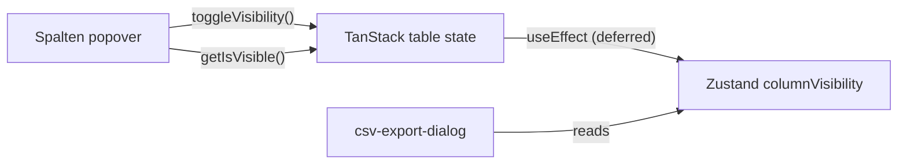

# Column Visibility — Spalten Popover vs useTripsTableStore (Audit)

**Symptom:** After toggling columns in the **Spalten** popover (`trips-filters-bar.tsx`), **Tabellenansicht exportieren** still pre-selects the wrong columns via `resolveTableViewColumns(columnVisibility)` reading `useTripsTableStore((s) => s.columnVisibility)`.

**Goal:** Trace where Spalten writes visibility, where the store is updated, and what the export dialog actually reads — to locate the disconnect.

**Date:** 2026-06-19

---

## Executive summary

| Layer | Source of truth for “what admin sees” | Updated how |
|-------|--------------------------------------|-------------|
| **Spalten popover UI** | TanStack `table` instance (`column.getIsVisible()`) | `column.toggleVisibility()` — **immediate** |
| **Zustand `columnVisibility`** | Mirror of `table.getState().columnVisibility` | **`useEffect` in `TripsTable`** — **deferred** (after commit) |
| **Table-view export** | Zustand `columnVisibility` via reactive selector | Read when dialog `open` effect runs |

**Primary disconnect:** The popover **never writes to the Zustand store**. It only mutates TanStack table state. Export reads the **store mirror**, not the table. The mirror is updated in a **`useEffect`**, so it can lag TanStack by one React commit (usually fine), or stay **stale** if the sync effect does not run when visibility changes.

**Recommended live read (audit finding, not implemented):** At export open time, prefer  
`useTripsTableStore.getState().table?.getState().columnVisibility`  
over `getState().columnVisibility` — same object the popover uses via `getIsVisible()`.

**Secondary disconnect (by design):** `resolveTableViewColumns` **always appends `EXPORT_ONLY_KEYS`** (~39 registry keys with no table toggle). Even with a perfect store sync, export pre-select will **not** match “only visible table columns” — it matches visible **mapped** columns plus all export-only fields.

**Not the root cause:** Popover does **not** write to a different location — it writes to TanStack; the store is a one-way delayed copy.

---

## 1. Spalten popover — complete implementation

### Store / table reads (top of filter bar)

```126:140:src/features/trips/components/trips-filters-bar.tsx
  const table = useTripsTableStore((s) => s.table);
  const columnVisibility = useTripsTableStore((s) => s.columnVisibility);
  // Hide invoice_status filter when the column is hidden — filtering by a column the user chose to hide is confusing.
  const invoiceStatusVisible = columnVisibility.invoice_status !== false;

  const hidableColumns = useMemo(() => {
    if (!table) return [];
    return table
      .getAllColumns()
      .filter(
        (col) => typeof col.accessorFn !== 'undefined' && col.getCanHide()
      );
    // columnVisibility in deps ensures re-render (and fresh getIsVisible()) on every toggle
    // eslint-disable-next-line react-hooks/exhaustive-deps
  }, [table, columnVisibility]);
```

- **`table`:** from Zustand (`s.table`) — TanStack `Table` ref set by `TripsTable`.
- **`columnVisibility`:** from Zustand — used for **`invoiceStatusVisible`** and to **force re-render** of `hidableColumns` when store updates.
- **Checkmarks in popover:** **not** from store — from **`column.getIsVisible()`** on the TanStack column (live table state).

### Complete popover (`renderColumnVisibilityPopover`)

```439:485:src/features/trips/components/trips-filters-bar.tsx
  const renderColumnVisibilityPopover = (triggerClassName: string) =>
    currentView === 'list' && table ? (
      <Popover>
        <PopoverTrigger asChild>
          {/* Match SelectTrigger / Input: h-10 touch row, md:h-9 (shadcn default height) */}
          <Button variant='outline' className={cn('px-3', triggerClassName)}>
            <Settings2 className='h-3.5 w-3.5 shrink-0' />
            <span className='truncate'>Spalten</span>
            <CaretSortIcon className='ml-1 h-3.5 w-3.5 shrink-0 opacity-50' />
          </Button>
        </PopoverTrigger>
        <PopoverContent align='start' className='w-48 p-0'>
          <Command>
            <CommandInput
              placeholder='Spalte suchen...'
              className='h-8 text-xs'
            />
            <CommandList>
              <CommandEmpty className='py-2 text-center text-xs'>
                Keine Spalten gefunden.
              </CommandEmpty>
              <CommandGroup>
                {hidableColumns.map((column) => (
                  <CommandItem
                    key={column.id}
                    onSelect={() =>
                      column.toggleVisibility(!column.getIsVisible())
                    }
                    className='text-xs'
                  >
                    <span className='truncate'>
                      {(column.columnDef.meta as any)?.label ?? column.id}
                    </span>
                    <CheckIcon
                      className={cn(
                        'ml-auto size-3.5 shrink-0',
                        column.getIsVisible() ? 'opacity-100' : 'opacity-0'
                      )}
                    />
                  </CommandItem>
                ))}
              </CommandGroup>
            </CommandList>
          </Command>
        </PopoverContent>
      </Popover>
    ) : null;
```

### Answers

| Question | Answer |
|----------|--------|
| How does popover read visibility? | **TanStack:** `column.getIsVisible()` for UI; **`table`** from store ref. Store `columnVisibility` only triggers re-render. |
| On toggle, what is called? | **`column.toggleVisibility(!column.getIsVisible())`** only — TanStack API on the column instance. |
| Store updated directly? | **No** — no `setColumnVisibility` from filter bar. |
| TanStack updated? | **Yes** — via `toggleVisibility` → `onColumnVisibilityChange` in `useDataTable`. |

Popover is **not shown** when `currentView !== 'list'` or `table === null` (Kanban, or before `TripsTable` mounts).

---

## 2. Complete store definition — `use-trips-table-store.ts`

```1:38:src/features/trips/stores/use-trips-table-store.ts
import { create } from 'zustand';
import type { Table, VisibilityState } from '@tanstack/react-table';

interface TripsTableStore {
  table: Table<any> | null;
  columnVisibility: VisibilityState;
  /** Mirrored from `table.getState().columnOrder` in TripsTable — for snapshots & active preset detection. */
  columnOrder: string[];
  /**
   * Queued from “Ansichten” when switching Kanban → Liste: TanStack instance is
   * null until TripsTable mounts — we apply and clear in TripsTable’s effect.
   */
  pendingColumnVisibility: VisibilityState | null;
  /**
   * Same pattern as pendingColumnVisibility — preset column order when list table
   * is not mounted (e.g. Kanban → Liste).
   */
  pendingColumnOrder: string[] | null;
  setTable: (table: Table<any> | null) => void;
  setColumnVisibility: (visibility: VisibilityState) => void;
  setColumnOrder: (order: string[]) => void;
  setPendingColumnVisibility: (visibility: VisibilityState | null) => void;
  setPendingColumnOrder: (order: string[] | null) => void;
}

export const useTripsTableStore = create<TripsTableStore>((set) => ({
  table: null,
  columnVisibility: {},
  columnOrder: [],
  pendingColumnVisibility: null,
  pendingColumnOrder: null,
  setTable: (table) => set({ table }),
  setColumnVisibility: (columnVisibility) => set({ columnVisibility }),
  setColumnOrder: (columnOrder) => set({ columnOrder }),
  setPendingColumnVisibility: (pendingColumnVisibility) =>
    set({ pendingColumnVisibility }),
  setPendingColumnOrder: (pendingColumnOrder) => set({ pendingColumnOrder })
}));
```

| Field | Initial value |
|-------|----------------|
| `table` | `null` |
| `columnVisibility` | `{}` |
| `columnOrder` | `[]` |
| `pendingColumnVisibility` | `null` |
| `pendingColumnOrder` | `null` |

**`table` ref:** `Table<any> | null`. Set in `TripsTable` mount effect; cleared on unmount. Used by filter bar popover, Ansichten presets, etc. **Not** used by `csv-export-dialog.tsx` today.

**No `getState` wrapper** — standard Zustand `create()` export exposes `.getState()` on `useTripsTableStore` automatically.

---

## 3. TanStack → store sync — `trips-tables/index.tsx`

### TanStack visibility ownership (`useDataTable`)

```117:118:src/hooks/use-data-table.ts
  const [columnVisibility, setColumnVisibility] =
    React.useState<VisibilityState>(initialState?.columnVisibility ?? {});
```

```291:309:src/hooks/use-data-table.ts
    state: {
      pagination,
      sorting,
      columnVisibility,
      rowSelection,
      columnFilters,
      columnOrder
    },
    ...
    onColumnVisibilityChange: setColumnVisibility,
```

Trips table **`initialState.columnVisibility`:**

```56:61:src/features/trips/components/trips-tables/index.tsx
    initialState: {
      columnVisibility: {
        net_price: false,
        tax_rate: false,
        reha_schein: false
      }
    }
```

### Complete sync effects

```79:106:src/features/trips/components/trips-tables/index.tsx
  React.useEffect(() => {
    setTable(table as any);
    return () => setTable(null);
  }, [table, setTable]);

  // Apply preset column visibility once the list table exists (see pendingColumnVisibility).
  React.useEffect(() => {
    if (pendingColumnVisibility === null) return;
    table.setColumnVisibility(pendingColumnVisibility);
    setPendingColumnVisibility(null);
  }, [table, pendingColumnVisibility, setPendingColumnVisibility]);

  // Apply queued column order after table mounted (Kanban → Liste).
  React.useEffect(() => {
    if (pendingColumnOrder === null) return;
    table.setColumnOrder(pendingColumnOrder);
    setPendingColumnOrder(null);
  }, [table, pendingColumnOrder, setPendingColumnOrder]);

  const columnVisibility = table.getState().columnVisibility;
  React.useEffect(() => {
    setColumnVisibility(columnVisibility);
  }, [columnVisibility, setColumnVisibility]);

  const columnOrder = table.getState().columnOrder;
  React.useEffect(() => {
    setColumnOrder(columnOrder);
  }, [columnOrder, setColumnOrder]);
```

| Question | Answer |
|----------|--------|
| What triggers sync? | **`useEffect`** watching `columnVisibility` from **`table.getState().columnVisibility`** during render — **not** `onColumnVisibilityChange` callback to Zustand. |
| Immediate or deferred? | **Deferred** — runs after paint/commit when the `columnVisibility` **reference** in the dependency array changes. |
| When is store first populated? | **After first `TripsTable` render + effect** — typically `{ net_price: false, tax_rate: false, reha_schein: false }`, **not** on first toggle. Before that, store stays `{}`. |

**Toggle flow:**

1. Popover → `column.toggleVisibility()`  
2. TanStack → `onColumnVisibilityChange` → `setColumnVisibility` in `useDataTable` (React state)  
3. `TripsTable` re-renders  
4. `const columnVisibility = table.getState().columnVisibility` (controlled state slice)  
5. **`useEffect`** → `useTripsTableStore.setColumnVisibility(columnVisibility)`  

There is **no** direct Zustand write on toggle.

---

## 4. At “Tabellenansicht exportieren” click — what does the store contain?

### Cannot be determined statically

Runtime value depends on session timing. Expected states:

| Phase | `getState().columnVisibility` | Matches admin toggles? |
|-------|------------------------------|-------------------------|
| Before `TripsTable` mounts | `{}` | N/A — no table |
| After first sync, no toggles | `{ net_price: false, tax_rate: false, reha_schein: false }` | Yes — matches `initialState` |
| After admin hides e.g. `payer_name` | Should include `payer_name: false` **if sync ran** | Yes **iff** effect ran after toggle |
| After admin hides column, sync lag | Still previous object **without** new `false` key | **No** — export thinks column visible |

### Timing vs dialog open effect

```145:167:src/features/trips/components/csv-export/csv-export-dialog.tsx
  React.useEffect(() => {
    if (!open) return;
    ...
    setSelectedColumns(resolveTableViewColumns(columnVisibility));
    ...
  }, [open, prefillFilters, mode, columnVisibility]);
```

- Export reads **`columnVisibility` from hook selector** at effect run time (same render cycle as `open === true`).
- Zustand updates are **synchronous** inside the TripsTable sync effect — once that effect runs, subscribers get new value.
- **Race:** Toggle → TanStack updates → user opens export **before** TripsTable sync `useEffect` runs → store missing latest `false` keys. Uncommon but possible in same event turn.
- **Steady state:** After toggling and waiting, store should match TanStack **if** every visibility change produces a new `columnVisibility` reference and the sync effect runs.

### `{}` vs defaults vs toggle state

- **`{}` before sync:** `resolveTableViewColumns({})` uses `DEFAULT_HIDDEN` fallback — **same effective visibility as table `initialState`** for mapped columns (see dialog helper).
- **After sync without toggles:** `{ net_price: false, tax_rate: false, reha_schein: false }` — explicit false keys; same outcome for `resolveTableViewColumns`.
- **After toggles:** Store must contain **`columnId: false`** (or `true` for re-shown default-hidden cols). If store lacks hidden keys, **`resolveTableViewColumns` treats absent keys as visible** (except `DEFAULT_HIDDEN`).

---

## 5. Zustand `getState()` — exact export

```26:38:src/features/trips/stores/use-trips-table-store.ts
export const useTripsTableStore = create<TripsTableStore>((set) => ({
  ...
}));
```

Zustand vanilla API (available at runtime):

```ts
useTripsTableStore.getState().columnVisibility
useTripsTableStore.getState().table
useTripsTableStore.getState().setColumnVisibility(...)
```

**Imperative read at click time** is supported — `csv-export-dialog.tsx` does **not** use it today; it uses the reactive hook selector.

---

## 6. TanStack `table` in store — live read at dialog open

**Yes** — `table: Table<any> | null` is stored (see §2).

At dialog open (list view, table mounted):

```ts
const tbl = useTripsTableStore.getState().table;
const live = tbl?.getState().columnVisibility;
```

- **`live`** is the same visibility object TanStack uses for **`getIsVisible()`** in the popover.
- **`getState().columnVisibility`** on Zustand is a **copy** written by the deferred effect — may equal `live` after sync, may lag or miss updates if effect did not run.

**Kanban / no table:** `table === null` — live read unavailable; must fall back to store `{}` or preset defaults.

**Recommendation (audit only):** In table-view open effect, resolve columns from **`table?.getState().columnVisibility ?? columnVisibility`** (store fallback).

---

## 7. `csv-export-dialog.tsx` — exact read path

### Helper + store selector

```41:62:src/features/trips/components/csv-export/csv-export-dialog.tsx
function resolveTableViewColumns(
  columnVisibility: Record<string, boolean>
): string[] {
  // Default hidden columns per table initialState
  const DEFAULT_HIDDEN = new Set(['net_price', 'tax_rate', 'reha_schein']);

  const mappedKeys = Object.entries(TABLE_COLUMN_TO_EXPORT_KEYS).flatMap(
    ([tableColId, exportKeys]) => {
      if (exportKeys.length === 0) return [];
      const explicitValue = columnVisibility[tableColId];
      const isVisible =
        explicitValue === true
          ? true
          : explicitValue === false
            ? false
            : !DEFAULT_HIDDEN.has(tableColId);
      return isVisible ? exportKeys : [];
    }
  );

  return [...new Set([...mappedKeys, ...EXPORT_ONLY_KEYS])];
}
```

```80:81:src/features/trips/components/csv-export/csv-export-dialog.tsx
  const prefillFilters = useExportFilterPrefill();
  const columnVisibility = useTripsTableStore((s) => s.columnVisibility);
```

```160:167:src/features/trips/components/csv-export/csv-export-dialog.tsx
    // WHY: honours the admin's column visibility configuration so table-view export matches what is visible on screen.
    setSelectedColumns(resolveTableViewColumns(columnVisibility));
    setIsLoadingPreview(true);
    setStep('preview');
    void loadPreviewCount(prefillFilters);
  }, [open, prefillFilters, mode, columnVisibility]);
```

| Question | Answer |
|----------|--------|
| Reactive selector or `getState()`? | **Reactive:** `useTripsTableStore((s) => s.columnVisibility)` |
| Stale selector snapshot? | Zustand selector updates when store updates — **not** a React stale-closure issue **if store is current**. Problem is **store content vs TanStack**, not selector caching. |
| Effect re-runs on visibility change? | **Yes** — `columnVisibility` in deps; reopening or toggling while open re-runs effect. |

---

## Root-cause analysis — why export ≠ Spalten

### A. Wrong read path (most likely for “hidden column still exported”)



- Popover truth = **TanStack**
- Export truth = **Zustand mirror**
- Mirror is **one hop behind** and **only updated in `useEffect`**

If admin hides `payer_name`, TanStack has `payer_name: false` immediately; store may still lack that key until sync → `resolveTableViewColumns` treats `payer_name` as **visible** (`undefined` → not in `DEFAULT_HIDDEN`).

### B. Sparse `VisibilityState` semantics (aligned if synced)

TanStack stores **overrides only** (`false` for hidden; `true` when re-showing default-hidden columns). Keys absent = visible (except table defaults).

`resolveTableViewColumns` mirrors that with `DEFAULT_HIDDEN` for absent keys — **correct when store matches TanStack**.

### C. `EXPORT_ONLY_KEYS` always included (by design — looks “wrong”)

Even perfect sync adds ~39 keys (`id`, `requested_date`, address subfields, `company_id`, …) with **no Spalten toggle**. Preview column list will **always** be much larger than visible table columns.

### D. Mapping asymmetry (not a sync bug)

- `scheduled_at` → 2 export keys; `time` → skipped  
- Hidden table columns with `[]` mapping (`gross_price`, `invoice_status`, `fremdfirma`, …) never affect export keys regardless of visibility  

---

## Verification checklist (manual)

1. Hide `payer_name` in Spalten → in DevTools console:
   - `useTripsTableStore.getState().table?.getState().columnVisibility` — expect `payer_name: false`
   - `useTripsTableStore.getState().columnVisibility` — **same?** If not, sync bug confirmed.
2. Open table-view export → inspect `selectedColumns` in React DevTools — is `payer_name` present?
3. If TanStack has `payer_name: false` but store `{}` or missing key → fix: read from **`table.getState()`** at open time or sync in `onColumnVisibilityChange`.

---

## Recommended fix direction (out of scope — audit only)

1. **Read live visibility at export open:**  
   `resolveTableViewColumns(useTripsTableStore.getState().table?.getState().columnVisibility ?? useTripsTableStore.getState().columnVisibility)`
2. **Or sync eagerly:** push to Zustand inside `onColumnVisibilityChange` in `useDataTable` / `TripsTable` (eliminate effect lag).
3. **Product clarity:** if admins expect export columns ≈ visible table columns only, revisit **`EXPORT_ONLY_KEYS` always-on** policy or document in preview UI.

---

## File index

| File | Role |
|------|------|
| `trips-filters-bar.tsx` L126–140, L439–485 | Spalten popover; TanStack toggle |
| `use-trips-table-store.ts` | Zustand mirror + `table` ref |
| `trips-tables/index.tsx` L56–61, L98–101 | initialState + sync effect |
| `use-data-table.ts` L117–118, L291–309 | Controlled `columnVisibility` state |
| `csv-export-dialog.tsx` L41–62, L81, L163–167 | `resolveTableViewColumns` + store read |
