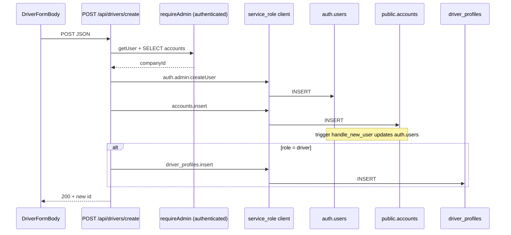

# Audit: "permission denied for table users" on driver create

**Date:** 2026-05-21  
**Scope:** Read-only — code path, migrations, live DB queries on linked production project `etwluibddvljuhkxjkxs` (Central EU).  
**No code changes.**

---

## Executive summary

On **production today**, `public.users` no longer exists (renamed to `public.accounts`); there is no `users` view. The create path uses **`service_role`** and inserts into **`accounts`**, not `users`, and does **not** call any RPC. No Postgres function in the live DB still references `users` in SQL.

The error string **`permission denied for table users`** is therefore **not expected on the current production create path** if migrations are applied and `SUPABASE_SERVICE_ROLE_KEY` is configured. It most likely referred to **`public.users`** in an **earlier DB state** (documented in migration `20260318110000_grant_users_driver_profiles.sql`) or could ambiguously refer to **`auth.users`** if a trigger updating auth metadata runs under a role without privileges (see §5).

---

## Live SQL query results

Run via `supabase db query --linked` against project `etwluibddvljuhkxjkxs`.

### Query 1 — Does a table called `users` still exist?

```sql
SELECT table_name, table_schema
FROM information_schema.tables
WHERE table_name = 'users';
```

**Result:**

| table_name | table_schema |
|------------|--------------|
| users      | auth         |

**Only `auth.users` exists.** No row for `public.users`.

---

### Query 2 — Does a view called `users` exist?

```sql
SELECT viewname, definition
FROM pg_views
WHERE viewname = 'users';
```

**Result:** *(empty — 0 rows)*

No view named `users` in any schema exposed by `pg_views`.

---

### Query 3 — RLS policies on `accounts`

```sql
SELECT policyname, cmd, qual, with_check
FROM pg_policies
WHERE tablename = 'accounts';
```

**Result:**

| policyname | cmd | qual | with_check |
|------------|-----|------|------------|
| Allow tenants only | SELECT | `(company_id = ((auth.jwt() ->> 'company_id'::text))::uuid)` | null |
| accounts_select_company_admin | SELECT | `(current_user_is_admin() AND (company_id = current_user_company_id()))` | null |
| accounts_select_own | SELECT | `(id = auth.uid())` | null |
| accounts_update_company_admin | UPDATE | `(current_user_is_admin() AND (company_id = current_user_company_id()))` | null |
| accounts_update_own | UPDATE | `(id = auth.uid())` | `(id = auth.uid())` |
| tenant select users | SELECT | `((company_id)::text = ((auth.jwt() -> 'app_metadata'::text) ->> 'company_id'::text))` | null |
| tenant update own user | UPDATE | `((id = auth.uid()) AND ((company_id)::text = ((auth.jwt() -> 'app_metadata'::text) ->> 'company_id'::text)))` | null |

**Notes:**

- RLS is **enabled** on `accounts` (`relrowsecurity = true`).
- Policies cover **SELECT** and **UPDATE** only.
- **No INSERT policy** for `authenticated` (or any role).
- Three policies (`Allow tenants only`, `tenant select users`, `tenant update own user`) are **legacy dashboard policies** predating the migration set; they were not dropped by `20260409170000_add_missing_rls.sql` (that migration does not touch `accounts`).

---

### Query 4 — Functions referencing `users` (old name)

```sql
SELECT proname, prosrc
FROM pg_proc
WHERE prosrc ILIKE '%from users%'
   OR prosrc ILIKE '%into users%'
   OR prosrc ILIKE '%update users%'
   OR prosrc ILIKE '%join users%';
```

**Result:** *(empty — 0 rows)*

All tracked functions (including `update_driver`) use `accounts`. Production `update_driver` body starts with `UPDATE accounts SET …`.

---

### Query 5 — `create_driver` (or similar) RPC

```sql
SELECT proname, prosrc
FROM pg_proc
WHERE proname ILIKE '%create%driver%'
   OR proname ILIKE '%driver%create%';
```

**Result:** *(empty — 0 rows)*

No `create_driver` (or similarly named) function exists in the live DB.

---

### Query 6 — Table grants on `accounts`

```sql
SELECT grantee, privilege_type
FROM information_schema.role_table_grants
WHERE table_name = 'accounts';
```

**Result:** `authenticated`, `anon`, `service_role`, and `postgres` each have **INSERT, SELECT, UPDATE, DELETE, TRUNCATE, REFERENCES, TRIGGER**.

Production grants are **broader** than migration `20260318130000` (which only documents `GRANT SELECT, UPDATE ON public.accounts TO authenticated/anon`). Full DML grants were likely applied via dashboard or a separate grant step.

---

### Supplemental queries (not in original list)

**`public.accounts` exists:**

| table_schema | table_name |
|--------------|------------|
| public       | accounts   |

**Triggers on `public.accounts`:**

| tgname | definition |
|--------|------------|
| on_user_created | `AFTER INSERT ON public.accounts FOR EACH ROW EXECUTE FUNCTION handle_new_user()` |
| on_user_company_claim | `AFTER INSERT OR UPDATE ON public.accounts FOR EACH ROW EXECUTE FUNCTION handle_user_company_claim()` |

**Trigger function bodies** (both update **`auth.users`**, not `public.users`):

```sql
-- handle_new_user / handle_user_company_claim (identical logic)
UPDATE auth.users
SET raw_app_meta_data = jsonb_set(
  coalesce(raw_app_meta_data, '{}'),
  '{company_id}',
  to_jsonb(new.company_id)
)
WHERE id = new.id;
```

- Owner: `postgres`
- **`SECURITY DEFINER`: false** — runs as the **invoking role** (the role that performed the `INSERT`/`UPDATE` on `accounts`).

**Triggers on `auth.users`:** none (0 rows).

**Rename migration applied:** `20260318130000` present in `supabase_migrations.schema_migrations`.

---

## 1. Does a table or view called `users` still exist?

| Object | Exists? | Details |
|--------|---------|---------|
| `public.users` (table) | **No** | Renamed to `public.accounts` by `20260318130000_rename_users_to_accounts.sql`. |
| `public.users` (view) | **No** | Query 2 returned 0 rows. No INSTEAD OF triggers or view RLS. |
| `auth.users` (table) | **Yes** | Supabase Auth internal table; not used by app code via PostgREST `.from()`. |

There is **no compatibility view** mapping `users` → `accounts`.

---

## 2. Exact code path when a driver is created

### UI entry points

All create flows share **`DriverFormBody`** (`src/features/driver-management/components/driver-form-body.tsx`):

| Surface | Component | Create trigger |
|---------|-----------|----------------|
| Miller columns | `driver-detail-panel.tsx` (`driverId === 'new'`) | Panel header → `formRef.submit()` → `DriverFormBody.onSubmit` |
| Table view sheet | `driver-form.tsx` | Same `DriverFormBody` |
| Table toolbar | `driver-create-button.tsx` | Opens sheet (same form) |

**Create submit** (lines 220–237 of `driver-form-body.tsx`):

```ts
fetch('/api/drivers/create', {
  method: 'POST',
  headers: { 'Content-Type': 'application/json' },
  body: JSON.stringify({ email, password, first_name, last_name, name, phone, role, license_number, default_vehicle_id })
});
```

Browser runs as the logged-in admin; **no direct Supabase write** from the client on create.

### API route: `POST /api/drivers/create`

File: `src/app/api/drivers/create/route.ts`

| Step | What runs | Postgres / Auth role |
|------|-----------|----------------------|
| 1 | `requireAdmin()` — session via `@/lib/supabase/server` (`createClient()` with user JWT) | **`authenticated`** — reads `accounts` for caller's `role` + `company_id` |
| 2 | `createClient(url, SUPABASE_SERVICE_ROLE_KEY)` | **`service_role`** — bypasses RLS |
| 3 | `supabaseAdmin.auth.admin.createUser({ email, password, email_confirm: true })` | **Auth Admin API** (service role) → inserts into **`auth.users`** |
| 4 | `supabaseAdmin.from('accounts').insert({ id, name, …, company_id, role, … })` | **`service_role`** → `INSERT` into **`public.accounts`** |
| 4a | *(DB trigger)* `on_user_created` → `handle_new_user()` | Invoker = **`service_role`** → `UPDATE auth.users` (JWT app_metadata) |
| 5 | If `role === 'driver'`: `supabaseAdmin.from('driver_profiles').insert(…)` | **`service_role`** |
| Rollback | On accounts/profile failure: delete `accounts` row + `auth.admin.deleteUser` | **`service_role`** |

**Edit path (not create):** `PATCH /api/drivers/[id]` uses **`authenticated`** client + `rpc('update_driver')` (`SECURITY DEFINER`). Not involved in create.

**Roster/panel reads** (`get-roster.ts`, `driver-detail-panel.tsx` load): server actions / authenticated reads only — not on the create write path.

### Flow diagram



---

## 3. Does the create path call any RPC? Does it reference `users`?

| Question | Answer |
|----------|--------|
| RPC on create? | **No.** Create uses direct `.insert()` on `accounts` and optionally `driver_profiles`. |
| `create_driver` function? | **Does not exist** in repo or live DB (Query 5). |
| `update_driver` on create? | **No** — only used by `PATCH /api/drivers/[id]`. |
| Any function body still saying `users`? | **No** on production (Query 4). Historical `update_driver` in `20260318120000` used `UPDATE users`; fixed in `20260318130000` and `20260521224017`. |

App source has **no** `.from('users')` references (grep over `src/`).

---

## 4. RLS policies on `accounts` — INSERT for `authenticated`?

**Policies (live):** 7 policies — all **SELECT** or **UPDATE**; **zero INSERT** policies.

**Effect by role on INSERT:**

| Role | INSERT into `accounts` |
|------|------------------------|
| `authenticated` | **Blocked by RLS** (has table-level INSERT grant but no policy → default deny). Error would be *"new row violates row-level security policy for table accounts"*, not *"permission denied for table users"*. |
| `service_role` | **Allowed** — bypasses RLS. This is what the create route uses. |
| `anon` | Same as authenticated — RLS block if attempted. |

Migration intent (`20260318130000`): admin provisioning is **server-side only** via service role; tenant users must not insert account rows.

---

## 5. What is the exact error — which `users`?

Postgres reports **`permission denied for table users`** (SQLSTATE `42501`) for **missing table-level privileges**, not for RLS violations.

The message **does not include a schema**, so three interpretations exist:

| Interpretation | Likely when | Production today |
|----------------|-------------|------------------|
| **`public.users`** | Table still named `users`; `authenticated`/`anon` lacked `SELECT`/`UPDATE`/`INSERT` grants. Documented explicitly in `20260318110000_grant_users_driver_profiles.sql`. | **N/A** — table renamed; object gone. |
| **`auth.users`** | Trigger or Auth hook runs `UPDATE auth.users` as a role without privilege (e.g. `authenticated` invoker on `handle_new_user`). Error text would still say `users`. | Create uses **service_role** invoker → should succeed. Would fail if create ever used **authenticated** client for `accounts.insert` and trigger fired. |
| **Stale tooling / wrong environment** | `supabase/diagnose_rls.sql` still queries `public.users` (lines 4–28). Local DB without rename migration. | Misleading diagnostics, not the app create path. |

### Mapping error to create-route steps

| Step | If this step failed with `permission denied for table users` |
|------|--------------------------------------------------------------|
| `requireAdmin()` SELECT `accounts` | Would say **`accounts`**, not `users`. |
| `auth.admin.createUser` | Auth API errors; typically not this Postgres message. |
| `accounts.insert` (service_role) | Should **not** touch `users` at all. Trigger updates **`auth.users`** as service_role. |
| `driver_profiles.insert` | Would say **`driver_profiles`**. |

### Conclusion on error identity

- **Historical (most likely for this exact string during development):** **`public.users`** before rename + missing grants — matches migration comment and `diagnose_rls.sql` purpose.
- **If seen after rename on production:** Investigate **`auth.users`** privilege context (trigger invoker role) or confirm the failing query is not an old dashboard policy/SQL still targeting `public.users`.
- **Not from create RPC:** no create RPC exists; `update_driver` no longer references `users`.

---

## Migration cross-reference

| Migration | Relevance |
|-----------|-----------|
| `20260318110000_grant_users_driver_profiles.sql` | Documents error; `GRANT SELECT, UPDATE ON public.users` (pre-rename). |
| `20260318130000_rename_users_to_accounts.sql` | Renames table; recreates RLS on `accounts` (SELECT/UPDATE only); `GRANT SELECT, UPDATE`; rewrites `update_driver` to use `accounts`. |
| `20260409170000_add_missing_rls.sql` | Trips, clients, payers, etc.; **does not modify `accounts`**; revokes `update_driver` from `anon`. |
| `20260521224017_make_update_driver_role_aware.sql` | Role-aware `update_driver`; uses `accounts` only. **Edit path only.** |

---

## Gaps / follow-ups (audit only — not implemented)

1. **Reproduce with server logs:** Capture which step returns the error (`createError` vs `userError` vs `profileError` in `create/route.ts`) and full Postgres detail (`schema.table`).
2. **Legacy policies:** Consider cleaning `Allow tenants only`, `tenant select users`, `tenant update own user` on `accounts` (duplicate/overlapping with migration policies).
3. **Update `supabase/diagnose_rls.sql`:** Still references `public.users` — will fail on renamed DBs.
4. **Trigger hardening:** `handle_new_user` / `handle_user_company_claim` are not `SECURITY DEFINER`; if inserts ever move off service_role, `UPDATE auth.users` could raise `permission denied for table users` (`auth.users`).

---

## Files read

- `src/app/api/drivers/create/route.ts`
- `src/features/driver-management/components/driver-form-body.tsx`
- `src/features/driver-management/components/driver-detail-panel.tsx`
- `src/features/driver-management/api/get-roster.ts`
- `supabase/migrations/20260318130000_rename_users_to_accounts.sql` (lines 1–50)
- `supabase/migrations/20260409170000_add_missing_rls.sql`
- `supabase/migrations/20260521224017_make_update_driver_role_aware.sql`

---

## Resolution (2026-05-24)

**Root cause:** `set_company_id` trigger on `public.accounts` was dashboard-created (not in repo) and lacked `SECURITY DEFINER`. On `accounts` INSERT, it fired as the invoking role and attempted `UPDATE auth.users` → `permission denied for table users`.

**Fix applied:**

- `handle_new_user`, `handle_user_company_claim`, `set_company_id` all hardened to `SECURITY DEFINER` in `20260524151222_harden_account_triggers.sql`
- `set_company_id` function and trigger binding added to migration file so local reset reproduces production state
- Migration history drift: duplicate `20260409160000` resolved by renaming conflicting file to `20260524151223_fix_angebote_company_fk.sql`; missing history entries repaired for `20260521120000`, `20260524120000`, and `20260524151223`

**Status:** Resolved — driver create confirmed working in production 2026-05-24
