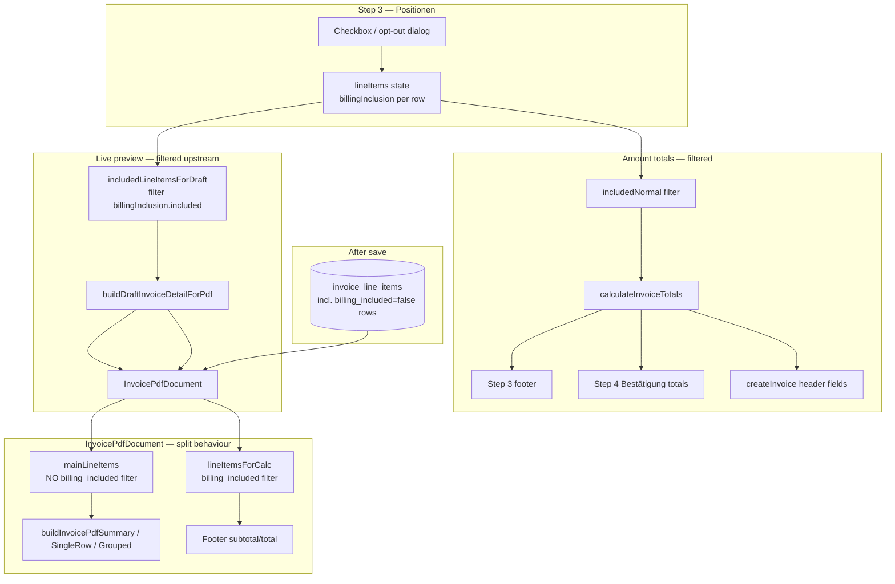

# Audit: Opted-Out Trips Still Included in km + Amount Totals

**Scope:** Read-only trace of the invoice builder exclusion toggle → preview → totals → line items pipeline.  
**Date:** 2026-06-08  
**Files read:** `use-invoice-builder.ts`, `index.tsx`, `step-3-line-items.tsx`, `step-4-confirm.tsx`, `use-invoice-builder-pdf-preview.tsx`, `build-draft-invoice-detail-for-pdf.ts`, `invoice-line-items.api.ts`, `InvoicePdfDocument.tsx`, `build-invoice-pdf-summary.ts`, `invoice.types.ts`, `map-line-item-row-to-builder-line-item.ts`.

---

## Executive summary

Exclusion state lives on each line item as `billingInclusion.included` (not a separate `excludedTripIds` set). The **live builder preview** and **Step 3/4 amount footers** both filter to included rows before computing totals. The **line items builder** never excludes trips — it always emits `billingInclusion: { included: true }`.

The clearest divergence is in **`InvoicePdfDocument.tsx`**: footer amounts use a `billing_included` filter, but the **cover summary table** (including `total_km` and per-group net/gross) is built from `mainLineItems`, which only removes cancelled trips and **still includes opted-out normal rows** whenever `invoice.line_items` contains persisted excluded rows (after save, invoice detail PDF, or any path that feeds the full DB line list into `InvoicePdfDocument`).

During an **unsaved builder session**, the preview hook pre-filters line items before draft construction, so the preview path hides this bug. Step 4 Bestätigung shows **filtered** header totals but an **unfiltered** position list and count.

---

## 1. Where is opted-out / excluded state stored?

| Property | Value |
|----------|-------|
| **Variable name** | `billingInclusion` on each `BuilderLineItem` / `BuilderCancelledTripRow` |
| **Type** | `BillingInclusionState` = `{ included: boolean; reason: string }` |
| **Normal trips default** | `{ included: true, reason: '' }` |
| **Cancelled trips default** | `{ included: false, reason: '' }` |

**Type definition** — `src/features/invoices/types/invoice.types.ts`:

```41:44:src/features/invoices/types/invoice.types.ts
export type BillingInclusionState = {
  included: boolean;
  reason: string;
};
```

**Where it lives:** React hook state in `useInvoiceBuilder`, not context.

- Normal trips: `lineItems: BuilderLineItem[]` — `use-invoice-builder.ts` **L169**
- Cancelled trips: `cancelledTrips: BuilderCancelledTripRow[]` — **L171–173**

There is **no** `excludedTripIds: Set<string>` or parallel exclusion array. Opted-out normal trips remain in `lineItems[]` with `billingInclusion.included === false`.

**Toggle handler (normal trips)** — `use-invoice-builder.ts` **L642–652**:

```642:652:src/features/invoices/hooks/use-invoice-builder.ts
  const handleLineItemInclusionChange = useCallback(
    (position: number, included: boolean, reason: string) => {
      setLineItems((prev) =>
        prev.map((item) =>
          item.position === position
            ? { ...item, billingInclusion: { included, reason } }
            : item
        )
      );
    },
    []
  );
```

**Step 3 UI** binds the checkbox to `item.billingInclusion.included` — `step-3-line-items.tsx` **L563, L589–606**. Opt-out opens a dialog; confirm calls `onLineItemInclusionChange(position, false, reason)` — **L1613–1617**.

**Derived count** — `excludedTripCount` in hook **L917–919**:

```917:919:src/features/invoices/hooks/use-invoice-builder.ts
  const excludedTripCount = lineItems.filter(
    (i) => !i.billingInclusion.included
  ).length;
```

---

## 2. How does the preview filter opted-out trips?

The preview hook filters **before** building the draft invoice. It does **not** pass the full `lineItems` array into `buildDraftInvoiceDetailForPdf`.

**Filter expression** — `use-invoice-builder-pdf-preview.tsx` **L296–299**:

```296:299:src/features/invoices/components/invoice-builder/use-invoice-builder-pdf-preview.tsx
  const includedLineItemsForDraft = useMemo(
    () => lineItems.filter((li) => li.billingInclusion.included),
    [lineItems]
  );
```

**Passed into draft builder** — **L305–309**:

```305:309:src/features/invoices/components/invoice-builder/use-invoice-builder-pdf-preview.tsx
    return buildDraftInvoiceDetailForPdf({
      companyId,
      companyProfile: companyProfileForDraft,
      step2: step2Values,
      lineItems: includedLineItemsForDraft,
```

**Shell wiring** — `index.tsx` passes the **unfiltered** `lineItems` into the preview hook (**L444**), but the hook applies the filter internally. Excluded rows are passed separately as appendix-only `excludedTripsForPdf` — `index.tsx` **L413–424**:

```413:424:src/features/invoices/components/invoice-builder/index.tsx
  const excludedTripsForPdf: ExcludedTripRow[] = useMemo(
    () =>
      lineItems
        .filter((li) => !li.billingInclusion.included)
        .map((li) => ({
          line_date: li.line_date,
          client_name: li.client_name,
          pickup_address: li.pickup_address,
          dropoff_address: li.dropoff_address,
          billing_exclusion_reason: li.billingInclusion.reason
        })),
    [lineItems]
  );
```

**Result:** Draft `invoice.line_items` contains only billing-included normal trips (+ opted-in cancelled rows merged in `build-draft-invoice-detail-for-pdf.ts` **L294–304**). Opted-out normals never appear on the cover table during builder preview; they can appear only in the **Ausgeschlossene Fahrten** appendix when `show_excluded_trips` is enabled.

---

## 3. How are totals (km + amount) calculated?

### 3a. Amount totals (Netto / MwSt / Brutto)

**Builder hook** — `use-invoice-builder.ts` **L899–915**:

```899:915:src/features/invoices/hooks/use-invoice-builder.ts
  // why: totals must reflect only billing-included rows; opted-out normal trips and
  // opted-out cancelled trips are excluded from subtotal/tax/total.
  const includedNormal = lineItems.filter((i) => i.billingInclusion.included);
  const includedCancelled = cancelledTrips.filter(
    (c) => c.billingInclusion.included && c.price_resolution != null
  );
  const totals = calculateInvoiceTotals([
    ...includedNormal,
    ...includedCancelled.map((c) => ({
      price_resolution: c.price_resolution!,
      tax_rate: c.tax_rate ?? 0,
      quantity: c.quantity ?? 1,
      approach_fee_net: c.approach_fee_net ?? null,
      unit_price: c.unit_price ?? null,
      manualGrossTotal: c.manualGrossTotal ?? null
    }))
  ]);
```

**Operates on:** FILTERED list (`includedNormal` + opted-in cancelled pricing shapes). Opted-out normal trips are excluded.

**Core algorithm** — `calculateInvoiceTotals` in `invoice-line-items.api.ts` **L808–914**:

- **Subtotal (net):** `nonTagSubtotal + priceTagNetTotal`, rounded — **L897**
- **Total (gross):** `nonTagSubtotal + taxNonTag + grossFixed`, rounded — **L895–896**
- **Tax amount:** `total − subtotal`, rounded — **L898**

Per-line logic branches on `manualGrossTotal`, gross-anchor `client_price_tag`, or net-anchor accumulation into rate buckets (**L820–885**).

**Draft PDF header totals** — `build-draft-invoice-detail-for-pdf.ts` **L244–247** (receives already-filtered `lineItems` param):

```244:247:src/features/invoices/components/invoice-pdf/build-draft-invoice-detail-for-pdf.ts
  const { subtotal, taxAmount, total } = calculateInvoiceTotals([
    ...lineItems,
    ...cancelledForTotals
  ] as TotalsLineShape[]);
```

**Persisted PDF footer** — `InvoicePdfDocument.tsx` **L365–404** filters then calculates:

```365:404:src/features/invoices/components/invoice-pdf/InvoicePdfDocument.tsx
  // Exclude opted-out lines so PDF footer matches builder totals
  const lineItemsForCalc: BuilderLineItem[] = invoice.line_items
    .filter((li) => li.billing_included !== false)
    .map((li) => ({
      // ...
    }));

  const { subtotal, total, breakdown } =
    calculateInvoiceTotals(lineItemsForCalc);
```

### 3b. km totals

There is **no km sum in Step 3 footer** or Step 4 confirm UI. km aggregation lives in the **PDF cover summary** via `build-invoice-pdf-summary.ts`:

**Per-line km accumulation (grouped / route layout)** — **L296–301**:

```296:301:src/features/invoices/components/invoice-pdf/lib/build-invoice-pdf-summary.ts
    const lineKm = item.effective_distance_km ?? item.distance_km;
    if (lineKm == null) {
      group.has_null_km = true;
    } else if (!group.has_null_km) {
      group.total_km += Number(lineKm);
    }
```

**Single-row layout** — `buildInvoicePdfSingleRow` **L392–397** (same pattern).

**Input list:** Whatever `InvoicePdfDocument` passes as `mainLineItems` / `line_items` into the summary builders (see §5).

---

## 4. Do line items include opted-out trips?

**Yes — by design.** Opted-out trips stay in `lineItems[]`; exclusion is a flag, not a splice.

**At build time** — `buildLineItemsFromTrips` in `invoice-line-items.api.ts` **L609–751**:

- Maps **every** fetched trip to a `BuilderLineItem`
- Sets default inclusion — **L725–726**:

```725:726:src/features/invoices/api/invoice-line-items.api.ts
      // why: normal trips are always included in billing by default; admin can opt out in Step 3.
      billingInclusion: { included: true, reason: '' },
```

- No filter on trips before mapping; no `excluded: true` field on line items

**At persist time** — `insertLineItems` / `lineItemToInsertRow` serializes **all** normal rows (included + excluded) — `invoice-line-items.api.ts` **L1062–1063, L970–974**:

```970:974:src/features/invoices/api/invoice-line-items.api.ts
    billing_included: item.billingInclusion.included,
    billing_exclusion_reason: item.billingInclusion.included
      ? null
      : item.billingInclusion.reason || null,
```

**Documented intent** — `invoice.types.ts` **L677–682**:

> Opted-out rows stay in the array — they are never spliced; they are excluded from totals only.

---

## 5. Divergence point — preview vs. totals

### What the preview receives that totals paths may not

| Path | Line item input | Exclusion applied? |
|------|-----------------|-------------------|
| Preview draft (`use-invoice-builder-pdf-preview`) | `includedLineItemsForDraft` only | **Yes** — upstream filter |
| Builder amount totals (`use-invoice-builder`) | `includedNormal` + opted-in cancelled | **Yes** — at calculation |
| Draft PDF stored totals (`buildDraftInvoiceDetailForPdf`) | Pre-filtered `lineItems` param | **Yes** — inherits preview filter |
| PDF footer (`InvoicePdfDocument` → `lineItemsForCalc`) | `billing_included !== false` | **Yes** |
| PDF cover summary (`InvoicePdfDocument` → `mainLineItems`) | All non-cancelled `invoice.line_items` | **No** — missing `billing_included` filter |
| Step 4 position table (`step-4-confirm`) | Full `lineItems` prop | **No** — display only |
| Step 4 `lineItemCount` | `lineItems.length` | **No** |

### Is `excludedTripIds` passed into totals?

**No.** Totals use `billingInclusion.included` (builder) or `billing_included` (persisted rows). There is no separate exclusion ID set in the totals pipeline.

### Exact divergence (amount + km in PDF cover summary)

**`InvoicePdfDocument.tsx` L349–351** — `mainLineItems`:

```349:351:src/features/invoices/components/invoice-pdf/InvoicePdfDocument.tsx
  const mainLineItems = invoice.line_items.filter(
    (li) => !(li.is_cancelled_trip ?? false)
  );
```

Compare **`appendixLineItems`** and **`lineItemsForCalc`** — both filter `billing_included !== false` (**L356–357, L366–367**).

**Summary builders consume unfiltered-for-inclusion `mainLineItems`** — **L409–423**:

```409:423:src/features/invoices/components/invoice-pdf/InvoicePdfDocument.tsx
  const summaryItems =
    effectiveProfile.main_layout === 'single_row'
      ? [
          buildInvoicePdfSingleRow(
            mainLineItems,
            // ...
          )
        ]
      : effectiveProfile.main_layout === 'grouped_by_billing_type'
        ? buildInvoicePdfGroupedByBillingType(mainLineItems)
        : buildInvoicePdfSummary({ ...invoice, line_items: mainLineItems })
            .summaryItems;
```

**Effect:**

- **Builder preview (unsaved):** Draft `line_items` already excludes opted-out rows → `mainLineItems` is effectively included-only → cover summary km/amounts match footer. Preview looks correct.
- **After save / invoice detail PDF / any full `line_items` feed:** Persisted opted-out rows remain in `invoice.line_items` with `billing_included = false` but still have distance and price snapshots → **cover summary `total_km`, `quantity`, net, and gross columns include them**, while the PDF footer (and builder hook totals) exclude them.

This is the **earliest structural point** where inclusion filtering is applied for footer amounts but omitted for cover summary aggregation.

### Secondary UI divergence (amount display only)

- **Step 3 footer** — receives filtered `totals.*` from hook — `index.tsx` **L693–695** → `step-3-line-items.tsx` **L1192–1210**
- **Step 4 confirm totals block** — filtered — `index.tsx` **L794–796** → `step-4-confirm.tsx` **L290–305**
- **Step 4 position table** — unfiltered `lineItems` — `index.tsx` **L840** → `step-4-confirm.tsx` **L331** (`lineItems.map`)
- **Section 3 summary chip** — `${lineItems.length} Positionen` uses **unfiltered** count — `index.tsx` **L472–474**

---

## 6. Einzelfahrt mode — any difference?

**No separate exclusion or totals path.** `single_trip` is only an `InvoiceMode` value affecting Step 2 trip fetch parameters. The same pipeline applies:

- `buildLineItemsFromTrips` → `lineItems` state
- `handleLineItemInclusionChange` / `billingInclusion`
- `includedNormal` filter → `calculateInvoiceTotals`
- Preview `includedLineItemsForDraft` filter

Einzelfahrt invoices with one trip behave identically: opting that trip out sets `billingInclusion.included = false` and removes it from filtered totals and preview draft line items.

---

## 7. Step 4 Bestätigung — what totals does it display?

**Props passed from shell** — `index.tsx` **L793–840**:

```793:797:src/features/invoices/components/invoice-builder/index.tsx
            <Step4Confirm
              subtotal={totals.subtotal}
              taxAmount={totals.taxAmount}
              total={totals.total}
              lineItemCount={lineItems.length}
```

```840:840:src/features/invoices/components/invoice-builder/index.tsx
              lineItems={lineItems}
```

**Trace:**

| Prop | Source | Filtered? |
|------|--------|-----------|
| `subtotal` | `useInvoiceBuilder` → `totals.subtotal` → `calculateInvoiceTotals(includedNormal + …)` | **Yes** |
| `taxAmount` | `totals.taxAmount` | **Yes** |
| `total` | `totals.total` | **Yes** |
| `lineItemCount` | `lineItems.length` | **No** (includes opted-out) |
| `lineItems` (position table) | Full hook `lineItems` | **No** (includes opted-out with prices) |

**Rendered in** `step-4-confirm.tsx` **L290–305** (totals block) and **L331–374** (position table).

**Create/save** uses the same filtered totals — `use-invoice-builder.ts` **L973–975** (`createInvoice({ subtotal, taxAmount, total })`).

---

## Senior-level recommendation

### Single earliest point to fix

**`InvoicePdfDocument.tsx` L349–351 — `mainLineItems` definition.**

Apply the same inclusion rule already used for `lineItemsForCalc` and `appendixLineItems`:

```ts
invoice.line_items.filter(
  (li) => !(li.is_cancelled_trip ?? false) && li.billing_included !== false
)
```

Or introduce a shared helper (e.g. `billingIncludedLineItems(invoice.line_items)`) used by `mainLineItems`, `lineItemsForCalc`, and `appendixLineItems` so cover summary km/amounts, footer totals, and appendix rows cannot diverge again.

### Where the fix belongs

| Layer | Fix needed? | Notes |
|-------|-------------|-------|
| **`InvoicePdfDocument.tsx`** | **Yes (primary)** | Cover summary km + grouped amounts |
| **`build-invoice-pdf-summary.ts`** | Optional | Could filter internally, but caller fix is cleaner |
| **`use-invoice-builder.ts` totals** | **No** | Already filters `includedNormal` |
| **`buildLineItemsFromTrips`** | **No** | Should keep all rows; exclusion is runtime |
| **`index.tsx` / `step-4-confirm.tsx`** | **Optional polish** | Filter `lineItems` / `lineItemCount` for display consistency |

The totals calculation function (`calculateInvoiceTotals`) is correct; the bug is **which rows are fed into summary aggregation**, not the arithmetic.

### Estimated blast radius (minimal fix)

| File | Change |
|------|--------|
| `src/features/invoices/components/invoice-pdf/InvoicePdfDocument.tsx` | 1-line filter change on `mainLineItems` (or extract shared filter) |
| **Optional** | `src/features/invoices/components/invoice-builder/index.tsx` — pass `lineItems.filter(li => li.billingInclusion.included)` and matching count to `Step4Confirm` |
| **Tests** | 1 PDF/summary test asserting opted-out row with km does not affect `total_km` when `billing_included = false` |

**Total: 1 required file, 1 optional file, 1 test file** for a minimal correct fix.

### Note on builder-session behaviour

If reporters see wrong **amount** totals in Step 3 footer while preview footer is correct, that would contradict the current hook filter at `use-invoice-builder.ts` L901–915. In that case, verify `billingInclusion.included` actually flips to `false` after the opt-out dialog (`step-3-line-items.tsx` L1613–1617) and that the UI is not conflating per-row displayed prices (opted-out rows **retain** pricing snapshots) with aggregate footer totals.

If reporters see wrong **km** totals in the PDF cover table after save or on the invoice detail page, the `mainLineItems` gap above is the root cause.

---

## Data-flow diagram



---

## Related docs

- `docs/invoices-module.md` — billing inclusion product spec (states opted-out rows excluded from totals + Haupttabelle)
- `docs/plans/pdf-tax-duplicate-audit.md` — prior note on `billing_included` filtering in `InvoicePdfDocument`
- `.cursor/plans/billing_inclusion_control_6944ad7b.plan.md` — original design: filter Haupttabelle to `billing_included === true`
