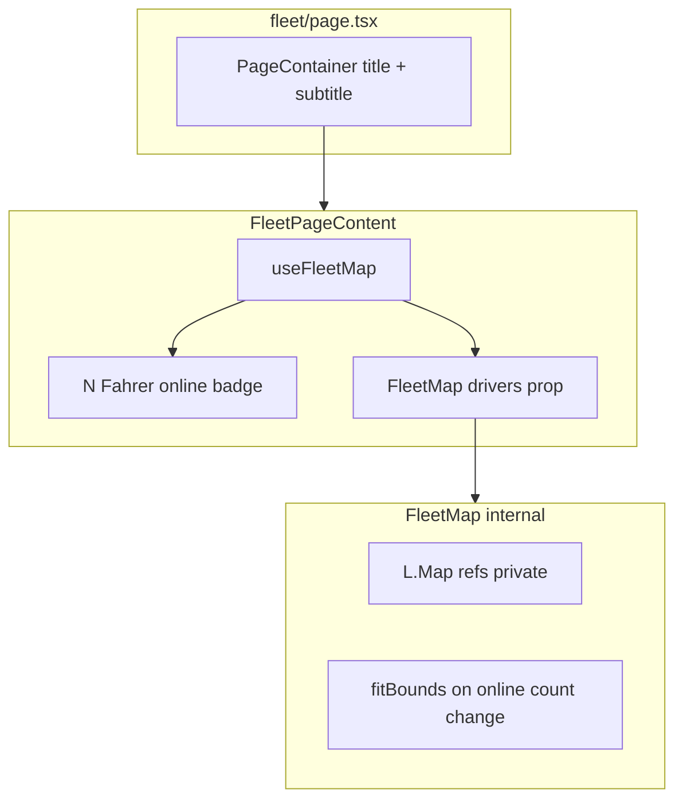

# Audit: Fleet Page UI — Driver Badges + Address Search

**Date:** 2026-05-24  
**Mode:** Read-only (no code changes)  
**Scope:** Current fleet page layout, map control surface, driver data availability in the parent, and reuse of Google Places autocomplete for a future address search on the fleet map.

---

## Files reviewed

| File | Role |
| --- | --- |
| [`src/app/dashboard/fleet/page.tsx`](../../src/app/dashboard/fleet/page.tsx) | Server page + `PageContainer` |
| [`src/features/fleet/components/fleet-page-content.tsx`](../../src/features/fleet/components/fleet-page-content.tsx) | Client orchestration |
| [`src/components/fleet/fleet-map.tsx`](../../src/components/fleet/fleet-map.tsx) | Leaflet map |
| [`src/lib/tracking/use-fleet-map.ts`](../../src/lib/tracking/use-fleet-map.ts) | Data hook + `DriverPosition` |
| [`src/lib/tracking/constants.ts`](../../src/lib/tracking/constants.ts) | Tracking tunables |
| [`src/app/api/places-autocomplete/route.ts`](../../src/app/api/places-autocomplete/route.ts) | Autocomplete proxy |
| [`src/app/api/place-details/route.ts`](../../src/app/api/place-details/route.ts) | Place Details proxy |
| [`src/features/trips/components/trip-address-passenger/address-autocomplete.tsx`](../../src/features/trips/components/trip-address-passenger/address-autocomplete.tsx) | Shared autocomplete UI |
| [`src/components/layout/page-container.tsx`](../../src/components/layout/page-container.tsx) | Page header / subtitle |

---

## 1. Fleet page layout

### Page tree

```text
FleetPage (server)
└── PageContainer (scrollable={false})
      pageTitle="Flottenübersicht"
      pageDescription="Aktuelle Positionen Ihrer Fahrer"
    └── FleetPageContent (client)
          ├── toolbar row (online badge + error)
          └── map area (Skeleton | FleetMap)
```

### Where subtitle vs badge live

| Element | Location | Mechanism |
| --- | --- | --- |
| **Title** `"Flottenübersicht"` | `PageContainer` header | `pageTitle` → [`Heading`](../../src/components/ui/heading.tsx) |
| **Subtitle** `"Aktuelle Positionen Ihrer Fahrer"` | `PageContainer` header | `pageDescription` → `Heading` description |
| **Online badge** `"{N} Fahrer online"` | `FleetPageContent` only | Separate `<div>` — **not** in `PageContainer` header |

[`page.tsx`](../../src/app/dashboard/fleet/page.tsx) (lines 14–19):

```tsx
<PageContainer
  scrollable={false}
  pageTitle='Flottenübersicht'
  pageDescription='Aktuelle Positionen Ihrer Fahrer'
>
  <FleetPageContent />
</PageContainer>
```

[`fleet-page-content.tsx`](../../src/features/fleet/components/fleet-page-content.tsx) (lines 16–31):

```tsx
<div className='flex min-h-0 flex-1 flex-col gap-4'>
  <div className='flex items-center justify-between gap-2 px-1'>
    <span className='bg-muted rounded-full px-3 py-1 text-sm font-medium'>
      {onlineCount} Fahrer online
    </span>
    {error && <span className='text-destructive text-sm'>{error}</span>}
  </div>
  <div className='min-h-0 flex-1'>
    {isLoading ? <Skeleton … /> : <FleetMap drivers={drivers} />}
  </div>
</div>
```

### Layout notes

- `PageContainer` with `scrollable={false}` uses a **non-scrollable flex column** (`overflow-hidden`, `flex-1 min-h-0`) so the map can fill remaining viewport height.
- Header block has `mb-4`; content (`FleetPageContent`) sits **below** the title/subtitle block.
- There is **no** `pageHeaderAction` on the fleet page today.
- The online badge is a **muted rounded pill** in a full-width row above the map — not integrated into the page header or a driver list.

---

## 2. Map ref access

**No external map control today.**

[`fleet-map.tsx`](../../src/components/fleet/fleet-map.tsx):

| Aspect | Status |
| --- | --- |
| `forwardRef` | No |
| `useImperativeHandle` | No |
| Callback props (`onMapReady`, `flyTo`, etc.) | No |
| Exported imperative API | None |

Internal refs only:

- `containerRef` — DOM mount point
- `mapRef` — `L.Map` instance (private)
- `markersRef` — driver markers map
- `prevOnlineCountRef` — bounds re-fit gate

**Built-in map behaviour:**

- Initial view: Oldenburg centre `[53.1435, 8.2146]`, zoom 13
- **Auto `fitBounds`** when **online driver count** changes (not on every GPS tick)
- Manual pan/zoom is preserved between position updates

**Implication for address search:** Parent cannot pan/fly to a searched address without extending `FleetMap` (e.g. `ref` with `flyTo(lat, lng)`, or a controlled `center`/`zoom` prop, or `onSearchSelect` handled inside the map component).

---

## 3. DriverPosition data in parent

**Yes — `FleetPageContent` holds the full `drivers` array.**

[`fleet-page-content.tsx`](../../src/features/fleet/components/fleet-page-content.tsx):

```typescript
const { drivers, isLoading, error } = useFleetMap();
const onlineCount = drivers.filter((d) => d.is_online).length;
```

| Data | Available in parent? |
| --- | --- |
| `drivers` | Yes — from hook, passed to `FleetMap` |
| `isLoading` | Yes |
| `error` | Yes |
| Per-driver fields | Yes — full `DriverPosition[]` |

### `DriverPosition` shape ([`use-fleet-map.ts`](../../src/lib/tracking/use-fleet-map.ts))

| Field | Type | Notes |
| --- | --- | --- |
| `driver_id` | string | PK / marker key |
| `name` | string | From `accounts` embed |
| `lat`, `lng` | number | Latest GPS |
| `speed_kmh` | number \| null | |
| `accuracy_m` | number \| null | |
| `updated_at` | string | ISO |
| `is_online` | boolean | `updated_at` within 60 s |
| `is_busy` | boolean | Trip `in_progress` / `driving` |

**Implication for driver badges:** A horizontal badge row (one chip per driver) can be built entirely in `FleetPageContent` from `drivers` without hook changes. Click-to-focus would still need map API extension (see §2).

Hook does **not** export `companyId` or raw map state — only `{ drivers, isLoading, error }`.

---

## 4. Places autocomplete API

### `POST /api/places-autocomplete`

**Request:**

```json
{ "query": "<search string>" }
```

**Behaviour:** Proxies to Google Places API (New) `places:autocomplete` with:

- `locationBias`: 15 km circle around Oldenburg (53.1435, 8.2147)
- `includedPrimaryTypes`: `route`, `street_address`, `establishment`
- `includedRegionCodes`: `['de']`
- `languageCode`: `de`

**Response:** Raw Google JSON passed through (`NextResponse.json(data)`). Typical shape (v1):

```json
{
  "suggestions": [
    {
      "placePrediction": {
        "placeId": "…",
        "text": { "text": "…" },
        "structuredFormat": { "mainText": { "text": "…" }, "secondaryText": { "text": "…" } },
        "types": ["…"],
        "distanceMeters": 1234
      }
    }
  ]
}
```

No app-level normalization in the route — parsing is done client-side in `AddressAutocomplete`.

**Env:** `GOOGLE_PLACES_API_KEY` (server only).

### `GET /api/place-details?placeId=…`

**Request:** Query param `placeId` (required). Supports ids with or without `places/` prefix (normalized server-side).

**Response (app shape):**

```typescript
{
  lat: number;           // from data.location.latitude
  lng: number;           // from data.location.longitude
  zip_code?: string;
  street?: string;
  street_number?: string;
  city?: string;
  place_id?: string;     // echo of request param
}
```

**Yes — `lat` and `lng` are returned** when Places resolves the place. Partial German PLZ may be backfilled via Geocoding reverse lookup (`GOOGLE_MAPS_API_KEY`).

**Errors:** `400` if missing `placeId`; upstream Places errors forwarded with status.

---

## 5. Existing autocomplete component

### Canonical implementation

**Path:** [`src/features/trips/components/trip-address-passenger/address-autocomplete.tsx`](../../src/features/trips/components/trip-address-passenger/address-autocomplete.tsx)

**Re-exports:**

- [`src/features/trips/components/trip-address-passenger/index.ts`](../../src/features/trips/components/trip-address-passenger/index.ts)
- [`src/features/trips/components/address-autocomplete.tsx`](../../src/features/trips/components/address-autocomplete.tsx) (barrel re-export)

### Props interface

```typescript
interface AddressAutocompleteProps {
  value: string;
  onChange: (result: AddressResult | string) => void;
  onSelectCallback?: (result: AddressResult) => void;
  placeholder?: string;      // default: 'Adresse suchen...'
  disabled?: boolean;
  className?: string;
}
```

### `AddressResult` (after selection + place-details)

```typescript
interface AddressResult {
  address: string;
  name?: string;
  street?: string;
  street_number?: string;
  zip_code?: string;
  city?: string;
  lat?: number;
  lng?: number;
  distance?: number;
  placeId?: string;
}
```

### Flow

1. User types (min 3 chars, debounced 300 ms) → `POST /api/places-autocomplete`
2. Client parses `suggestions` / `placePrediction`, sorts Oldenburg-first
3. On select → `GET /api/place-details?placeId=…` → merges `lat`/`lng` + structured fields
4. `onChange` / `onSelectCallback` receive full `AddressResult`

### Dashboard usages (non-exhaustive)

| Feature | File |
| --- | --- |
| Trip create (pickup/dropoff) | `create-trip/sections/pickup-section.tsx`, `dropoff-section.tsx` |
| Trip detail sheet | `trip-detail-sheet/trip-detail-sheet.tsx` |
| Clients | `clients/components/client-form.tsx` |
| Drivers | `driver-management/components/driver-form-body.tsx` |
| Company settings | `company-settings/components/company-settings-form.tsx` |
| Rechnungsempfänger | `rechnungsempfaenger-form-dialog.tsx` |
| Angebote / Letters | `angebot-builder/step-1-empfaenger.tsx`, `letter-step-1-recipient.tsx` |
| Recurring rules | `recurring-rule-form-body.tsx` |
| Payers | `billing-type-behavior-dialog.tsx` |

**UI pattern:** Popover + Command list (combobox-style), not a plain `<input>` with datalist.

**Fleet fit:** Reuse `AddressAutocomplete` with `onSelectCallback` receiving `lat`/`lng` is the lowest-friction path for address search; map pan requires new `FleetMap` API (§2).

---

## Architecture diagram (current)



---

## Senior summary for fleet UI work

| Need | Current state | Likely change |
| --- | --- | --- |
| Driver badge row | Only aggregate online count | Add chips from `drivers` in `FleetPageContent` |
| Badge click → map focus | No map API | Extend `FleetMap` with `ref.flyTo` or controlled center |
| Address search bar | None on fleet page | Reuse `AddressAutocomplete`; on select call map flyTo |
| Subtitle / header | In `PageContainer` | Search bar could go in toolbar row next to online badge, or `pageHeaderAction` |
| Coordinates for search | Available via place-details | Already returns `lat`/`lng` |

### Constants relevant to badges ([`constants.ts`](../../src/lib/tracking/constants.ts))

- `TRACKING_OFFLINE_AFTER_MS` (60_000) — online vs grey pin
- `TRACKING_BUSY_TRIP_STATUSES` — busy vs green pin (`is_busy` on `DriverPosition`)

No fleet-specific UI constants exist yet.

---

## Reference index

| Topic | Primary file |
| --- | --- |
| Page shell | `src/app/dashboard/fleet/page.tsx` |
| Toolbar + hook | `src/features/fleet/components/fleet-page-content.tsx` |
| Map (self-contained) | `src/components/fleet/fleet-map.tsx` |
| Driver data | `src/lib/tracking/use-fleet-map.ts` |
| Autocomplete UI | `src/features/trips/components/trip-address-passenger/address-autocomplete.tsx` |
| API routes | `src/app/api/places-autocomplete/route.ts`, `place-details/route.ts` |
| Autocomplete docs | `docs/address-autocomplete.md` |
