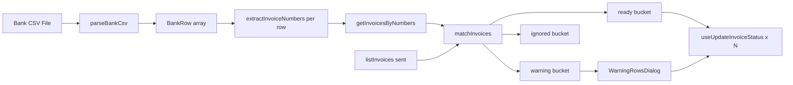

# Multi-Invoice Payment Matching — Audit

**Date:** 2026-06-17  
**Scope:** Read-only audit. No code changes.  
**Goal:** Map the current Zahlungsabgleich (bank CSV → invoice payment) flow, data shapes, schema constraints, and the cleanest path to support **one bank transaction settling multiple invoices** when the reference lists several invoice numbers and the sum of open amounts equals the transfer amount.

**Related docs:** [`docs/bank-reconciliation-module.md`](../bank-reconciliation-module.md), [`docs/plans/bank-csv-reconciliation-audit.md`](bank-csv-reconciliation-audit.md)

---

## Current Matching Flow (narrative + code references)

### End-to-end pipeline

1. **Entry:** Admin opens `ZahlungsabgleichDialog` from `/dashboard/invoices` (lazy-mounted; hook runs only while open).
2. **Upload:** `onFileDrop` in `use-zahlungsabgleich.ts` receives a `File`, calls `parseBankCsv(file)` → `BankRow[]`.
3. **Prefetch:** While open, `listInvoices({ status: 'sent' })` loads open invoices; on file drop, `getInvoicesByNumbers(collectExtractedNumbers(bankRows))` loads **all statuses** for every number found in the CSV.
4. **Match:** `matchInvoices(bankRows, sentInvoices, invoiceLookup)` returns `MatchedRow[]` bucketed as `ready` | `warning` | `ignored`.
5. **Review:** `ReviewTable` shows **ready** rows (checkbox confirm). **Warning** rows open via “Manuelle Prüfung anzeigen” → `WarningRowsDialog`.
6. **Write:** `useUpdateInvoiceStatus().mutateAsync({ invoiceId, status: 'paid', paidAt: buchungstagISO })` per invoice — no RPC, no payments table.



### Where 1:1 matching lives

**File:** `src/features/bank-reconciliation/lib/match-invoices.ts`  
**Function:** `matchInvoices(bankRows, sentInvoices, invoiceLookup)`

For rows with **exactly one** extracted invoice number, the 1:1 branch (lines 153–197):

1. Looks up the number in `invoiceLookup` (from `getInvoicesByNumbers`, all statuses).
2. If missing → `bucket: 'warning'`, `warningReasons: ['not_found']`.
3. If `lookupInvoice.status !== 'sent'` → adds `'already_paid'`.
4. If found in `sentByNumber` (from `listInvoices({ status: 'sent' })`) but `|bank.betrag| − sentInvoice.total| > AMOUNT_TOLERANCE` → adds `'amount_mismatch'`.
5. Any warning reason → `bucket: 'warning'` (manual review).
6. Otherwise → `bucket: 'ready'`, `matchedInvoice` set.

**Multi-number rows** do **not** use the 1:1 branch. They route to `resolveMultiInvoiceRow()` in the same file, which today only auto-resolves **exactly two** numbers (see Question 1 / 4).

### What triggers “manual review”

There is **no** `MANUAL_REVIEW` constant. Manual review = any row with `bucket === 'warning'` (excluding `already_paid` rows hidden from the warning dialog count).

| Trigger | Mechanism |
|---------|-----------|
| `not_found` | Number extracted but absent from `invoiceLookup` |
| `already_paid` | Invoice exists but `status !== 'sent'` |
| `amount_mismatch` | Single-invoice row; bank amount ≠ `invoices.total` (± €0.01) |
| `multi_invoice` | 2+ numbers in `verwendungszweck`; may include `multiInvoiceBlockReason` when auto-resolution fails |
| `multi_invoice` + `> 2` numbers | **Immediate block** — no sum check, no lookup of all invoices |

UI surfaces this via `countManualReviewWarnings()` (excludes `already_paid`) and the “Manuelle Prüfung anzeigen (N)” button in `zahlungsabgleich-dialog.tsx`.

### Orchestration (not matching logic)

`src/features/bank-reconciliation/hooks/use-zahlungsabgleich.ts` wires parse → API lookup → `matchInvoices`, selection state, and batch `markRowsPaid` / `markWarningRowPaid`. It does **not** implement matching rules itself except `canMarkWarningRow()` for warning-row eligibility.

---

## Data Shapes (types/interfaces, verbatim)

### `BankRow` — parsed bank transaction row

From `src/features/bank-reconciliation/types/reconciliation.types.ts`:

```typescript
export type BankRow = {
  buchungstag: string;
  buchungstagISO: string;
  verwendungszweck: string;
  betrag: number;
  beguenstigter: string;
  rawLine: string;
};
```

**Payment reference field:** `verwendungszweck` (CSV column index 4).  
**Amount:** `betrag` is a **JavaScript `number`** — parsed from German CSV text via `parseGermanAmount()` (`"1.234,56"` → `1234.56`). Inflows only (`betrag > 0`); outflows are dropped in `rowToBankRow`.

### `MatchedInvoice`

```typescript
export type MatchedInvoice = {
  id: string;
  invoiceNumber: string;
  total: number;
  status: string;
  payerName: string;
};
```

### `MatchedRow` — match result per CSV row

```typescript
export type ReconciliationBucket = 'ready' | 'warning' | 'ignored';

export type WarningReason =
  | 'multi_invoice'
  | 'amount_mismatch'
  | 'already_paid'
  | 'not_found';

export type MatchedRow = {
  rowKey: string;
  bankRow: BankRow;
  bucket: ReconciliationBucket;
  extractedNumbers: string[];
  matchedInvoice: MatchedInvoice | null;
  matchedInvoices?: MatchedInvoice[];
  warningReasons: WarningReason[];
  multiInvoiceResolved?: boolean;
  multiInvoiceBlockReason?: string;
};
```

### `BatchMarkPaidResult`

```typescript
export type BatchMarkPaidResult = {
  invoiceId: string;
  invoiceNumber: string;
  success: boolean;
  error?: string;
};
```

### Constants

```typescript
export const AMOUNT_TOLERANCE = 0.01;
```

```typescript
export const INVOICE_NUMBER_REGEX = /\bRE-\d{4}-\d{2}-\d{4}\b/g;
```

There are **no** `MATCHED`, `MANUAL_REVIEW`, or `SKIPPED` enums in this feature. Buckets + `WarningReason` replace that model; `ignored` ≈ skipped (no extractable number).

---

## Answers to Questions 1–7

### 1. WHERE does the 1:1 matching logic currently live?

| Item | Answer |
|------|--------|
| **File** | `src/features/bank-reconciliation/lib/match-invoices.ts` |
| **Function** | `matchInvoices()` — 1:1 branch when `extractedNumbers.length === 1` |
| **Helper** | `amountMatches(bankAmount, invoiceTotal)` — private, same file |
| **Multi-invoice (partial)** | `resolveMultiInvoiceRow()` — same file; **only for exactly 2 numbers** |

**Inputs (not raw CSV):**

| Parameter | Source | Shape |
|-----------|--------|-------|
| `bankRows` | `parseBankCsv(file)` → `parseBankCsvRows()` | `BankRow[]` |
| `sentInvoices` | `listInvoices({ status: 'sent' })` → `mapInvoiceWithPayerToMatched()` | `MatchedInvoice[]` |
| `invoiceLookup` | `getInvoicesByNumbers(collectExtractedNumbers(bankRows))` → `Map<invoiceNumber, MatchedInvoice>` | `Map<string, MatchedInvoice>` |

**On match failure → manual review:**

- Returns `MatchedRow` with `bucket: 'warning'` and one or more `warningReasons`.
- For 3+ invoice numbers in one row: always `warningReasons: ['multi_invoice']`, `multiInvoiceResolved: false`, `multiInvoiceBlockReason: 'Mehr als zwei Rechnungsnummern — bitte manuell prüfen.'` — **before** any amount-sum logic.

### 2. WHAT is the data shape of a parsed bank transaction row?

See **Data Shapes** above (`BankRow`).

| Question | Answer |
|----------|--------|
| Reference / Verwendungszweck | `bankRow.verwendungszweck` (string, trimmed from CSV col 4) |
| Amount type | `number` (EUR, positive inflows only) |
| Raw German amount | Only exists transiently in `parse-bank-csv.ts` as `betragRaw` before `parseGermanAmount()` |
| Booking date for `paid_at` | `bankRow.buchungstagISO` (e.g. `2026-06-14T12:00:00.000Z`) |

### 3. HOW are invoice numbers stored and queried?

**DB format (canonical, current issuances):** `RE-YYYY-MM-NNNN`  
Examples: `RE-2026-06-0014`, `RE-2026-06-0015` — **with hyphens**, not `RE2026-06-0014`.

- Generator: `src/features/invoices/lib/invoice-number.ts` → `formatInvoiceNumber()` → `` `RE-${year}-${paddedMonth}-${paddedSeq}` ``
- Column: `invoices.invoice_number` (`TEXT NOT NULL UNIQUE`)
- Extraction regex: `\bRE-\d{4}-\d{2}-\d{4}\b` in `parse-bank-csv.ts`
- Legacy rows may use `RE-YYYY-NNNN`; **not** matched by current regex (documented in module doc)

**Fetch by number:**

- `getInvoicesByNumbers(numbers: string[])` in `src/features/invoices/api/invoices.api.ts`
- Query: `.from('invoices').select('id, invoice_number, total, status, payer:payers(name)').in('invoice_number', numbers)`
- Returns `MatchedInvoice[]` (all statuses; RLS scopes to company)

There is **no** separate `getInvoiceByNumber(singular)` — batch `.in()` only.

**“Open amount”:**

- **Not a stored column** on `invoices`.
- For Zahlungsabgleich, “open” ≡ invoice with `status === 'sent'`; amount compared is **`invoices.total`** (Brutto snapshot).
- Controlling KPIs compute aggregate `open_amount` as `SUM(total) WHERE status = 'sent'` (`get_controlling_invoice_kpis` RPC) — same semantics, not used by bank matching.

Partial payments, credit notes on open balance, and Storno-adjusted open amounts are **out of scope** — matcher assumes full `total` is due when `sent`.

### 4. WHAT does the current match result / status object look like?

**Statuses today:**

| Concept | Values | Where |
|---------|--------|-------|
| Reconciliation bucket | `ready`, `warning`, `ignored` | `MatchedRow.bucket` |
| Warning reasons | `multi_invoice`, `amount_mismatch`, `already_paid`, `not_found` | `MatchedRow.warningReasons[]` |
| Multi-invoice resolution flag | `multiInvoiceResolved?: boolean` | Set only for `multi_invoice` rows |
| Block explanation | `multiInvoiceBlockReason?: string` | German UI string when not auto-resolvable |

**No** `MATCHED` / `MANUAL_REVIEW` / `SKIPPED` types exist in code.

**One transaction → multiple invoices:**

| Layer | Today |
|-------|-------|
| **Match model** | `matchedInvoices?: MatchedInvoice[]` on a **single** `MatchedRow` (one bank row) |
| **Auto-resolve** | Only **2** invoices; guards: both found, both `sent`, same `payerName`, sum within tolerance |
| **Write** | `markWarningRowPaid()` loops `matchedInvoices` — separate `updateInvoiceStatus` per invoice, **same** `paidAt` |
| **DB linkage** | **None** — no shared transaction ID, no join table, no audit of “settled together” |

Extending to 3+ invoices is **match-layer + UI** work on existing `matchedInvoices`; persisting “group settlement” visibility is **net-new** unless inferred from identical `paid_at` timestamps.

### 5. WHERE would the helper best live?

| Location | Assessment |
|----------|------------|
| `src/features/bank-reconciliation/lib/match-invoices.ts` | **Current home** — `resolveMultiInvoiceRow()` already here; natural to generalize or extract |
| `src/features/bank-reconciliation/lib/resolve-multi-invoice-transaction.ts` | **Recommended** for `resolveMultiInvoiceTransaction()` — pure function, testable, keeps `matchInvoices` thin |
| `src/features/bank-reconciliation/types/reconciliation.types.ts` | Extend types if adding N-invoice result shape |
| No `lib/matching/` folder | Feature-local `lib/` is the convention |

**Unit tests:**

- **None exist** for bank-reconciliation today.
- `package.json` `"test"` script does **not** include `src/features/bank-reconciliation/`.
- Adding tests under `src/features/bank-reconciliation/lib/__tests__/` would be new coverage, not regression protection — but strongly recommended when generalizing multi-invoice logic.

### 6. HOW is “manual review” surfaced in the UI?

**Main review step** (`review-table.tsx`):

- Shows **ready** rows only: Buchungsdatum, Begünstigter, Rechnungsnr., Rechnungsbetrag, Bankbetrag, Differenz.
- Footer text: “X Zeilen erfordern manuelle Prüfung” via `countManualReviewWarnings(warningRows)` — no per-warning detail on main table.
- **No** match-type badge on ready rows.

**Warning sub-dialog** (`warning-rows-dialog.tsx`):

| Column | Content |
|--------|---------|
| Checkbox | Only if `canMarkWarningRow(row)` |
| **Grund** | `WARNING_LABELS[reason].label` + explanation; amount hint for `amount_mismatch` |
| **Verwendungszweck** | Full `bankRow.verwendungszweck`; for resolved multi-invoice: `formatMultiInvoiceSummary()` + green “Beträge stimmen überein — **beide** Rechnungen…” |
| **Bankbetrag** | `formatEur(row.bankRow.betrag)` |
| **Rechnung** | Single invoice or stacked list for `matchedInvoices` |
| **Result icon** | `CheckCircle2` / `XCircle` from `confirmResults[row.rowKey]` |

**`canMarkWarningRow()` rules** (`use-zahlungsabgleich.ts`):

- `multiInvoiceResolved === true` + non-empty `matchedInvoices` → actionable
- Else single `matchedInvoice` unless `not_found` or unresolved `multi_invoice`

**Where to add “settled via group transaction” indicator:**

- **Without layout break:** extend the existing green hint block under **Verwendungszweck** (lines 204–216 in `warning-rows-dialog.tsx`) — already used for 2-invoice resolution; generalize copy from “beide” to “alle N”.
- Optionally add a compact badge in the **Grund** column when `multiInvoiceResolved` (e.g. “Sammelzahlung erkannt”) — `WARNING_LABELS.multi_invoice` currently always says “manuell prüfen” even when resolved; copy should diverge for resolved vs blocked.
- **Ready bucket promotion:** if N-invoice auto-resolve succeeds, could move row to `ready` (with `matchedInvoices`) instead of warning — would require `ReviewTable` + `markRowsPaid` to handle multi-invoice ready rows (today `markRowsPaid` only uses `row.matchedInvoice`).

**DB-visible “shared transaction”:** not shown anywhere today — would need schema + invoice detail UI (see §7).

### 7. SCHEMA — does the DB need changes?

**Current schema:**

| Table | Role in Zahlungsabgleich |
|-------|--------------------------|
| `invoices` | `status`, `paid_at`, `total`, `invoice_number` — **only** persistence |
| No `payments` table | — |
| No `bank_transactions` table | — |
| No invoice↔transaction join | — |

**Marking 4 invoices paid via one bank row today:**

- **Possible without migration:** 4× `updateInvoiceStatus(id, 'paid', paidAt)` with the same `paidAt` (already implemented for 2 invoices in `markWarningRowPaid`).
- **Not possible without migration:** recording that those 4 were settled by **one** bank transaction (reference text, bank amount, CSV row id, import batch id).

**Schema change required?**

| Goal | Schema change? |
|------|----------------|
| Auto-match 3+ invoices when sum === bank amount | **No** — pure matcher + hook/UI |
| Mark all as `paid` with bank Buchungstag | **No** — existing write path |
| Admin-visible “settled via group transaction” with audit trail | **Yes** — new table(s) recommended (e.g. `payment_imports` + `payment_allocations` or `invoice_payment_events`) |
| Atomic all-or-nothing batch | **Optional** — deferred RPC `mark_invoices_paid` noted in module doc |

---

## Schema Change Required?

**For the core feature (parse N numbers → sum `total` → mark all `paid`):** **No.**

**For “visible to admin that they were settled via one shared transaction” beyond coincident `paid_at`:** **Yes**, unless product accepts inferring group settlement from identical timestamps + manual institutional knowledge.

**Rationale:**

- `invoices` models lifecycle only (`draft` → `sent` → `paid`); `paid_at` is per invoice with no FK to a bank movement.
- Re-importing the same CSV or correlating disputes has no idempotency key or allocation record.
- Module doc **Deferred** list already includes “Import audit / batch logging table”.

**Minimal future schema sketch (not implemented):**

```
payment_imports (id, company_id, imported_at, source_filename, ...)
payment_allocations (id, import_id, invoice_id, bank_betrag, verwendungszweck, buchungstag, ...)
```

Until then, group settlement is **ephemeral** in `MatchedRow` during the dialog session only.

---

## Recommended Helper Location

```
src/features/bank-reconciliation/lib/resolve-multi-invoice-transaction.ts
```

**Suggested signature (conceptual):**

```typescript
export type MultiInvoiceResolution =
  | { ok: true; invoices: MatchedInvoice[] }
  | { ok: false; blockReason: string; invoices?: MatchedInvoice[] };

export function resolveMultiInvoiceTransaction(
  bankRow: BankRow,
  extractedNumbers: string[],
  invoiceLookup: Map<string, MatchedInvoice>,
  sentByNumber: Map<string, MatchedInvoice>
): MultiInvoiceResolution;
```

**Integration:** `matchInvoices()` calls this when `extractedNumbers.length > 1`, replacing the hard-coded `> 2` early return in `resolveMultiInvoiceRow()`.

**Reuse existing guards from 2-invoice path:**

1. All numbers found in `invoiceLookup`
2. All `status === 'sent'` (or use `sentByNumber` membership)
3. Same payer (`payerName` today; consider loading `payer_id` in `getInvoicesByNumbers`)
4. `|Σ total − |bank.betrag|| ≤ AMOUNT_TOLERANCE`

**Tests:** `src/features/bank-reconciliation/lib/__tests__/resolve-multi-invoice-transaction.test.ts` — add `bank-reconciliation` to `package.json` test glob when implemented.

---

## Open Risks or Ambiguities

1. **Invoice number format in user examples** (`RE2026-06-0014` without hyphens) does **not** match the extractor. Real system format is `RE-2026-06-0014`. Payers using wrong formatting → `ignored` or `not_found`, not fixable by sum logic alone.

2. **Hard cap at 2 invoices** is the direct cause of the reported bug for 4-invoice Sammelzahlungen. Code path at `match-invoices.ts:55–61` returns immediately without summing.

3. **Same payer guard** uses `payerName` string equality, not `payer_id` — rename collisions or whitespace could false-block or false-allow.

4. **`open amount` vs `total`:** Matcher uses full Brutto `total` for `sent` invoices. Credit notes, partial payments, or corrected amounts are not modeled.

5. **No idempotency:** Re-uploading the same CSV could attempt to mark already-paid invoices (`already_paid` warning) — no import batch deduplication.

6. **Ready-path gap:** Even when `multiInvoiceResolved: true`, rows stay in **warning** bucket; admin must open Manuelle Prüfung. UX friction for high-confidence auto-matches.

7. **`markRowsPaid` ignores `matchedInvoices`:** Only `markWarningRowPaid` handles multi-invoice. Promoting N-invoice matches to `ready` requires hook changes.

8. **No automated tests** for `match-invoices.ts` / `parse-bank-csv.ts` — refactoring risk.

9. **Legacy `RE-YYYY-NNNN`** numbers in open AR would not be extracted by current regex.

10. **Concurrent mark-paid:** Sequential `mutateAsync` in a loop — partial failure possible (handled in `markWarningRowPaid` with “Teilweise fehlgeschlagen”).

---

## Senior Recommendation (Cursor's assessment)

**Cleanest approach — two phases:**

### Phase A — Matcher only (ships the business fix, no migration)

1. Extract **`resolveMultiInvoiceTransaction()`** from the existing `resolveMultiInvoiceRow()` logic, removing the `extractedNumbers.length > 2` guard and looping over **N** numbers with the same validation rules.
2. Keep **`matchedInvoices`** on one `MatchedRow` per bank line; set `multiInvoiceResolved: true` when sum matches.
3. **Promote resolved N-invoice rows to `ready`** (preferred UX): extend `markRowsPaid` to mirror `markWarningRowPaid`’s multi-invoice loop so admins confirm in the main table without opening Manuelle Prüfung. Alternatively, keep warning bucket but fix copy (“alle N Rechnungen”) — weaker UX.
4. Extend **`getInvoicesByNumbers`** select to include `payer:payers(id, name)` and compare **`payer_id`** instead of display name.
5. Add **unit tests** for 2-, 3-, and 4-invoice sum match/mismatch, missing invoice, mixed status, mixed payer.

### Phase B — Audit trail (optional, product-dependent)

If admins need post-hoc proof of Sammelzahlung:

- Add **`payment_imports`** + **`payment_allocations`** (or single JSONB audit on a new `invoice_payment_events` table).
- Populate on confirm from `bankRow` + `matchedInvoices`.
- Show on invoice detail: “Bezahlt via Zahlungsabgleich Import {date} — Sammelzahlung mit RE-…, RE-…”.

**Do not** block Phase A on Phase B — the reported pain (false manual review when sum matches) is entirely a **matcher cap + bucket UX** problem solvable in `bank-reconciliation/lib` with existing `updateInvoiceStatus` writes.

**Invoice format reminder for QA:** test data must use `RE-2026-06-0014` (hyphenated), matching PDF/SEPA Verwendungszweck, not concatenated variants.
