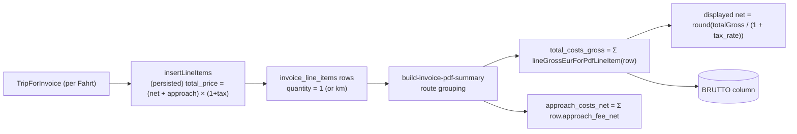

# PDF aggregated-line BRUTTO audit (read-only)

> **Status (2026-05-07): not implemented — reverted.** A net-first cover-aggregator rewrite was landed and then reverted by product decision. The aggregator continues to sum per-line gross (`lineGrossEurForPdfLineItem` over persisted `total_price`). Per-line correctness is now provided upstream by `insertLineItems` (writes `total_price` from `frozen.net + approach`, then `× (1 + tax_rate)`); the cover BRUTTO column may still drift by a few cents vs. `calculateInvoiceTotals(...).total` for `tiered_km` invoices because each per-line gross is rounded to cents before summation (e.g. `13 × round(48.5245) = 630.76` vs header `630.82`). This is accepted behaviour for now.

Scope: how grouped/route summary BRUTTO is computed for the PDF cover, whether `× (1 + tax_rate)` is applied at the aggregate level, and how that relates to the user-observed gap on `13× same route`. No code changes.

**TL;DR:** There is **no separate aggregated-line pricing path**. Aggregation **sums already-grossed per-line `total_price`** values; `× (1 + tax_rate)` is applied **once per individual line item** in `insertLineItems` / draft PDF, **not** at the group level. The user's expected `(41.55 + 3.80) × 13 × 1.07 = 630.82€` is **not** what the code produces — and the gap comes from **per-line rounding before summation**, not a missing tax multiplier on the group.

---

## 1. Aggregation flow



There is **no** group-level `× (1 + tax_rate)` step. The aggregator works **only on already-grossed per-line totals**.

---

## 2. Single-trip vs aggregated-line: are formulas different?

**No separate per-line pricing path** — every persisted `invoice_line_items.total_price` is computed identically in `insertLineItems`.

For `tiered_km`, `quantity` already equals **km** (not trip count); for flat strategies, `quantity = 1`. Trip-count never appears on a persisted line item — it only emerges as the `count` aggregator on `RouteGroupAgg`.

### Per-line `total_price` (`insertLineItems`, current)

```733:758:src/features/invoices/api/invoice-line-items.api.ts
    let total_price: number;
    if (isGrossAnchorClientPriceTag(frozen)) {
      total_price =
        frozen.gross! * item.quantity +
        (item.approach_fee_net ?? 0) * (1 + item.tax_rate);
    } else {
      const transportNet =
        frozen.net !== null && frozen.net !== undefined
          ? frozen.net
          : (item.unit_price ?? 0) * item.quantity;
      // why: frozen.net is authoritative tiered (or fallback) transport net; unit × qty
      // loses precision when unit_price_net is a rounded per-km display rate.
      total_price =
        (transportNet + (item.approach_fee_net ?? 0)) * (1 + item.tax_rate);
      // note: Net-anchor total_price stays an unrounded float here. Draft PDF preview uses
      // Math.round on line gross — slight insert-vs-preview gap predates this PR; not a
      // regression from using frozen.net (see build-draft-invoice-detail-for-pdf).
    }
```

So the multiplier `(1 + tax_rate)` is applied **once per line** here. After insert, the row carries a **gross** `total_price` (Postgres `numeric` typically truncates/rounds to its column scale).

### PDF per-line gross helper

```42:52:src/features/invoices/components/invoice-pdf/lib/invoice-pdf-line-amounts.ts
export function lineGrossEurForPdfLineItem(
  item: PdfLineItemAmountsInput
): number {
  if (item.kts_override) return 0;
  const stored = item.total_price;
  if (typeof stored === 'number' && !Number.isNaN(stored)) {
    return Math.round(stored * 100) / 100;
  }
  const net = lineNetEurForPdfLineItem(item);
  return Math.round(net * (1 + item.tax_rate) * 100) / 100;
}
```

The "preferred" branch uses **`stored = item.total_price`** (already grossed) and **rounds to cents**. The fallback (only when `total_price` is null) is the **only** call site that applies `× (1 + tax_rate)` per line in PDF code — and even then it's per individual line, not on the aggregate.

### Aggregated row build (route grouping)

```200:241:src/features/invoices/components/invoice-pdf/lib/build-invoice-pdf-summary.ts
  invoice.line_items.forEach((item, idx) => {
    const pAddr = (item.pickup_address || '').trim().replace(/\s+/g, ' ');
    const dAddr = (item.dropoff_address || '').trim().replace(/\s+/g, ' ');
    const rate = item.tax_rate;
    ...
    const group = routeGroups[routeKey];
    group.count += 1;
    group.total_price += lineNetEurForPdfLineItem(item);
    group.total_gross += lineGrossEurForPdfLineItem(item);
    group.approach_costs_net += item.approach_fee_net ?? 0;
    ...
  });
```

```151:182:src/features/invoices/components/invoice-pdf/lib/build-invoice-pdf-summary.ts
function summaryRowFromAgg(
  g: RouteGroupAgg & { routeKey: string; id: string },
  idx: number,
  directionLabel: InvoicePdfRouteDirectionLabel
): InvoicePdfSummaryRow {
  const totalGross = Math.round(g.total_gross * 100) / 100;
  const approachNet = Math.round(g.approach_costs_net * 100) / 100;
  // Derive net from gross anchor — do not use g.total_price (sum of stored
  // unit_price × qty) because pre-fix invoices have rounded unit_price values
  // that accumulate drift (e.g. 13 × 30.47 = 396.11 instead of 396.07).
  // Back-deriving from the correct gross is the standard accounting practice:
  // displayed_net = round(gross / (1 + tax_rate)).
  const totalNet = Math.round((totalGross / (1 + g.tax_rate)) * 100) / 100;
  const transportNet = Math.round((totalNet - approachNet) * 100) / 100;
  ...
  return {
    ...
    total_price: totalNet,
    quantity: g.count,
    ...
    total_costs_gross: totalGross
  };
}
```

The `BRUTTO` column on a grouped/single/billing-type summary row reads **`row.total_costs_gross`** — i.e. `round(Σ lineGrossEurForPdfLineItem(row) * 100) / 100`. The `dataField: 'total_price'` on the catalog `gross_price` column maps to **`InvoicePdfSummaryRow.total_costs_gross`** for grouped rows (the cover JSDoc explicitly states this: `pdf-column-layout.ts:241–244`).

`buildInvoicePdfSingleRow` and `buildInvoicePdfGroupedByBillingType` use the same pattern (sum of per-line gross; back-derive net via `gross / (1 + tax_rate)`).

**Conclusion (Q1 + Q2):** No separate code path for aggregated vs single. Aggregation **sums per-line gross**; tax is applied **once per individual line** in `insertLineItems`, **never on the aggregate**.

---

## 3. Numerical trace — `transport_net = 41.55, approach = 3.80, tax_rate = 0.07, quantity = 13`

(Each of 13 line items has these per-line values.)

### Per-line `total_price` written by `insertLineItems`

`(41.55 + 3.80) × 1.07 = 45.35 × 1.07 = 48.5245`

Stored as `numeric(?, 2)` → DB-rounds to **`48.52`** (or kept as `48.5245` then rounded by `lineGrossEurForPdfLineItem` → **`48.52`**).

### Aggregator

- `g.total_gross = 13 × 48.52 = 630.76`
- `totalGross = round(630.76 * 100) / 100 = 630.76`
- `approachNet = round(13 × 3.80 * 100) / 100 = 49.40`
- `totalNet = round(630.76 / 1.07 * 100) / 100 = round(58950.467… ) / 100 = 589.5046… → 589.50`
- `transportNet = round((589.50 − 49.40) * 100) / 100 = 540.10`

### BRUTTO column value rendered today

**`630.76 €`** (from `total_costs_gross` on the summary row).

### User's "correct" reference

`(41.55 + 3.80) × 13 × 1.07 = 45.35 × 13 × 1.07 = 589.55 × 1.07 = 630.8185 → 630.82 €`

**Gap:** `630.82 − 630.76 = 0.06 €` for 13 trips.

---

## 4. Where is `× (1 + tax_rate)` actually applied?

| Layer | Location | Multiplier applied? |
|-------|----------|---------------------|
| Per-line persistence | `insertLineItems` net-anchor branch | **Yes — per line**, on `(transport + approach)` |
| Per-line draft preview | `builderItemToDraftLineItem` net-anchor branch | **Yes — per line**, with `Math.round` to cents |
| Per-line PDF helper | `lineGrossEurForPdfLineItem` (preferred path) | **No multiplication** — returns rounded stored gross |
| Per-line PDF helper (fallback only) | `lineGrossEurForPdfLineItem` when `total_price == null` | Yes — `Math.round(net × (1 + tax_rate) × 100) / 100` |
| Aggregation (route / single / billing-type) | `summaryRowFromAgg` / `buildInvoicePdfSingleRow` / `buildInvoicePdfGroupedByBillingType` | **No** — sums already-gross values |

**There is no "missing or misplaced" `× (1 + tax_rate)` step in the aggregation.** The multiplier is correctly applied **once per line** at insert time. The user's framing — "the × (1 + tax_rate) step is missing for aggregated lines" — is **not what the code is doing**.

The 6-cent gap arises from a **different** rounding policy: **per-line rounding to cents before summation**.

- `13 × round(48.5245) = 13 × 48.52 = 630.76`
- `round(13 × 48.5245) = round(630.8185) = 630.82`

The same class of issue is acknowledged by the file's own JSDoc, but for the **net** column (`13 × 30.47 = 396.11 ≠ 396.07`), and the chosen mitigation there is **back-deriving net from a stable gross anchor** — not eliminating per-line rounding.

---

## 5. Is `BRUTTO = (transport_net + approach) × qty × (1 + tax_rate)` reachable?

Not without changing the aggregator. To produce **`630.82 €`** you would need to either:

1. Sum **net** (`transport_net + approach`) per line, then apply `× (1 + tax_rate)` **once on the group**:  
   `round(Σ (net + approach) × (1 + tax_rate) × 100) / 100`.
2. Or store **unrounded** per-line gross (DB scale permitting) and round only after summation.

Option (1) is the standard accounting "round once at the bucket" pattern — the **same** pattern that `calculateInvoiceTotals` uses for the **header** (`taxNonTag` is computed **once per rate bucket**, not per line — see `invoice-line-items.api.ts:678–682`). Option (1) would also bring grouped PDF BRUTTO into agreement with the invoice **header total** — which today is computed differently than per-line `total_price` summation and may already differ by cents on multi-trip groups.

Both options are out of scope here — this audit is read-only.

---

## 6. Cross-check: header total vs sum of per-line `total_price`

`calculateInvoiceTotals` net-anchor path:

```656:679:src/features/invoices/api/invoice-line-items.api.ts
    } else {
      // Net-anchor path (all strategies except client_price_tag):
      // Accumulate net line totals by tax rate. Tax is computed ONCE per rate bucket
      // below (round(bucketNet × rate)), not per line, to minimise rounding drift
      // across many trips at the same rate.
      const frozen = frozenPriceResolutionForInsert(item);
      const fallbackTransport =
        item.unit_price !== null ? item.unit_price * item.quantity : 0;
      const baseNet =
        frozen.net !== null && frozen.net !== undefined
          ? frozen.net
          : fallbackTransport;
      // why: Same transport net as insertLineItems / tieredNetTotal; not unit × qty.
      const lineTotal = baseNet + approach;
      nonTagSubtotal += lineTotal;
      ...
    }
```

```678:686:src/features/invoices/api/invoice-line-items.api.ts
  const taxNonTag = Object.entries(byRateNonTag).reduce(
    (sum, [rateStr, net]) => {
      return sum + Math.round(net * parseFloat(rateStr) * 100) / 100;
    },
    0
  );

  const total =
    Math.round((nonTagSubtotal + taxNonTag + grossFixed) * 100) / 100;
```

For 13 lines with `(net = 41.55, approach = 3.80, rate = 0.07)`:

- `nonTagSubtotal = 13 × (41.55 + 3.80) = 589.55`
- `taxNonTag = round(589.55 × 0.07) = round(41.2685) = 41.27`
- `total = round(589.55 + 41.27) = 630.82`

So the **invoice header total** already produces **`630.82 €`** (matches the user's expectation), while the **grouped PDF BRUTTO column** produces **`630.76 €`** because it sums per-line rounded gross.

---

## Answers to the prompt's questions

| Question | Answer |
|----------|--------|
| Aggregated brutto formula | `total_costs_gross = round(Σ lineGrossEurForPdfLineItem(row) × 100) / 100` — no `× (1 + tax_rate)` at the group level; tax already baked into each `row.total_price`. |
| Separate code path for `qty > 1` vs `qty = 1`? | **No.** Per-line `total_price` is the same formula for both. "Trip count" is `count` on the route group, not `quantity` on the line item. |
| What does the code produce for the user's example? | **`630.76 €`** (13 × rounded `48.52`). |
| Mathematically correct (`× 1.07` once on the group)? | **`630.82 €`** — matches the **header total** but **not** the **grouped BRUTTO**. |
| Where is `× (1 + tax_rate)` missing/misplaced for aggregated lines? | **Not missing** — it is applied per line. The 6-cent gap is from **rounding per line before summation**, a different (and pre-existing) rounding policy choice. |

---

## Notes / caveats

- DB column scale on **`invoice_line_items.total_price`** determines how many cents survive after `insertLineItems` writes the unrounded float; if the column is `numeric(_, 2)` Postgres rounds **half-away-from-zero** so `48.5245` typically becomes `48.52`. This was already the behavior pre-PR.
- For pre-fix invoices the `total_price` snapshot was written from **`unit × qty × (1 + tax)`**, not `net × (1 + tax)`; the back-derived display net in `summaryRowFromAgg` was deliberately chosen to keep the UI accurate against whichever gross was persisted.
- `client_price_tag` (gross-anchor) lines are not affected by this rounding gap because both insert and aggregator use the gross as the anchor (`frozen.gross × qty`) without VAT multiplication.
