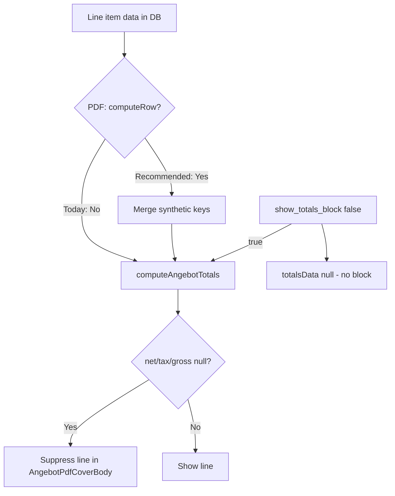

# Totals Block (Summenblock) — Audit

**Date:** 2026-05-19  
**Scope:** Read-only audit of how Netto / MwSt / Brutto totals are computed, gated, and rendered when `show_totals_block` is enabled.  
**Reported issue:** The Summenblock only shows totals for amounts that correspond to computed columns present in `columnSchema` (e.g. if `tax_amount` is not a table column, the MwSt total line is suppressed).

**Files read:**

- `src/features/angebote/lib/angebot-formula-engine.ts`
- `src/features/angebote/hooks/use-angebot-builder.ts`
- `src/features/angebote/lib/angebot-auto-columns.ts`
- `src/features/angebote/lib/angebot-column-presets.ts`
- `src/features/angebote/types/angebot.types.ts`
- `src/features/angebote/components/angebot-pdf/AngebotPdfDocument.tsx`
- `src/features/angebote/components/angebot-pdf/AngebotPdfCoverBody.tsx`
- `src/features/angebote/components/angebot-builder/index.tsx`
- `src/features/angebote/components/angebot-builder/step-2-positionen.tsx`
- `src/features/angebote/components/angebot-builder/use-angebot-builder-pdf-preview.tsx`
- `src/features/angebote/components/angebot-detail-view.tsx`
- `src/features/angebote/lib/angebot-formula-engine.test.ts`
- `docs/angebot-formula-engine.md`

---

## 1. Where are totals values computed?

### Primary aggregation: `computeAngebotTotals`

**File:** `src/features/angebote/lib/angebot-formula-engine.ts`  
**Function:** `computeAngebotTotals(rows, columns)`

This is the **only** function that sums net / tax / gross across all line items for the PDF Summenblock.

```225:252:src/features/angebote/lib/angebot-formula-engine.ts
export function computeAngebotTotals(
  rows: RowData[],
  columns: AngebotColumnDef[]
): {
  netTotal: number | null;
  taxTotal: number | null;
  grossTotal: number | null;
} {
  const sumKey = (key: string): number | null => {
    const values = rows
      .map((r) => r[key])
      .filter((v): v is number => typeof v === 'number' && isFinite(v));
    return values.length > 0 ? values.reduce((a, b) => a + b, 0) : null;
  };

  // Prefer synthetic keys (always present after Phase 4b).
  // Fall back to role-column IDs for backwards compatibility with
  // rows that were saved before Phase 4b.
  const netCol = columns.find((c) => c.role === 'net_amount');
  const taxCol = columns.find((c) => c.role === 'tax_amount');
  const grossCol = columns.find((c) => c.role === 'gross_amount');

  return {
    netTotal: sumKey(SYNTHETIC_NET_KEY) ?? (netCol ? sumKey(netCol.id) : null),
    taxTotal: sumKey(SYNTHETIC_TAX_KEY) ?? (taxCol ? sumKey(taxCol.id) : null),
    grossTotal:
      sumKey(SYNTHETIC_GROSS_KEY) ?? (grossCol ? sumKey(grossCol.id) : null)
  };
}
```

**Behavior:**

1. **First:** Sum reserved synthetic keys `__net_amount__`, `__tax_amount__`, `__gross_amount__` across all rows (schema-independent *if those keys exist in row data*).
2. **Fallback:** If a synthetic sum is empty/null, sum the column whose `role` is `net_amount` / `tax_amount` / `gross_amount` **only if that role exists in `columns`**.

It does **not** re-run the formula engine on raw inputs. It only reads numeric values already present on each row’s `data` object.

### Per-row source values: `computeRow`

**File:** `src/features/angebote/lib/angebot-formula-engine.ts`  
**Function:** `computeRow(row, columns, inputMode?)`

Per-row net / tax / gross are derived here from **roles present in `columns`** via `resolveRoleValues`:

```56:71:src/features/angebote/lib/angebot-formula-engine.ts
export function resolveRoleValues(
  row: RowData,
  columns: AngebotColumnDef[]
): ResolvedRoleValues {
  const result: ResolvedRoleValues = {};
  for (const col of columns) {
    if (!col.role) continue;
    const raw = row[col.id];
    // ... parse to number or null
  }
  return result;
}
```

```160:191:src/features/angebote/lib/angebot-formula-engine.ts
  const netAmount = computeNetAmount(convertedV);
  const taxAmount =
    netAmount === null || v.tax_rate === null || v.tax_rate === undefined
      ? null
      : netAmount * (v.tax_rate / 100);
  const grossAmount =
    netAmount === null ? null : netAmount * (1 + (v.tax_rate ?? 0) / 100);

  for (const col of columns) {
    switch (col.role) {
      case 'net_amount':
        patch[col.id] = netAmount;
        break;
      case 'tax_amount':
        patch[col.id] = taxAmount;
        break;
      case 'gross_amount':
        patch[col.id] = grossAmount;
        break;
      // ...
    }
  }

  // Always write synthetic totals keys regardless of schema columns
  patch[SYNTHETIC_NET_KEY] = netAmount;
  patch[SYNTHETIC_TAX_KEY] = taxAmount;
  patch[SYNTHETIC_GROSS_KEY] = grossAmount;
```

**Where `computeRow` runs today:** Only in the builder on **manual row edits**, not at PDF render time:

```240:252:src/features/angebote/components/angebot-builder/index.tsx
  const updateLineItemWithComputed = useCallback(
    (index: number, patch: Partial<(typeof lineItems)[number]>) => {
      const mergedData = { ...currentItem.data, ...(patch.data ?? {}) };
      const computedPatch = computeRow(mergedData, columnSchema, inputMode);
      updateLineItem(index, {
        ...patch,
        data: { ...mergedData, ...computedPatch }
      });
    },
    [lineItems, columnSchema, updateLineItem, inputMode]
  );
```

There is **no** mount-time or save-time pass that runs `computeRow` on every row before persistence or PDF export.

### PDF call site

**File:** `src/features/angebote/components/angebot-pdf/AngebotPdfDocument.tsx`

```154:163:src/features/angebote/components/angebot-pdf/AngebotPdfDocument.tsx
  const totalsData = angebot.show_totals_block
    ? {
        ...computeAngebotTotals(
          angebot.line_items.map((item) => item.data),
          columnSchema
        ),
        labelNet: angebot.totals_label_net ?? DEFAULT_TOTALS_LABEL_NET,
        labelTax: angebot.totals_label_tax ?? DEFAULT_TOTALS_LABEL_TAX,
        labelGross: angebot.totals_label_gross ?? DEFAULT_TOTALS_LABEL_GROSS
      }
    : null;
```

**Answer:** Totals are **aggregated** from persisted `line_items[].data` (synthetic keys or visible computed-column IDs). They are **not** recomputed from raw line-item inputs at PDF time. Per-row amounts depend on `columnSchema` for **input** roles (`unit_price`, `tax_rate`, etc.) when `computeRow` last ran.

### Not involved

- `use-angebot-builder.ts` — only stores `showTotalsBlock` and label strings; no numeric totals.
- `angebot-auto-columns.ts` — Pos. column injection only.
- `angebot-column-presets.ts` — layout/role UI metadata only.

---

## 2. What gates the display of each totals line?

### Master gate: `show_totals_block`

**File:** `AngebotPdfDocument.tsx` — entire `totalsData` is `null` when the flag is false (see snippet above).

**DB / types:** `AngebotRow.show_totals_block` (`angebot.types.ts` L125), builder toggle in `step-2-positionen.tsx` L779–791 (no schema guard; switch always enabled).

### Per-line gates: computed total is non-null

**File:** `src/features/angebote/components/angebot-pdf/AngebotPdfCoverBody.tsx`  
**Component:** `AngebotPdfCoverBody`

The Summenblock section renders when `totalsData` is truthy. **Each** of Netto / MwSt / Brutto is rendered only if its aggregated value is not `null`:

```512:548:src/features/angebote/components/angebot-pdf/AngebotPdfCoverBody.tsx
      {totalsData ? (
        <View style={[styles.totalsSection, { marginTop: PDF_ZONES.totalsSectionMarginTop }]} wrap={false}>
          {totalsData.netTotal !== null ? (
            <View style={styles.totalsRow}>
              <Text style={styles.totalsLabel}>{totalsData.labelNet}</Text>
              <Text style={styles.totalsValue}>{formatEur(totalsData.netTotal)}</Text>
            </View>
          ) : null}
          {totalsData.taxTotal !== null ? (
            <View style={styles.totalsRow}>
              <Text style={styles.totalsLabel}>{totalsData.labelTax}</Text>
              <Text style={styles.totalsValue}>{formatEur(totalsData.taxTotal)}</Text>
            </View>
          ) : null}
          {totalsData.grossTotal !== null ? (
            <>
              <View style={styles.totalsGrandSpacer} />
              <View style={styles.totalsGrandRow} wrap={false}>
                <Text style={styles.totalsGrandLabel}>{totalsData.labelGross}</Text>
                <Text style={styles.totalsGrandValue}>{formatEur(totalsData.grossTotal)}</Text>
              </View>
            </>
          ) : null}
        </View>
      ) : null}
```

**There is no separate `showTax` / `hasTax` flag.** Suppression is entirely:

| Layer | Condition |
|--------|-----------|
| Block | `angebot.show_totals_block === true` |
| Netto line | `totalsData.netTotal !== null` |
| MwSt line | `totalsData.taxTotal !== null` |
| Brutto line | `totalsData.grossTotal !== null` |

Indirectly, `netTotal` / `taxTotal` / `grossTotal` become `null` when `computeAngebotTotals` finds no finite numbers under synthetic keys **and** no matching computed-role column in `columnSchema` (fallback path).

### Builder UI

`step-2-positionen.tsx` shows the toggle and **label** inputs only — no numeric totals preview (L793–828).

### Preview / detail

- Builder live preview: `use-angebot-builder-pdf-preview.tsx` → `AngebotPdfDocument` (same totals path).
- Detail download: `angebot-detail-view.tsx` L568–597 → `AngebotPdfDocument` with saved `angebot` from API.

---

## 3. Is there a structural separation between table columns and totals values?

**Yes — three layers with different schema coupling.**

| Layer | Schema-dependent? | Notes |
|--------|---------------------|--------|
| **Input parsing** (`resolveRoleValues`) | **Yes** | Only roles assigned to columns in `columnSchema` are read from `row.data`. If `tax_rate` is not in the schema, tax cannot be calculated. |
| **Per-row outputs** (`computeRow`) | **Partially** | Synthetic keys are **always** written, but their **values** follow the same role-based inputs. Visible `net_amount` / `tax_amount` / `gross_amount` column cells are only patched when those roles exist in schema. |
| **Aggregation** (`computeAngebotTotals`) | **Partially** | Prefers schema-independent synthetic keys **in stored data**; if missing, requires computed-role columns in `columnSchema` for fallback sums. |
| **PDF render** | **No recomputation** | Uses whatever is already in `item.data`; does not call `computeRow`. |

**Phase 4b intent** (documented in `docs/angebot-formula-engine.md` L164–170): synthetic keys decouple the Summenblock from **visible computed columns**, provided rows were updated through `computeRow` so synthetics are populated.

**Gap causing the reported bug:** PDF/detail paths call `computeAngebotTotals` on **raw persisted** `item.data` without first running `computeRow`. Legacy rows or rows never edited after enabling the block may lack `__tax_amount__` etc. If the schema also omits `tax_amount`, `taxTotal` is `null` and the MwSt line is hidden — even with `show_totals_block === true`.

**Tests documenting intended vs. legacy behavior:**

```308:316:src/features/angebote/lib/angebot-formula-engine.test.ts
  it('computeAngebotTotals — no net_amount column → netTotal null', () => {
    const columns: AngebotColumnDef[] = [
      col('tax', 'MwSt', 'betrag', 'tax_amount'),
      col('gross', 'Brutto', 'betrag', 'gross_amount')
    ];
    const rows = [{ tax: 1.9, gross: 11.9 }];
    const totals = computeAngebotTotals(rows, columns);
    expect(totals.netTotal).toBeNull();
  });
```

```318:339:src/features/angebote/lib/angebot-formula-engine.test.ts
  describe('computeAngebotTotals — schema-independent', () => {
    it('schema without computed-role columns: sums synthetic keys', () => {
      const columns: AngebotColumnDef[] = [
        col('unit', 'Preis', 'betrag', 'unit_price'),
        col('tax', 'MwSt', 'percent', 'tax_rate')
      ];
      const rows = [
        { [SYNTHETIC_NET_KEY]: 10, [SYNTHETIC_TAX_KEY]: 1.9, [SYNTHETIC_GROSS_KEY]: 11.9 },
        // ...
      ];
      const totals = computeAngebotTotals(rows, columns);
      expect(totals.netTotal).toBe(30);
      expect(totals.taxTotal).toBeCloseTo(5.7);
```

---

## 4. What data shape does the PDF totals block receive?

### Pipeline

```
AngebotWithLineItems (DB)
  → resolveAngebotPdfColumnSchema(angebot)  → columnSchema
  → computeAngebotTotals(line_items[].data, columnSchema)
  → totalsData { netTotal, taxTotal, grossTotal, labelNet, labelTax, labelGross }
  → AngebotPdfCoverBody totalsData prop
```

### `totalsData` type

**Defined in:** `AngebotPdfCoverBody.tsx` L272–279

```typescript
totalsData: {
  netTotal: number | null;
  taxTotal: number | null;
  grossTotal: number | null;
  labelNet: string;
  labelTax: string;
  labelGross: string;
} | null;
```

**Pre-computed** in `AngebotPdfDocument`; the cover body does not read line items or re-sum.

### Related angebot fields (not passed as separate totals props)

From `angebot.types.ts`:

- `show_totals_block: boolean`
- `totals_label_net | tax | gross: string | null` (NULL → defaults from `use-angebot-builder.ts`)

Builder draft preview builds a synthetic `AngebotWithLineItems` with live `line_items[].data` from builder state (`index.tsx` L417–421) — still no `computeRow` at PDF boundary.

**Note:** `draftAngebot` in the builder does not currently set `input_mode` on the draft row object (only `initialInputMode` in the hook). Gross-mode PDF preview may not match saved offers until that field is included on the draft.

---

## 5. Existing constants or flags for which totals lines are shown

### Per-quote (always relevant)

| Name | Location | Purpose |
|------|----------|---------|
| `show_totals_block` / `showTotalsBlock` | DB, types, builder hook | Master on/off for Summenblock |
| `totals_label_net/tax/gross` | DB, types, builder hook | PDF row labels |
| `DEFAULT_TOTALS_LABEL_*` | `use-angebot-builder.ts` L34–36 | Fallback labels |

### Engine constants

| Name | Location | Purpose |
|------|----------|---------|
| `SYNTHETIC_NET_KEY` etc. | `angebot-formula-engine.ts` L44–46 | `__net_amount__`, `__tax_amount__`, `__gross_amount__` |

### **Not** used for totals-line visibility

No `showTax`, `hasTax`, `includeTax`, or `columnSchema`-derived booleans in the PDF totals path.

### Related but different: `hasTaxRateValue`

**File:** `step-2-positionen.tsx` L67–77 — used for **Brutto-Eingabe** UI hint when `tax_rate` column/value is missing, **not** for the Summenblock.

### Outdated doc comment

`computeAngebotTotals` JSDoc (L218–219) still says totals return null when “the Vorlage has no column with that role”; implementation prefers synthetic keys first. Comment should be updated when fixing.

### Historical guard (removed)

`docs/plans/totals-block-phase4b-audit.md` references a `hasNetAmountCol` guard on the toggle; **current** `step-2-positionen.tsx` (L783) calls `onShowTotalsBlockChange(checked)` with no schema check — aligned with `docs/angebot-formula-engine.md` L177.

---

## 6. Minimal change surface (for fix planning)

### Root cause (concise)

Two coupled behaviors produce “column-shaped” totals:

1. **Computation gap:** `AngebotPdfDocument` aggregates persisted `item.data` without running `computeRow` first, so synthetic keys are often absent on view/export.
2. **Display gap:** `AngebotPdfCoverBody` hides any line whose aggregate is `null`, so missing tax column + missing synthetics ⇒ no MwSt row.

### Recommended fix location and approach

#### Primary fix (computation) — `AngebotPdfDocument.tsx`

**Single best place:** Before `computeAngebotTotals`, materialize each row through the engine:

```typescript
const columnSchema = resolveAngebotPdfColumnSchema(angebot);
const inputMode = angebot.input_mode ?? 'net';
const rowsForTotals = angebot.line_items.map((item) => ({
  ...item.data,
  ...computeRow(item.data, columnSchema, inputMode)
}));
// then computeAngebotTotals(rowsForTotals, columnSchema)
```

**Why here:**

- One call site covers builder preview, detail PDF download, and any other `AngebotPdfDocument` consumer.
- Reuses existing `computeRow` + synthetic keys; no duplicate tax/net formulas.
- `columnSchema` still defines which **input** roles exist (`unit_price`, `tax_rate`, …) — templates without `tax_rate` still cannot compute tax (correct business rule).

**Optional hardening:** Add `input_mode` to `draftAngebot` in `angebot-builder/index.tsx` so live preview respects Brutto-Eingabe.

#### Secondary fix (display) — `AngebotPdfCoverBody.tsx`

If product requirement is **always three lines** when `show_totals_block` is true:

- Render Netto / MwSt / Brutto whenever `totalsData` is non-null, using `formatEur(value ?? 0)` or showing `—` for null — instead of conditional `{totalsData.taxTotal !== null ? … : null}`.

Keep computation and display changes separate: fixing PDF materialization alone solves “schema hid computed column”; display change solves “user wants empty tax row visible.”

#### Optional builder hardening

- On load / before save: map all `lineItems` through `computeRow` once so DB rows always persist synthetic keys (helps non-PDF consumers and backwards compatibility).

#### Tests to extend

- `angebot-formula-engine.test.ts`: integration test — rows **without** synthetic keys but with input roles, after simulated `computeRow` merge, produce full totals.
- New test at PDF layer (if added): schema without `tax_amount` column but with `tax_rate` + `unit_price` still yields non-null `taxTotal` when `computeRow` runs before sum.

#### Files **not** recommended as primary fix sites

| File | Reason |
|------|--------|
| `use-angebot-builder.ts` | No totals math; flag/label state only |
| `angebot-column-presets.ts` | Layout/metadata only |
| `step-2-positionen.tsx` | No PDF totals rendering |
| `computeAngebotTotals` alone | Summation is correct; missing upstream row materialization is the bug |

---

## Summary diagram



**Bottom line:** Phase 4b added schema-independent **storage keys** and **summation**, but the PDF path never **populates** those keys at render time. Fixing that at `AngebotPdfDocument` (plus optional always-render-three-lines in `AngebotPdfCoverBody`) is the smallest change that matches user expectation when `showTotalsBlock === true`.

---

## Resolution (2026-05-19)

All three recommended fixes were applied. `bun run build` passes with zero type errors after each step.

| Fix | File | Status |
|-----|------|--------|
| 1 — Materialise rows via `computeRow` before `computeAngebotTotals` | `src/features/angebote/components/angebot-pdf/AngebotPdfDocument.tsx` | Done |
| 2 — Always render Netto / MwSt / Brutto rows (`—` when aggregate is null) | `src/features/angebote/components/angebot-pdf/AngebotPdfCoverBody.tsx` | Done |
| 3 — Add `input_mode` to builder `draftAngebot` for live PDF preview | `src/features/angebote/components/angebot-builder/index.tsx` | Done |

**Docs updated:** `docs/angebot-formula-engine.md` (PDF materialisation + totals contract).

**Unchanged (by design):** `computeRow`, `computeAngebotTotals`, `step-2-positionen.tsx`, PDF styles/layout.
