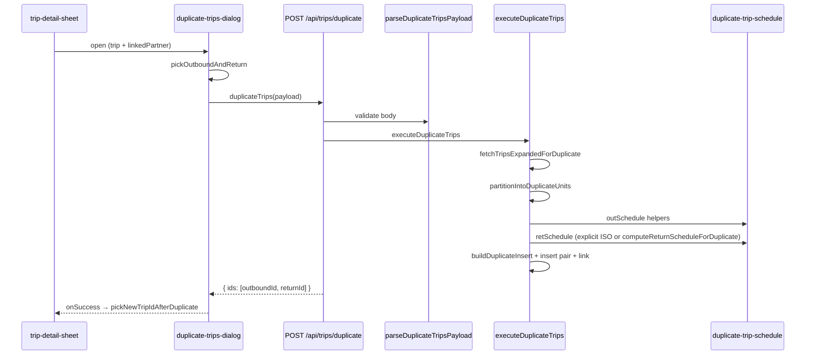

# Audit: duplicated return inherits original time instead of staying open

**Date:** 2026-06-17  
**Scope:** End-to-end duplicate-trip flow (Trip Detail Sheet → dialog → server insert) with focus on Hin/Rück pairs and “return stays open” semantics.  
**Code changes:** None (audit only).

**Note on filenames:** The user prompt referenced `duplicate-trips-2.ts`. The repository implements this logic in [`src/features/trips/lib/duplicate-trips.ts`](../src/features/trips/lib/duplicate-trips.ts). There is no `duplicate-trips-2.ts`.

---

## 1. End-to-end flow (functions and payload fields)

### 1.1 Trip Detail Sheet entry

| Step | Location | Function / symbol |
|------|----------|-------------------|
| Open dialog | [`trip-detail-sheet.tsx`](../src/features/trips/trip-detail-sheet/trip-detail-sheet.tsx) ~2075–2076 | `onClick={() => setIsDuplicateDialogOpen(true)}` in **Aktionen** menu |
| Render dialog | ~2134–2152 | `<DuplicateTripsDialog … variant='detail' selectedTrips={[trip]} linkedPartnerPreview={linkedPartner} onSuccess={…} />` |
| Post-success navigation | ~160–167, ~2143–2148 | `pickNewTripIdAfterDuplicate(createdIds, tripLegDirection)` → `onNavigateToTrip?.(nextId)` |

`linkedPartner` is resolved earlier via `findPairedTrip` and held in sheet state. `tripLegDirection` comes from `getTripDirection(trip)`.

### 1.2 Duplicate dialog

| Step | Location | Function / symbol |
|------|----------|-------------------|
| Pair detection | [`duplicate-trips-dialog.tsx`](../src/features/trips/components/trips-tables/duplicate-trips-dialog.tsx) ~135–145 | `pickOutboundAndReturn(selectedTrips[0], linkedPartnerPreview)` when `showLinkedToggle && includeLinkedLeg` |
| Submit | ~241–331 | `handleSubmit` → `tripsService.duplicateTrips({ … })` |

**Payload fields sent from the detail sheet path:**

| Field | When set |
|-------|----------|
| `ids` | `[openedTrip.id]` |
| `targetDateYmd` | Date picker (default: next calendar day in business TZ) |
| `scheduleMode` | `'preserve_original_time'` \| `'unified_time'` \| `'time_open'` |
| `includeLinkedLeg` | Only when `showLinkedToggle`; `true` if “Gegenfahrt mitkopieren” checked |
| `explicitPerLegUnifiedTimes` | `true` when `variant === 'detail'` **and** a Hin/Rück pair is active (`isDetail && pairForUnified`) |
| `unifiedScheduledAtIso` | `scheduleMode === 'unified_time'` and Hinfahrt time field non-empty → `combineYmdAndHmToIsoString(targetDateYmd, unifiedHinTimeHm)` |
| `unifiedReturnScheduledAtIso` | Same mode and Rückfahrt time field non-empty → `combineYmdAndHmToIsoString(targetDateYmd, unifiedRueckTimeHm)` |

**Important:** ISO fields are spread into the payload only when truthy (`...(unifiedReturnScheduledAtIso ? { unifiedReturnScheduledAtIso } : {})`). An intentionally empty return time field means the key is **absent** from the JSON body.

### 1.3 Client API

[`trips.service.ts`](../src/features/trips/api/trips.service.ts) `duplicateTrips` → `POST /api/trips/duplicate` with the payload JSON.

### 1.4 API route

[`src/app/api/trips/duplicate/route.ts`](../src/app/api/trips/duplicate/route.ts):

1. `requireAdmin()`
2. `parseDuplicateTripsPayload(json)` — [`duplicate-trip-schedule.ts`](../src/features/trips/lib/duplicate-trip-schedule.ts)
3. `fetchTripsExpandedForDuplicate` (partner expansion when `includeLinkedLeg !== false`)
4. `executeDuplicateTrips(admin, payload, companyId, userId, getCtx)` — [`duplicate-trips.ts`](../src/features/trips/lib/duplicate-trips.ts)

### 1.5 Server duplicate execution (pair path)

| Step | Function | Role |
|------|----------|------|
| Expand selection | `fetchTripsExpandedForDuplicate` | Loads partner leg when `includeLinkedLeg` |
| Group rows | `partitionIntoDuplicateUnits` | `{ kind: 'pair', outbound, ret }` |
| Outbound schedule | inline in `executeDuplicateTrips` ~519–540 | `computeTimeOpenSchedule` / unified ISO / `computePreserveScheduleForLeg` |
| Return schedule | inline ~542–560 | `unifiedReturnScheduledAtIso` shortcut **or** `computeReturnScheduleForDuplicate` |
| Inserts | `buildDuplicateInsert` × 2 | `scheduled_at`, `requested_date`, `link_type`, `linked_trip_id`, `ingestion_source: 'trip_duplicate'` |
| Link backfill | Supabase update on outbound | `link_type: 'outbound'`, `linked_trip_id` → new return |

**Schedule helpers** (all in `duplicate-trip-schedule.ts`):

| Helper | Used for |
|--------|----------|
| `computePreserveScheduleForLeg` | `preserve_original_time` per leg |
| `computeTimeOpenSchedule` | `time_open` (date only) |
| `combineYmdAndHmToIsoString` | Dialog → ISO for unified times |
| `outboundIsoFromUnifiedTimeChoice` | Bulk unified + anchor (not detail dual-field path) |
| `computeReturnScheduleForDuplicate` | Return leg when no explicit `unifiedReturnScheduledAtIso` |

### 1.6 Flow diagram



---

## 2. The bug (code terms)

### 2.1 Symptom

When duplicating a **Hin/Rück pair** from the detail sheet with **„Neue Uhrzeit wählen“** (`scheduleMode: 'unified_time'`), setting a time for the **Hinfahrt** but leaving the **Rückfahrt** time field **empty** (intended: return copy stays open), the duplicated return row gets a **non-null `scheduled_at`** copied/derived from the **original pair’s return time** (via outbound–return delta), instead of `scheduled_at: null`.

### 2.2 Where the return time is sourced

In `executeDuplicateTrips`, return schedule is chosen here:

```542:560:src/features/trips/lib/duplicate-trips.ts
    const retSchedule =
      payload.scheduleMode === 'unified_time' &&
      payload.unifiedReturnScheduledAtIso
        ? (() => {
            const retIso = payload.unifiedReturnScheduledAtIso;
            const retMs = new Date(retIso).getTime();
            return {
              scheduled_at: retIso,
              requested_date: instantToYmdInBusinessTz(retMs)
            };
          })()
        : computeReturnScheduleForDuplicate(
            unit.outbound,
            unit.ret,
            outSchedule,
            payload.scheduleMode,
            payload.targetDateYmd,
            payload.unifiedScheduledAtIso
          );
```

When the dialog omits `unifiedReturnScheduledAtIso` (empty Rückfahrt field), the code always falls through to `computeReturnScheduleForDuplicate`.

Inside that helper, for `unified_time` with a scheduled new outbound and **both source legs having `scheduled_at`**:

```170:177:src/features/trips/lib/duplicate-trip-schedule.ts
  const delta =
    new Date(origRet.scheduled_at).getTime() -
    new Date(origOut.scheduled_at).getTime();
  const retMs = new Date(newOut.scheduled_at).getTime() + delta;
  return {
    scheduled_at: new Date(retMs).toISOString(),
    requested_date: instantToYmdInBusinessTz(retMs)
  };
```

So the duplicated return instant is: **`newOutbound.scheduled_at + (origRet − origOut)`** — i.e. the original pair’s spacing, not “open”.

### 2.3 Why it inherits the original return time

`computeReturnScheduleForDuplicate` was written for **bulk** unified mode (single time + anchor radio): when both Vorlage legs have times, the non-anchored leg is **intentionally** computed from the Vorlage delta ([`docs/trips-duplicate.md`](../trips-duplicate.md) § „Liste (Bulk)“).

The **detail** path sends `explicitPerLegUnifiedTimes: true` and documents that **omitted** return ISO means “no `scheduled_at` on the copy” ([`duplicate-trip-schedule.ts`](../src/features/trips/lib/duplicate-trip-schedule.ts) lines 35–37, 182–183; [`docs/trips-duplicate.md`](../trips-duplicate.md) lines 46, 63).

`executeDuplicateTrips` never branches on `explicitPerLegUnifiedTimes` when building `retSchedule`. It only validates that the batch is a single pair (~454–459). The bulk delta fallback runs anyway.

**Dialog behavior is correct:** empty return field → key not sent.  
**Schedule helper is correct for bulk** but has no `explicitPerLegUnifiedTimes` parameter.  
**Bug origin: insert-building logic in `duplicate-trips.ts`** (missing guard), in combination with reusing a helper whose contract does not match the detail per-leg semantics.

### 2.4 Trigger conditions (all required)

1. Detail sheet, linked pair, `includeLinkedLeg: true`
2. `scheduleMode: 'unified_time'`
3. `explicitPerLegUnifiedTimes: true` (automatic for detail + pair)
4. `unifiedScheduledAtIso` set (Hinfahrt time filled)
5. `unifiedReturnScheduledAtIso` **omitted** (Rückfahrt field empty)
6. Source **outbound and return both have `scheduled_at`**

If the source return had no `scheduled_at`, the helper’s earlier branch (~159–168) correctly returns `scheduled_at: null`. The bug is specific to **timed source pairs**.

### 2.5 Related UX footgun (not the same bug)

When switching to `unified_time`, an effect prefills both time inputs from the Vorlage (~201–215 in the dialog). Users must clear the Rückfahrt field manually. If they submit with the prefilled value, the dialog correctly sends `unifiedReturnScheduledAtIso` — that is user-chosen time, not the delta bug.

---

## 3. `scheduleMode`, unified values, and optional return — origin matrix

| `scheduleMode` | Dialog (detail + pair) | Server outbound | Server return (when `unifiedReturnScheduledAtIso` absent) |
|----------------|------------------------|-----------------|-----------------------------------------------------------|
| `preserve_original_time` | No ISO fields | `computePreserveScheduleForLeg(outbound)` | `computePreserveScheduleForLeg(return)` — open only if **source** return had no `scheduled_at` |
| `time_open` | No ISO fields | `computeTimeOpenSchedule` | `computeReturnScheduleForDuplicate` → `computeTimeOpenSchedule` ✓ |
| `unified_time` | Optional per-leg ISOs; `explicitPerLegUnifiedTimes: true` | ISO or `{ scheduled_at: null, requested_date: targetDateYmd }` | **BUG:** delta from source pair when source both timed |
| `unified_time` (bulk) | Single `unifiedScheduledAtIso` + anchor | ISO | Delta via `computeReturnScheduleForDuplicate` ✓ (intended) |

**Conclusion:** Bug is **not** in the dialog payload for the empty-return case. It is **not** in `time_open` or `preserve_original_time` paths (for their documented semantics). It is **`executeDuplicateTrips` retSchedule branching** failing to honor `explicitPerLegUnifiedTimes`, while **`computeReturnScheduleForDuplicate` is the wrong tool** for that case without a caller-side guard.

---

## 4. Why the duplicated return is “not editable” afterward

### 4.1 Primary cause: wrong `scheduled_at` on insert

When the bug fires, the return row is persisted with `scheduled_at` set. The detail sheet treats that as a **fully scheduled** trip:

- Header shows date + time (`trip.scheduled_at` branch ~1175–1218)
- `timeDraft` is initialized from `trip.scheduled_at` (~477–481)
- User sees a concrete return time (derived from the original pair), not an empty “offen” state

### 4.2 Not caused by

| Hypothesis | Finding |
|------------|---------|
| `requested_date` alone making UI “scheduled” | UI shows date+time block when `scheduled_at \|\| requested_date`; date-only rows have **empty** `timeDraft` — correct for open trips |
| `link_type` / `linked_trip_id` | No disable logic on date/time fields for linked returns |
| `ingestion_source === 'trip_duplicate'` | Only renders a **„Kopie“** badge (~1133–1139); does not lock fields |
| `status` / `return_status` | Date/time inputs disabled only when `isSavingDetails \|\| !isOpen` |

### 4.3 Secondary cause: cannot revert to “open” via the sheet

[`build-trip-details-patch.ts`](../src/features/trips/trip-detail-sheet/lib/build-trip-details-patch.ts) has paths to **set** `scheduled_at` from `timeDraft` but **no path to clear** `scheduled_at` back to `null` when the user empties the time field on a row that already has `scheduled_at` (~213–259).

So after the bug:

- The return **looks** fixed to a time (misleading dispatch state).
- User can **change** the time to another value.
- User **cannot** clear the time field and save to restore date-only / “offen” — the save patch never nulls `scheduled_at`.

This is a **product gap** independent of duplication, but it amplifies the duplicate bug: a wrongly scheduled return cannot be corrected back to “open” without Verschieben/workarounds or direct DB edit.

---

## 5. Intended meaning of “return stays open”

From [`docs/trips-duplicate.md`](../trips-duplicate.md) and [`duplicate-trip-schedule.ts`](../src/features/trips/lib/duplicate-trip-schedule.ts):

| Question | Intended behavior |
|----------|-------------------|
| Fixed time on duplicated return? | **No** — `scheduled_at` should be `null` |
| Date without scheduled time? | **Yes** — `requested_date` = chosen target day (detail unified: `targetDateYmd`; when outbound is timed and return open, docs require aligning return `requested_date` with the new outbound’s business calendar day — see helper comment ~161–164) |
| Editable in sheet after duplication? | **Yes** — date picker + empty time input; user can later set a time and save (same as any date-only trip) |

**Modes that express “return stays open”:**

1. **`time_open`** — **both** legs open (not return-only).
2. **`unified_time` + detail dual fields** — return field empty → per-leg open for return while outbound may have a time (`explicitPerLegUnifiedTimes`).
3. **`preserve_original_time`** — return open **only if** source return had no `scheduled_at`.

### Does current implementation match intent?

| Scenario | Match? |
|----------|--------|
| `time_open` + pair | ✓ Yes |
| `preserve_original_time` + source return ohne Zeit | ✓ Yes |
| `unified_time` + detail + empty return + **source pair both timed** | ✗ **Violates** — delta fallback schedules return |
| Open return editable after correct duplicate | ✓ Yes (date + empty time) |
| Open return after bug | ✗ Appears scheduled; cannot clear time via save |

---

## 6. `retSchedule` / `computeReturnScheduleForDuplicate` safety by mode

| Mode | `computeReturnScheduleForDuplicate` behavior | Safe for all callers? |
|------|-----------------------------------------------|------------------------|
| `time_open` | Early return → `computeTimeOpenSchedule(targetDateYmd)` | ✓ |
| `preserve_original_time` | `computePreserveScheduleForLeg(origRet, …)` | ✓ |
| `unified_time`, `newOut.scheduled_at` null | `scheduled_at: null`, `requested_date: targetDateYmd` | ✓ |
| `unified_time`, source return or outbound missing `scheduled_at` | `scheduled_at: null`, `requested_date` aligned to outbound day | ✓ (documented bulk/detail edge case) |
| `unified_time`, both source timed, `newOut.scheduled_at` set | Delta-based return instant | ✓ for **bulk anchor**; ✗ for **`explicitPerLegUnifiedTimes` with omitted return ISO** |

The helper is **not universally wrong** — it is **over-applied** in `executeDuplicateTrips` when `explicitPerLegUnifiedTimes` is true and return ISO is intentionally absent.

---

## 7. Refactor vs smallest fix

### 7.1 Smallest contained fix

In `executeDuplicateTrips` pair branch, when building `retSchedule`:

```text
IF scheduleMode === 'unified_time'
   AND payload.explicitPerLegUnifiedTimes
   AND payload.unifiedReturnScheduledAtIso is undefined
THEN use open return schedule (scheduled_at: null, requested_date aligned per existing helper rules)
ELSE existing branches unchanged
```

Reuse logic from `computeReturnScheduleForDuplicate` lines 156–168 (align `requested_date` with new outbound when outbound is timed) or extract a one-liner shared function — **do not** call the delta branch.

**Risk:** Low if guarded strictly on `explicitPerLegUnifiedTimes`. Bulk and non-explicit unified paths untouched.

### 7.2 Preferred maintainable refactor

Introduce a **schedule derivation module** (see §8) so `executeDuplicateTrips` does not embed mode matrix inline and cannot drift from dialog/docs again.

### 7.3 Risk surface

| Area | Risk if fix is wrong |
|------|----------------------|
| Bulk unified + anchor + delta | High — must not gate on `explicitPerLegUnifiedTimes` incorrectly |
| `preserve_original_time` / `time_open` | Low — separate branches |
| Single-trip duplicate | None — pair branch only |
| `requested_date` day alignment Hin/Rück | Medium — open return should stay on outbound’s business day when outbound has ISO |
| Pricing | Low — `computeTripPrice` uses final `scheduled_at` |

### 7.4 Behaviors that must remain functionally identical

- Bulk list duplicate (no `explicitPerLegUnifiedTimes`)
- Bulk pair + unified anchor + delta spacing
- `includeLinkedLeg` default `true` / expansion semantics
- Insert order `createdIds = [outboundId, returnId]`
- Link backfill (`return` → outbound id, then outbound → return id)
- `ingestion_source: 'trip_duplicate'`, cleared `rule_id` / driver / group
- `parseDuplicateTripsPayload` validation rules
- Detail navigation via `pickNewTripIdAfterDuplicate`

---

## 8. Senior recommendation: dedicated duplication schedule helper

### 8.1 Should we introduce one?

**Yes.** The schedule contract is already split across three places (dialog submit, `parseDuplicateTripsPayload`, `executeDuplicateTrips` inline + `computeReturnScheduleForDuplicate`), and the `explicitPerLegUnifiedTimes` flag is validated but not consumed at schedule-build time. A single owner for **“what schedule does this payload mean for this unit?”** would prevent recurrence of this class of bug.

Keep **`executeDuplicateTrips`** responsible for Supabase I/O, expansion, pricing, and linking. Move **pure schedule decisions** into a dedicated helper module (extend `duplicate-trip-schedule.ts` or add `duplicate-trip-schedules.ts`).

### 8.2 Proposed API shape

```typescript
// duplicate-trip-schedule.ts (or sibling module)

export interface DuplicateLegSchedule {
  scheduled_at: string | null;
  requested_date: string | null;
}

export interface DeriveDuplicateSchedulesInput {
  payload: DuplicateTripsPayload;
  unit: DuplicateUnit; // 'single' | 'pair' from duplicate-trips.ts
}

export interface DuplicateSchedulesResult {
  outbound: DuplicateLegSchedule;
  return?: DuplicateLegSchedule; // only when unit.kind === 'pair'
}

/**
 * Single entry: given validated payload + partitioned unit,
 * returns insert-ready schedules. No Supabase.
 */
export function deriveDuplicateSchedules(
  input: DeriveDuplicateSchedulesInput
): DuplicateSchedulesResult;
```

**Internal responsibilities (private functions):**

| Function | Owns |
|----------|------|
| `deriveSingleLegSchedule(sourceLeg, payload)` | `time_open` / `preserve` / `unified` for singles |
| `deriveOutboundSchedule(origOutbound, payload)` | Pair outbound branch |
| `deriveReturnSchedule(origOutbound, origReturn, outboundSchedule, payload)` | **All** return semantics including `explicitPerLegUnifiedTimes`, explicit ISO shortcut, bulk delta |
| `normalizeUnifiedPerLegFlags(payload)` | Assert invariants (e.g. explicit per-leg ⇒ exactly one pair) |

`executeDuplicateTrips` would become:

```typescript
const { outbound, return } = deriveDuplicateSchedules({ payload, unit });
const outInsert = buildDuplicateInsert(unit.outbound, outbound, …);
const retInsert = buildDuplicateInsert(unit.ret, return!, …);
```

### 8.3 Ownership boundaries

| Layer | Owns |
|-------|------|
| `duplicate-trips-dialog.tsx` | UX, defaults, prefilling Vorlage times, building ISO strings from `<input type="time">` |
| `parseDuplicateTripsPayload` | Request validation, type coercion, defaults (`includeLinkedLeg`) |
| **`deriveDuplicateSchedules`** | **Normative schedule semantics** for every mode and unit kind |
| `executeDuplicateTrips` | Fetch, partition, insert order, link updates, metrics, pricing |
| `buildDuplicateInsert` | Field copy matrix (route, billing, flags) + schedule/link injection |
| `trip-detail-sheet` | Display/edit persisted rows (separate from duplicate write path) |

### 8.4 What moves into the helper

- Pair vs single branching currently inline in `executeDuplicateTrips` (~463–560)
- `retSchedule` ternary + `computeReturnScheduleForDuplicate` caller logic
- `explicitPerLegUnifiedTimes` “omit ISO = open leg” rule (today only documented + parsed, not enforced)
- `requested_date` alignment when return is open but outbound is timed

**What stays put:**

- `computePreserveScheduleForLeg`, `computeTimeOpenSchedule`, `combineYmdAndHmToIsoString`, `outboundIsoFromUnifiedTimeChoice` as low-level primitives
- `buildDuplicateInsert`, `enrichInsertWithMetrics`, pricing
- Dialog effects and Vorlage prefilling

### 8.5 Tests to add with the helper

Unit tests in `duplicate-trip-schedule` (or `duplicate-trips`) covering:

1. Detail `explicitPerLegUnifiedTimes`: outbound ISO set, return ISO omitted, **both source legs timed** → return `scheduled_at: null`
2. Bulk unified: anchor hinfahrt, both source timed → delta return (regression)
3. `time_open` pair → both null `scheduled_at`
4. `preserve_original_time` with source return ohne Zeit → return open
5. `requested_date` alignment when outbound ISO crosses business-day boundary (existing comment in helper)

---

## 9. Summary

| Item | Verdict |
|------|---------|
| End-to-end entry | Trip Detail Sheet **Aktionen → Duplizieren** → `DuplicateTripsDialog` → `tripsService.duplicateTrips` → `executeDuplicateTrips` |
| Bug | Detail `unified_time` + empty return field still runs **bulk delta** via `computeReturnScheduleForDuplicate` when source pair both have times |
| Root cause | **`duplicate-trips.ts` insert-building** ignores `explicitPerLegUnifiedTimes` for return; dialog is correct |
| “Not editable” | Wrong `scheduled_at` on insert + **no save path to clear** `scheduled_at` in detail sheet |
| Intent | Open return = `scheduled_at: null`, `requested_date` set, time field empty and later editable |
| Fix size | Small guard in `executeDuplicateTrips`; **recommended** extract `deriveDuplicateSchedules` for long-term maintainability |

---

## 10. File reference

| File | Role |
|------|------|
| [`trip-detail-sheet.tsx`](../src/features/trips/trip-detail-sheet/trip-detail-sheet.tsx) | Entry, dialog wiring, post-duplicate navigation |
| [`duplicate-trips-dialog.tsx`](../src/features/trips/components/trips-tables/duplicate-trips-dialog.tsx) | Payload assembly, per-leg unified UI |
| [`duplicate-trips.ts`](../src/features/trips/lib/duplicate-trips.ts) | Expansion, partition, **retSchedule bug**, inserts |
| [`duplicate-trip-schedule.ts`](../src/features/trips/lib/duplicate-trip-schedule.ts) | Schedule primitives, payload parse, `computeReturnScheduleForDuplicate` |
| [`docs/trips-duplicate.md`](../trips-duplicate.md) | Product spec (explicit per-leg optional ISOs) |
| [`build-trip-details-patch.ts`](../src/features/trips/trip-detail-sheet/lib/build-trip-details-patch.ts) | Cannot null `scheduled_at` when clearing time |
