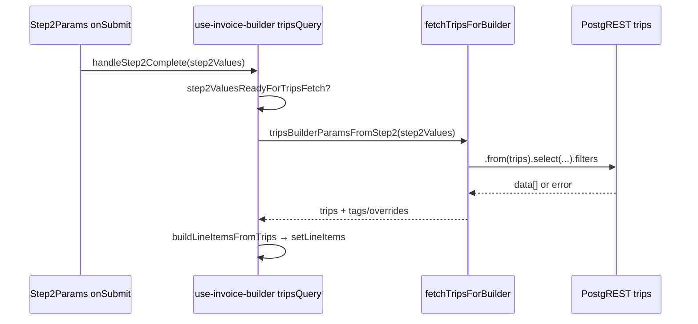

# Audit: Trips Not Found for Specific Payer in Invoice Builder

**Date:** 2026-06-03  
**Scope:** Read-only trace of create-mode trip loading when Step 2 completes (e.g. Kostenträger “Rechnungsfahrt”, passenger context “Kira Herbers”).  
**Symptom:** Section 3 shows no billable positions (`lineItems.length === 0`) after Step 2 submit.  
**Related:** [invoice-builder-features-audit.md](./invoice-builder-features-audit.md), [invoice-revision-workflow-audit.md](./invoice-revision-workflow-audit.md), [docs/invoices-module.md](../invoices-module.md), [docs/trip-client-linking.md](../trip-client-linking.md).

---

## Files read (inventory)

| Role | Path |
|------|------|
| Trip query orchestration | `src/features/invoices/hooks/use-invoice-builder.ts` |
| Step 2 → fetch params | `src/features/invoices/lib/trips-builder-params.ts` |
| PostgREST queries | `src/features/invoices/api/invoice-line-items.api.ts` |
| Section guards / empty Section 3 | `src/features/invoices/lib/invoice-builder-section-guards.ts` |
| Step 2 payer + date UI | `src/features/invoices/components/invoice-builder/step-2-params.tsx` |
| Builder shell | `src/features/invoices/components/invoice-builder/index.tsx` |
| Step 3 UI copy | `src/features/invoices/components/invoice-builder/step-3-line-items.tsx` |
| Query keys | `src/query/keys/invoices.ts` |
| Payer list (server) | `src/app/dashboard/invoices/new/page.tsx` |
| CSV → `payer_id` | `src/features/trips/components/bulk-upload-dialog.tsx` |
| RLS | `supabase/migrations/20260409170000_add_missing_rls.sql` |
| Trips “uninvoiced” filter (Fahrtenliste only) | `supabase/migrations/20260411140000_trip_ids_matching_invoice_effective_status.sql` |
| Schema (relevant columns) | `src/types/database.types.ts` (`trips` Row) |
| Example seed / CSV (non-PII patterns) | `EXAMPLE/Billing_Payer/payers_rows.csv`, `EXAMPLE/Termine_19.03.26.csv` |

There is **no** `use-invoice-builder-trips.ts`; all create-mode trip loading lives in `use-invoice-builder.ts` (`tripsQuery`).

---

## End-to-end flow (create mode)



**Edit mode:** `tripsQuery` is **disabled** (`enabled: !isEditMode && …`); line items come from `invoice_line_items` hydration, not a live trip fetch.

---

## 1. Trip query filters

### Orchestration

| Step | File | Lines |
|------|------|-------|
| Query enabled when Step 2 valid | `use-invoice-builder.ts` | 442 |
| Params assembly | `trips-builder-params.ts` | 29–68 |
| Billing trips fetch | `invoice-line-items.api.ts` | 269–354 |
| Variant pre-resolution | `invoice-line-items.api.ts` | 158–217, 92–155 |

`tripsBuilderParamsFromStep2` passes through:

- `payer_id` — UUID from Step 2 form
- `period_from` / `period_to` — `YYYY-MM-DD` strings
- `billing_type_id`, `billing_type_ids`, `billing_variant_id`, `billing_variant_ids` — optional scope (mode-dependent)
- `client_id` — only meaningful in `per_client` mode

### Exact PostgREST chain (`fetchTripsForBuilder`)

Base query (always applied):

```286:323:src/features/invoices/api/invoice-line-items.api.ts
  let query = supabase
    .from('trips')
    .select(
      `
      id,
      payer_id,
      status,
      scheduled_at,
      ...
    `
    )
    .eq('payer_id', params.payer_id)
    .gte('scheduled_at', params.period_from)
    .lte('scheduled_at', params.period_to + 'T23:59:59.999Z')
    // Defence in depth: billing must never see cancelled rows even if other layers regress.
    .neq('status', CANCELLED_STATUS)
    .order('scheduled_at', { ascending: true });
```

Optional filters (same function):

| Condition | Filter | Lines |
|-----------|--------|-------|
| Single Unterart (`billing_variant_id`) | `.eq('billing_variant_id', variantId)` | 325–326 |
| All variants of type(s) / subset | `.in('billing_variant_id', variantIdsForType)` | 327–328 |
| `per_client` + `client_id` | `.eq('client_id', params.client_id)` | 331–335 |

**Early exit (no DB trip query):** `resolveBillingVariantFilters` may set `abortEmpty: true` (e.g. selected `billing_type_id` has zero variants). Then `fetchTripsForBuilder` returns `{ trips: [], … }` at lines 280–281 **without throwing**.

### Filters **not** applied by the builder

| Filter | In builder? |
|--------|-------------|
| `company_id` | No explicit `.eq` — tenant scope via **RLS** only |
| `deleted_at` | No column on `trips` in `database.types.ts` |
| Already on an invoice (`invoice_line_items`) | **No** |
| `no_invoice_required` | **No** |
| `requested_date` | **No** — only `scheduled_at` |
| Trip list “Rechnungsstatus” / `trip_ids_matching_invoice_effective_status` | **No** (that RPC is for Fahrtenliste, migration `20260411140000`) |

### Parallel query: cancelled trips

`fetchCancelledTripsForBuilder` uses the same payer/period/variant/client filters but `.eq('status', CANCELLED_STATUS)` instead of `.neq` (lines 438–441). Cancelled rows populate `cancelledTrips`, **not** `lineItems`.

### Summary table — every WHERE-like condition

| # | Condition | Source |
|---|-----------|--------|
| 1 | `payer_id = params.payer_id` | `.eq` |
| 2 | `scheduled_at >= period_from` (date string start of day UTC interpretation via PostgREST) | `.gte` |
| 3 | `scheduled_at <= period_toT23:59:59.999Z` | `.lte` |
| 4 | `status != 'cancelled'` | `.neq` |
| 5 | Optional `billing_variant_id = …` or `billing_variant_id IN (…)` | variant resolver |
| 6 | Optional `client_id = …` | `per_client` only |
| 7 | RLS: admin + `company_id = current_user_company_id()` | DB policy |

Trips with `scheduled_at IS NULL` are **excluded** by (2)–(3) in SQL (`NULL` comparisons fail).

---

## 2. Already-billed exclusion

**Does the builder exclude trips already on an invoice?** **No.**

- `fetchTripsForBuilder` has no join or subquery on `invoice_line_items` / `invoices`.
- Documented explicitly in [invoice-revision-workflow-audit.md](./invoice-revision-workflow-audit.md) (trip double-link / period change risk).

**Could Kira Herbers’ trips already be on a draft or finalised invoice?** **Yes, and they would still be returned** by the builder query if all other filters match. The UI does not hide “already invoiced” trips in create mode.

To see invoicing state, use the Fahrtenliste filter backed by `trip_ids_matching_invoice_effective_status` (`uninvoiced` = no line item on invoice with `status IN ('draft','sent','paid')`) — **not** wired into the invoice builder.

**Implication:** Empty list is **unlikely** to be caused by “already billed” filtering in code. If trips exist but were billed, they would still appear unless another filter (payer, date, variant, cancelled, RLS) removes them.

---

## 3. Payer ID resolution (“Rechnungsfahrt”)

### Step 2 UI (monthly / single_trip / standard modes)

Kostenträger is a `<Select>` whose **value is `payers.id`** (UUID), not the display name:

```729:748:src/features/invoices/components/invoice-builder/step-2-params.tsx
                      <Select
                        value={field.value}
                        ...
                        onValueChange={(id) => {
                          field.onChange(id);
                          ...
                        }}
                      >
                        ...
                          {payers.map((p) => (
                            <SelectItem key={p.id} value={p.id}>
                              {p.name} ({p.number})
```

On submit, `payer_id: values.payer_id` is passed to `handleStep2Complete` (lines 545–556).

### Payer list source

Server page loads all company payers (RLS-scoped); labels come from `payers.name`:

```65:85:src/app/dashboard/invoices/new/page.tsx
    supabase
      .from('payers')
      .select(
        `
        id,
        name,
        ...
```

There is **no** secondary lookup by name at trip-fetch time — the UUID stored in `step2Values.payer_id` is used directly in `.eq('payer_id', params.payer_id)`.

### Verifying “Rechnungsfahrt” UUID

**In repo example seed** (`EXAMPLE/Billing_Payer/payers_rows.csv`):

| `payers.name` | `payers.id` | `company_id` |
|---------------|-------------|--------------|
| Rechnungsfahrt | `b18222dd-bfe2-48a7-927b-c7abec700ab0` | `8df83726-cd59-4fd0-87df-0bd905915fec` |

Production UUIDs may differ; confirm in Supabase:

```sql
SELECT id, name, number, company_id
FROM payers
WHERE lower(trim(name)) = lower('Rechnungsfahrt');
```

**Consistency check:** In browser devtools / React Query devtools, inspect key `['invoices','builder-trips', { payer_id: '…', period_from, period_to, … }]`. The `payer_id` in that object must equal the row returned above.

### CSV import mapping (how trips get `payer_id`)

Bulk upload resolves Kostenträger by **case-insensitive name match** on the loaded payers list:

```739:743:src/features/trips/components/bulk-upload-dialog.tsx
          const payer = payers.find(
            (p) =>
              p.name.toLowerCase() ===
              (parsedRow.kostentraeger || '').toLowerCase()
          );
```

Wrong CSV column → wrong `payer_id` on inserted trips, even if the dispatcher intended “Rechnungsfahrt” in the invoice builder.

### `per_client` mode

Payer UUID comes from historical `client_payers` combinations (`comb.payer_id`), not the Kostenträger dropdown alone (lines 632–637).

---

## 4. RLS on `trips`

Policies in `20260409170000_add_missing_rls.sql`:

**Admin SELECT** (lines 16–21):

```sql
USING (
  public.current_user_is_admin()
  AND company_id = public.current_user_company_id()
);
```

**Driver SELECT** (own trips only, lines 44–52) — irrelevant if the user is on `/dashboard/invoices/new` (admin layout).

### Behaviour on failure

- PostgREST returns **`{ data: [], error: null }`** when RLS hides all rows — **not** a permission error in the common case.
- Query errors are thrown only when `error` is set: `if (error) throw toQueryError(error)` (`invoice-line-items.api.ts` 338–340).

### Could RLS explain zero trips?

| Scenario | Result |
|----------|--------|
| Admin, trips belong to same `company_id` as session | Rows visible if filters match |
| Trips stored under different `company_id` | **0 rows**, no error |
| Non-admin on dashboard (should be blocked by layout) | Typically 0 rows |

**Silent empty array** is consistent with RLS or with **no matching data** — distinguish via SQL with service role or admin SQL editor (see §5).

---

## 5. Kira Herbers’ trips in the DB

**Live DB was not queried in this audit.** Findings below use repository example data and code constraints only — **no production PII** is reproduced here.

### Example CSV pattern (import intent)

In `EXAMPLE/Termine_19.03.26.csv`, rows for passenger **Herbers / Kira** use Kostenträger column **`Selbstzahler`**, not `Rechnungsfahrt` (lines 15–16 in that file). Under `EXAMPLE/Billing_Payer/payers_rows.csv`, **Selbstzahler** is payer `aebdb66f-0ab0-4ea0-9e6b-b4037da86b64`, while **Rechnungsfahrt** is `b18222dd-bfe2-48a7-927b-c7abec700ab0`.

If production data followed the same import pattern, selecting **Rechnungsfahrt** in the invoice builder would return **zero** trips for that passenger even when trips exist under **Selbstzahler**.

### SQL pack for admin (run in Supabase SQL editor)

Replace placeholders after running the payer lookup.

```sql
-- A) Resolve payer UUID for "Rechnungsfahrt"
SELECT id AS rechnungsfahrt_payer_id, name, company_id
FROM payers
WHERE lower(trim(name)) = lower('Rechnungsfahrt');

-- B) Trips for that payer in a date window (adjust dates to Step 2 range)
SELECT
  t.id,
  t.status,
  t.scheduled_at,
  t.requested_date,
  t.payer_id,
  t.billing_variant_id,
  t.client_id,
  t.client_name,
  EXISTS (
    SELECT 1
    FROM invoice_line_items li
    JOIN invoices i ON i.id = li.invoice_id
    WHERE li.trip_id = t.id
      AND i.status IN ('draft', 'sent', 'paid')
  ) AS on_open_invoice
FROM trips t
WHERE t.payer_id = :rechnungsfahrt_payer_id   -- from (A)
  AND t.scheduled_at >= '2026-03-01'::timestamptz
  AND t.scheduled_at <= '2026-03-31T23:59:59.999Z'::timestamptz
  AND t.status IS DISTINCT FROM 'cancelled'
ORDER BY t.scheduled_at;

-- C) Same passenger name, any payer (detect payer mismatch)
SELECT
  t.id,
  t.scheduled_at,
  t.status,
  p.name AS payer_name,
  t.payer_id,
  t.client_name
FROM trips t
JOIN payers p ON p.id = t.payer_id
WHERE t.company_id = (SELECT company_id FROM payers WHERE id = :rechnungsfahrt_payer_id)
  AND (
    lower(coalesce(t.client_name, '')) LIKE '%herbers%'
    OR EXISTS (
      SELECT 1 FROM clients c
      WHERE c.id = t.client_id
        AND (lower(c.last_name) LIKE '%herbers%' OR lower(c.first_name) LIKE '%kira%')
    )
  )
  AND t.scheduled_at >= '2026-03-01'::timestamptz
  AND t.scheduled_at <= '2026-03-31T23:59:59.999Z'::timestamptz
ORDER BY t.scheduled_at;

-- D) Count uninvoiced trips for payer (Fahrtenliste semantics — NOT builder filter)
SELECT count(*) AS uninvoiced_count
FROM trips t
WHERE t.payer_id = :rechnungsfahrt_payer_id
  AND t.status IS DISTINCT FROM 'cancelled'
  AND t.id IN (
    SELECT trip_ids_matching_invoice_effective_status('uninvoiced')
  );
```

**Interpretation:**

| (B) count | (C) shows other payer | Likely cause |
|-----------|------------------------|--------------|
| 0 | Rows under Selbstzahler / other payer | **Data:** wrong `payer_id` on trips |
| >0 | — | Check Step 2 **date range** + **Abrechnungsart/Unterart** filters |
| 0 | 0 everywhere | No trips / wrong dates / `scheduled_at` null |
| 0 | — but admin company mismatch | **RLS / company_id** |

---

## 6. Date range filter

**Yes.** Required fields in Step 2 (`step2Schema` lines 79–80; guards lines 36–37).

| Aspect | Detail |
|--------|--------|
| Default in form | `period_from: ''`, `period_to: ''` until user picks range (`step-2-params.tsx` 416–417) |
| Fetch gate | Trips load only after both dates set and form submitted (`step2ValuesReadyForTripsFetch`) |
| Column used | **`scheduled_at` only** — not `requested_date` |
| Upper bound | Inclusive end of `period_to` via `period_to + 'T23:59:59.999Z'` |
| Timezone note | See AGENTS.md / `docs/trips-date-filter.md` — persisted trip times must use Berlin builders; filter compares stored `scheduled_at` ISO strings |

**Could Kira Herbers’ trips fall outside the range?** **Yes**, if:

- Dispatcher chose a month/week that does not include `2026-03-19` (example CSV date), or
- Trips were imported **without time** (`scheduled_at` null, `requested_date` set) — they **fail** `.gte`/`.lte` and never appear.

Check:

```sql
SELECT id, scheduled_at, requested_date, status
FROM trips
WHERE payer_id = :rechnungsfahrt_payer_id
  AND scheduled_at IS NULL
  AND requested_date BETWEEN '2026-03-01' AND '2026-03-31';
```

---

## 7. Error or empty result?

| Outcome | Mechanism | User-visible signal |
|---------|-----------|---------------------|
| **Success, empty** | `data: []`, `error: null` → `buildLineItemsFromTrips([])` → `lineItems = []` | Step 3: no “X Fahrten gefunden” banner (`step-3-line-items.tsx` 461–466); confirm button disabled (`lineItems.length === 0`, 1228) |
| **Success, rows** | Same path with trips | “{n} Fahrten gefunden…” |
| **Query error** | `throw toQueryError(error)` in `fetchTripsForBuilder` | `tripsQuery.isError` true (`use-invoice-builder.ts` 1124); `isInvoiceBuilderSection3Complete` returns false when `isTripsError` (guards 60–61) |
| **Variant abortEmpty** | Returns `[]` without throw | Same as success-empty |
| **RLS / no rows** | Empty data, no error | Same as success-empty |

**Network tab:** Look for PostgREST `GET /rest/v1/trips?...` — **200** with `[]` vs **4xx/5xx** with error body.

**Note:** `isTripsError` is consumed for section gating in `index.tsx` (313) but **no dedicated error Alert** was found in the builder shell grep — a failed query may present as a locked/empty Section 3 rather than an explicit toast. Worth confirming in UI when reproducing.

---

## Senior-level recommendation

### Single most likely cause

**Payer mismatch between invoice builder selection and trip data** — dispatcher selects Kostenträger **Rechnungsfahrt** (`payer_id` for that payer row), while trips for the passenger were created under a **different** payer (e.g. CSV Kostenträger **Selbstzahler**). The builder filters strictly on `trips.payer_id`; passenger name is not used in the fetch.

Secondary frequent causes (in order):

1. **Date range** does not cover `scheduled_at` of the trips (or trips are **timeless** / `scheduled_at` null).
2. **Optional Abrechnungsart / Unterart** subset excludes the trips’ `billing_variant_id` (including `abortEmpty` when a type has no variants).
3. All matching trips are **`cancelled`** (excluded from billing fetch; only appear in optional cancelled block if in range).

**Unlikely as primary cause:** “Already on another invoice” (not filtered). **RLS-only** empty set if other payers’ trips load fine in the same session.

### Data vs code

| Classification | Assessment |
|----------------|------------|
| **Data problem** | **Most likely** — wrong `payer_id` on trips, date window, cancelled status, or variant scope |
| **Code problem** | **Possible but secondary** — no `requested_date` fallback for timeless trips; no uninvoiced filter (usually *increases* rows, not decreases); silent empty on RLS |

### Minimal verification before any fix

1. In Supabase, run **SQL (A)** and **(C)** from §5 with the **exact** Step 2 `period_from` / `period_to` the user entered.
2. If (C) shows trips under another payer name → **data / import / booking** fix (reassign payer or pick correct Kostenträger in builder), not query code.
3. If (B) returns rows but builder empty → compare `billing_variant_id` to Step 2 **Abrechnungsarten / Unterarten** selection; reproduce query string from React Query key vs PostgREST filters.
4. If (B) is empty and `scheduled_at IS NULL` rows exist for `requested_date` in range → **timeless-trip vs `scheduled_at` filter** hypothesis (product/code decision).

---

## Status

**Audit only** — no application or database changes in this document.
