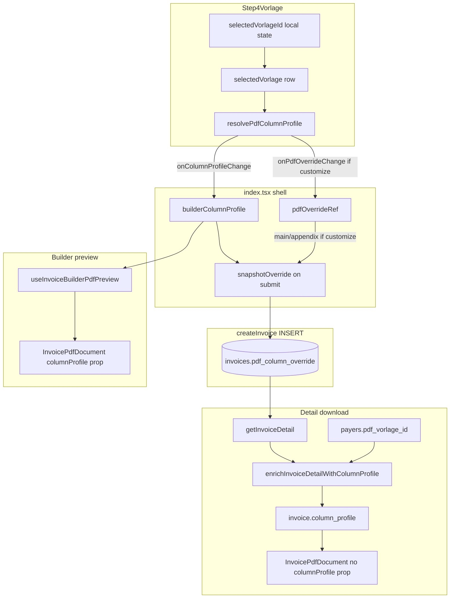

# Audit: PDF Vorlage ID — Data Flow from Selection to Download

**Status:** Fix applied — 2026-06-03 (tier-1 Zod guard on INSERT, loud enrich parse failures, snapshot/schema alignment)

**Date:** 2026-06-03  
**Scope:** Read-only trace of invoice builder → create → detail download → PDF renderer.  
**Note:** `step-4-confirm-2.tsx` does not exist; confirmation/submit is `step-4-confirm.tsx`. There is no `invoice-builder-context.ts`; state lives in `invoice-builder/index.tsx`.

---

## Files read (inventory)

| Role | Path |
|------|------|
| Builder shell | `src/features/invoices/components/invoice-builder/index.tsx` |
| PDF-Vorlage step | `src/features/invoices/components/invoice-builder/step-4-vorlage.tsx` |
| Bestätigung / submit form | `src/features/invoices/components/invoice-builder/step-4-confirm.tsx` |
| Create/save hook | `src/features/invoices/hooks/use-invoice-builder.ts` |
| Supabase INSERT | `src/features/invoices/api/invoices.api.ts` |
| Digital + Brief download | `src/features/invoices/components/invoice-detail/index.tsx` |
| PDF root | `src/features/invoices/components/invoice-pdf/InvoicePdfDocument.tsx` |
| Builder preview hook | `src/features/invoices/components/invoice-builder/use-invoice-builder-pdf-preview.tsx` |
| Draft detail builder | `src/features/invoices/components/invoice-pdf/build-draft-invoice-detail-for-pdf.ts` |
| Post-fetch enrich | `src/features/invoices/lib/enrich-invoice-detail-column-profile.ts` |
| Resolver | `src/features/invoices/lib/resolve-pdf-column-profile.ts` |
| DB migration | `supabase/migrations/20260408120001_pdf_vorlagen.sql` |

---

## 1. Selection → shell state

### Where `selectedVorlageId` lives

`selectedVorlageId` is **local React state only** inside `Step4Vorlage` — not a context key and not lifted as an ID to the parent.

```132:134:src/features/invoices/components/invoice-builder/step-4-vorlage.tsx
  const [selectedVorlageId, setSelectedVorlageId] = useState<string | null>(
    null
  );
```

The dropdown writes it via `setSelectedVorlageId` (`306:310:step-4-vorlage.tsx`).

### How the parent learns the choice

The shell (`index.tsx`) does **not** receive `selectedVorlageId`. It receives:

| Callback | Prop name | What flows up |
|----------|-----------|----------------|
| Resolved column profile | `onColumnProfileChange` → `setBuilderColumnProfile` | `PdfColumnProfile` (columns, `main_layout`, flags) |
| Override payload for INSERT | `onPdfOverrideChange` → `pdfOverrideRef` | `PdfColumnOverridePayload \| null` (only when “Spalten anpassen” is ON) |
| Vorlage row for Brieftext | `onResolvedVorlageRowChange` → `setBuilderResolvedVorlage` | `PdfVorlageRow \| null` |

Wiring in the shell:

```727:738:src/features/invoices/components/invoice-builder/index.tsx
            <Step4Vorlage
              key={step2Values?.payer_id ?? '__no-payer__'}
              companyId={companyId}
              payerPdfVorlageId={selectedPayer?.pdf_vorlage_id}
              unlocked={section4Unlocked}
              excludedTripCount={excludedTripCount}
              onColumnProfileChange={setBuilderColumnProfile}
              onPdfOverrideChange={handlePdfOverridePersist}
              onPdfColumnsReordered={() =>
                setPdfColumnReorderGeneration((g) => g + 1)
              }
              onResolvedVorlageRowChange={handleResolvedVorlageRowChange}
            />
```

Lifted shell state:

```179:186:src/features/invoices/components/invoice-builder/index.tsx
  const [builderColumnProfile, setBuilderColumnProfile] =
    useState<PdfColumnProfile>(() => resolvePdfColumnProfile(null, null, null));
  /** Phase 10: Vorlage row from Section 4 dropdown — drives Brieftext default resolution. */
  const [builderResolvedVorlage, setBuilderResolvedVorlage] =
    useState<PdfVorlageRow | null>(null);
  const [pdfColumnReorderGeneration, setPdfColumnReorderGeneration] =
    useState(0);
  const pdfOverrideRef = useRef<PdfColumnOverridePayload | null>(null);
```

### Resolution inside Step 4

`selectedVorlageId` → `selectedVorlage` row (`153:156:step-4-vorlage.tsx`), then `resolvePdfColumnProfile(override?, selectedVorlage, companyDefaultVorlage)` in a `useEffect` (`195:214:step-4-vorlage.tsx`). Initial dropdown value is synced from payer / company default (`146:150:step-4-vorlage.tsx`).

**Answer:** Lifted via **callback props**, not context. The Vorlage **UUID is never stored in shell state** — only the resolved profile, optional customize override ref, and the Vorlage row object for text-block defaults.

---

## 2. Shell → create mutation

### Is `pdf_vorlage_id` on the INSERT payload?

**No.** There is no `pdf_vorlage_id` field on `invoices` and none in `CreateInvoicePayload`.

Persisted PDF layout is **`pdf_column_override`** (JSONB), not a Vorlage FK.

### Submit path (Section 5)

`Step4Confirm` fires `onConfirm`; the shell builds `snapshotOverride` and calls `createInvoice` / `updateInvoice`:

```784:812:src/features/invoices/components/invoice-builder/index.tsx
              onConfirm={(step4Values) => {
                // Phase 9c — layout snapshot: always write the full resolved profile
                // (main_columns + appendix_columns + main_layout) to pdf_column_override
                // so the invoice renders exactly as the dispatcher saw in the builder
                // preview, regardless of later Vorlage changes (§14 UStG snapshot).
                // When 'Spalten anpassen' is ON, preserve the user's custom column
                // arrays; otherwise use the preview's resolved columns from
                // builderColumnProfile. Tier 1 always wins for new invoices.
                const snapshotOverride: PdfColumnOverridePayload = {
                  main_columns:
                    pdfOverrideRef.current?.main_columns ??
                    builderColumnProfile.main_columns,
                  appendix_columns:
                    pdfOverrideRef.current?.appendix_columns ??
                    builderColumnProfile.appendix_columns,
                  main_layout: builderColumnProfile.main_layout,
                  show_cancelled_trips:
                    builderColumnProfile.show_cancelled_trips ?? false,
                  // why: carry Step 4 admin intent for excluded trips appendix into persisted snapshot
                  show_excluded_trips:
                    builderColumnProfile.show_excluded_trips ?? false
                };
                // why: same confirm UI for both flows; edit mode persists changes to
                // the existing draft (RPC + meta), create mode issues a new invoice.
                if (isEditMode) {
                  updateInvoice(step4Values, snapshotOverride);
                } else {
                  createInvoice(step4Values, snapshotOverride);
                }
              }}
```

### Hook → API payload

```903:918:src/features/invoices/hooks/use-invoice-builder.ts
      let pdfPayload: Record<string, unknown> | null = null;
      if (pdfColumnOverride) {
        pdfPayload = pdfColumnOverrideSchema.parse(
          pdfColumnOverride
        ) as unknown as Record<string, unknown>;
      }

      const invoice = await createInvoice({
        companyId,
        formValues: fullValues,
        subtotal: totals.subtotal,
        taxAmount: totals.taxAmount,
        total: totals.total,
        rechnungsempfaengerId: rechnungsempfaengerId ?? null,
        pdfColumnOverride: pdfPayload
      });
```

`CreateInvoicePayload` type:

```219:233:src/features/invoices/api/invoices.api.ts
export interface CreateInvoicePayload {
  companyId: string;
  formValues: InvoiceBuilderFormValues;
  /** Pre-calculated totals from the line items. */
  subtotal: number;
  taxAmount: number;
  total: number;
  /** Resolved recipient FK (catalog cascade or step-4 override); snapshot frozen here. */
  rechnungsempfaengerId: string | null;
  /**
   * Per-invoice PDF column override (Step 5). Null = resolve from payer Vorlage /
   * company default / system fallback at PDF time.
   */
  pdfColumnOverride?: Record<string, unknown> | null;
}
```

INSERT column:

```283:312:src/features/invoices/api/invoices.api.ts
  const { data, error } = await supabase
    .from('invoices')
    .insert({
      company_id: payload.companyId,
      invoice_number: invoiceNumber,
      payer_id: payload.formValues.payer_id,
      ...
      pdf_column_override: payload.pdfColumnOverride ?? null
    })
```

**Answer:** The create mutation carries **`pdfColumnOverride`** (parsed `PdfColumnOverridePayload`), not `pdf_vorlage_id`. With current shell code, submit always passes a non-null `snapshotOverride` object, so new invoices should get a populated `pdf_column_override` when creation succeeds.

---

## 3. Shell → download handler (Digital)

After create, navigation goes to detail (`238:240:index.tsx` → `router.push(/dashboard/invoices/${newId})`).

Downloads live on **`InvoiceDetailView`**, not in the builder.

```414:437:src/features/invoices/components/invoice-detail/index.tsx
              <PDFDownloadLink
                className='flex-1'
                document={
                  <InvoicePdfDocument
                    invoice={pdfInvoice}
                    paymentQrDataUrl={paymentQrDataUrl}
                    renderMode='digital'
                    showDraftWatermark={invoice.status === 'draft'}
                  />
                }
                fileName={`${invoice.invoice_number ?? 'rechnung'}-digital.pdf`}
              >
```

Template selection for layout/tables:

1. `useInvoiceDetail` → `getInvoiceDetail` → **`enrichInvoiceDetailWithColumnProfile`** (`82:91:use-invoice.ts`).
2. `InvoicePdfDocument` **does not** receive `columnProfile` here.
3. Effective profile inside the document:

```188:191:src/features/invoices/components/invoice-pdf/InvoicePdfDocument.tsx
  const effectiveProfile =
    columnProfileProp ??
    invoice.column_profile ??
    resolvePdfColumnProfile(null, null, null);
```

So Digital download uses **`invoice.column_profile`** from enrich, which is derived from:

- `invoices.pdf_column_override` (tier 1), else
- `pdf_vorlagen` row for **`payers.pdf_vorlage_id`** (tier 2), else
- company default Vorlage (tier 3), else system fallback (`30:59:enrich-invoice-detail-column-profile.ts`, `62:135:resolve-pdf-column-profile.ts`).

**Not** used at download: builder `selectedVorlageId`, `builderColumnProfile`, or `builderResolvedVorlage`.

**Answer:** Digital PDF uses the **persisted invoice row** (+ enrich), primarily **`pdf_column_override`** when valid; otherwise re-resolves from **payer’s** `pdf_vorlage_id`, not the builder dropdown session.

---

## 4. Shell → download handler (Brief)

Same component and data path as Digital; only `renderMode` and filename differ:

```438:461:src/features/invoices/components/invoice-detail/index.tsx
              <PDFDownloadLink
                ...
                document={
                  <InvoicePdfDocument
                    invoice={pdfInvoice}
                    paymentQrDataUrl={paymentQrDataUrl}
                    renderMode='brief'
                    showDraftWatermark={invoice.status === 'draft'}
                  />
                }
                fileName={`${invoice.invoice_number ?? 'rechnung'}-brief.pdf`}
              >
```

`InvoicePdfDocument` branches header/address geometry on `renderMode` (`456:512:InvoicePdfDocument.tsx`); **`effectiveProfile` is shared** — column layout does not diverge between Digital and Brief.

**Answer:** **Shared code path**; only `renderMode='digital' | 'brief'` and file name differ.

---

## 5. PDF renderer — template prop

There is **no** `vorlageId` or `templateId` prop on `InvoicePdfDocument`.

Layout is controlled by:

| Input | Type | Role |
|-------|------|------|
| `columnProfile` (optional prop) | `PdfColumnProfile \| null` | Builder preview; wins over invoice |
| `invoice.column_profile` | `PdfColumnProfile \| undefined` | Set by enrich on detail fetch |
| Fallback | `resolvePdfColumnProfile(null, null, null)` | System default |

Props definition: `79:111:InvoicePdfDocument.tsx`.  
Resolution: `188:191:InvoicePdfDocument.tsx`.

`PdfColumnProfile` (`84:101:pdf-vorlage.types.ts`) includes `main_columns`, `appendix_columns`, `main_layout`, `appendix_is_landscape`, `source`, `show_cancelled_trips`, `show_excluded_trips`.

### `null` / `undefined`

- `columnProfile` prop defaults to `null` (`182:InvoicePdfDocument.tsx`).
- If both prop and `invoice.column_profile` are missing, **`resolvePdfColumnProfile(null, null, null)`** runs → system grouped columns (`110:116:resolve-pdf-column-profile.ts`).
- `undefined` on `invoice.column_profile` behaves like missing → same fallback chain.

**Answer:** Template layout = **`columnProfile` prop** or **`invoice.column_profile`**, type **`PdfColumnProfile`**. No Vorlage ID at render time. Null/undefined → system fallback profile.

---

## 6. Database column

### `invoices.pdf_vorlage_id`

**Does not exist.** Vorlage identity is not stored on the invoice row.

### `invoices.pdf_column_override`

```85:96:supabase/migrations/20260408120001_pdf_vorlagen.sql
ALTER TABLE public.invoices
  ADD COLUMN pdf_column_override jsonb;

COMMENT ON COLUMN public.invoices.pdf_column_override IS
  'Per-invoice PDF column override. Null = resolve from Kostenträger Vorlage → '
  'company default → SYSTEM_DEFAULT_*. Non-null = use these columns for this invoice only. '
  '§14 UStG: immutable after invoice creation.';
```

- **Nullable:** yes (no `NOT NULL`).
- **Populated on INSERT:** when `payload.pdfColumnOverride` is non-null after Zod parse (`311:invoices.api.ts`). Current builder always builds `snapshotOverride` on submit (`792:805:index.tsx`).
- **Shape:** validated by `pdfColumnOverrideSchema` (`72:80:pdf-vorlage.types.ts`) — requires non-empty `main_columns` and `appendix_columns` arrays.

### Related columns (not on `invoices`)

| Table | Column | Purpose |
|-------|--------|---------|
| `payers` | `pdf_vorlage_id` (nullable FK) | Kostenträger default Vorlage |
| `pdf_vorlagen` | `id`, columns, `main_layout`, … | Template definitions |

**Answer:** No `pdf_vorlage_id` on `invoices`. Layout intent is **`pdf_column_override` (nullable JSONB)**, populated on INSERT when the create payload includes a parsed override.

---

## 7. Preview vs. download divergence

### Preview path (builder)

```423:442:src/features/invoices/components/invoice-builder/index.tsx
  const { pdf, draftInvoice, isDirty, requestPreviewUpdate } =
    useInvoiceBuilderPdfPreview({
      ...
      columnProfile: builderColumnProfile,
      columnReorderGeneration: pdfColumnReorderGeneration
    });
```

`useInvoiceBuilderPdfPreview` passes **`columnProfile={p.columnProfile}`** explicitly to `InvoicePdfDocument` (`357:362:use-invoice-builder-pdf-preview.tsx`), sourced from **`builderColumnProfile`** updated by Step 4’s `resolvePdfColumnProfile(..., selectedVorlage, companyDefaultVorlage)` (`195:214:step-4-vorlage.tsx`).

Draft row also embeds the same profile:

```342:343:build-draft-invoice-detail-for-pdf.ts
    // column_profile: Section 4 resolved profile for preview (Phase 6e table layout).
    column_profile: columnProfile
```

But the preview hook’s **explicit `columnProfile` prop overrides** `invoice.column_profile` in `effectiveProfile` (`188:191:InvoicePdfDocument.tsx`).

### Download path (detail)

- No `columnProfile` prop on `InvoicePdfDocument` (`417:423:invoice-detail/index.tsx`).
- Relies on **`enrichInvoiceDetailWithColumnProfile`**, which:
  - Parses `detail.pdf_column_override` from DB.
  - Loads Vorlage rows via **`payer.pdf_vorlage_id`** and company default — **not** the builder dropdown’s `selectedVorlageId`.

### Exact divergence point

| Stage | Preview | Download |
|-------|---------|----------|
| Vorlage choice | Dropdown → `selectedVorlage` → resolver tier 2 **in builder** | N/A (ID not stored) |
| Profile source | `columnProfile` prop = `builderColumnProfile` | `enrich` → `invoice.column_profile` |
| If `pdf_column_override` IS NULL | Preview still correct (builder state) | **Re-resolves from `payers.pdf_vorlage_id` → company default → system** — **ignores dispatcher dropdown** |
| If `pdf_column_override` IS valid snapshot | Should match if snapshot was taken from same `builderColumnProfile` at submit | Tier 1 `invoice_override` — should match preview at submit time |
| If override JSON fails Zod in enrich | N/A in builder | `override` treated as null → falls through to payer Vorlage (`35:37:enrich-invoice-detail-column-profile.ts`) |

**Primary divergence (historical / legacy invoices):** Submit used to pass only `pdfOverrideRef.current` (null when “Spalten anpassen” off) — see `.cursor/plans/persist_preview_layout_b2b0d297.plan.md`. Download then skipped tier 1 and used **payer Vorlage**, while preview used **dropdown-selected** `selectedVorlage`.

**Primary divergence (current code, if bug persists):** Mismatch between **dropdown-selected Vorlage** at preview time vs **`pdf_column_override` null or invalid** on the row at download time; or enrich tier-2 using **`payer.pdf_vorlage_id`** when override is absent — never the ephemeral `selectedVorlageId`.

---

## 8. Resolution chain at download time

### In builder (Step 4) — once per session / edit

Evaluated in `useEffect` whenever Vorlage, customize, or flags change (`195:225:step-4-vorlage.tsx`). Uses:

1. Customize payload (tier 1 override JSON) if enabled.
2. **`selectedVorlage`** (dropdown row).
3. **`companyDefaultVorlage`**.

Payer assignment only **seeds** the dropdown (`146:150:step-4-vorlage.tsx`); user can pick another Vorlage or “Unternehmens- / System-Standard” (`317:318:step-4-vorlage.tsx`).

### At download — re-evaluated on every detail fetch

`enrichInvoiceDetailWithColumnProfile` runs in `useInvoiceDetail` queryFn (`87:90:use-invoice.ts`) and **re-runs the full 4-level chain** from DB state:

1. `invoices.pdf_column_override`
2. `getPdfVorlage(payer.pdf_vorlage_id)`
3. `getDefaultVorlageForCompany(company_id)`
4. System fallback

It does **not** read a stored Vorlage ID from the invoice (none exists) and does **not** know builder dropdown history.

**Answer:** The Kostenträger → company → system chain is **re-evaluated at download time** whenever enrich runs, **unless** tier 1 wins with a valid `pdf_column_override`. Builder dropdown resolution is **not** re-applied at download — only frozen JSON or payer/company defaults.

---

## Senior-level recommendation

### Root cause (earliest point Vorlage intent is dropped or ignored)

1. **Architectural:** The invoice row never stores **`pdf_vorlage_id`** (or any Vorlage FK). Dispatcher choice exists only as **ephemeral `selectedVorlageId`** plus derived columns in shell state.

2. **Historical submit bug (fixed in shell, may still affect old rows):** Passing only `pdfOverrideRef.current` on create left **`pdf_column_override` null** when “Spalten anpassen” was off, so download re-resolved from **`payers.pdf_vorlage_id`**, which can differ from the dropdown-selected Vorlage used in preview (`persist_preview_layout` plan documents this).

3. **Download vs preview wiring:** Preview passes **`columnProfile={builderColumnProfile}`**; download omits that prop and depends on **enrich + DB**. Any gap between snapshot and preview state, or failed override parse, reverts download to payer/company chain — not builder selection.

**Earliest logical drop:** At **persist boundary** — when `pdf_column_override` is null or invalid, the Vorlage UUID and dropdown choice are **not recoverable** on the invoice row; download cannot reconstruct them.

### Minimal fix path (fewest files, no preview regression)

**If the bug is still seen on newly created invoices:**

1. **Verify** `pdf_column_override` on the created row (Supabase) contains `main_columns`, `appendix_columns`, `main_layout`, and flags — confirm Zod parse in enrich succeeds.
2. If snapshot is correct in DB but PDF wrong, inspect **enrich** / **`effectiveProfile`** (unlikely if tier 1 wins).

**If the bug is “preview OK, download wrong” on invoices with null override (or pre-snapshot deploy):**

1. **Already implemented in** `index.tsx` (`792:805`): always pass full `snapshotOverride` from `builderColumnProfile` on submit — **no preview change** (preview already uses `builderColumnProfile`).
2. **Optional hardening (1 file):** `invoice-detail/index.tsx` — pass `columnProfile={invoice.column_profile}` explicitly (redundant if enrich is correct; aids debugging).
3. **Do not** change `resolvePdfColumnProfile` or preview hook unless snapshot content is wrong.

**If product requires storing Vorlage FK for audit (out of minimal scope):**

- Migration: `invoices.pdf_vorlage_id` + INSERT in `createInvoice` from `selectedVorlageId` lifted to shell — larger change; not needed if `pdf_column_override` snapshot is complete (§14 layout is column JSON, not FK).

**Recommended minimal path:** Ensure every create/save path always persists the **full** `snapshotOverride` (already in `index.tsx`); treat existing null-override invoices as data migration or one-off re-save. Keep preview on explicit `columnProfile` prop — unchanged.

---

## Diagram (end-to-end)



---

## Related docs

- [docs/pdf-vorlagen.md](../pdf-vorlagen.md) — priority chain and tables  
- [.cursor/plans/persist_preview_layout_b2b0d297.plan.md](../../.cursor/plans/persist_preview_layout_b2b0d297.plan.md) — snapshot fix rationale  
