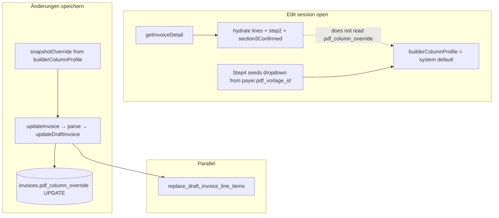

# Audit: Vorlage / pdf_column_override in Invoice Edit Mode

**Status:** Fix applied — 2026-06-03 (Fix A: edit hydration of `builderColumnProfile` + `pdfOverrideRef`; Fix B: pre-UPDATE `safeParse` in `updateDraftInvoice`)

**Date:** 2026-06-03  
**Scope:** Read-only trace of draft re-open (`/dashboard/invoices/[id]/edit`) — Vorlage UI, save path, DB UPDATE, and preview hydration.  
**Related:** [vorlage-data-flow-audit.md](./vorlage-data-flow-audit.md) (create + download), [pdf-vorlagen.md](../pdf-vorlagen.md) (tier-1 guard).

---

## Files read (inventory)

| Role | Path |
|------|------|
| Builder shell | `src/features/invoices/components/invoice-builder/index.tsx` |
| Builder hook (hydration + save) | `src/features/invoices/hooks/use-invoice-builder.ts` |
| INSERT / UPDATE API | `src/features/invoices/api/invoices.api.ts` |
| Section unlock guards | `src/features/invoices/lib/invoice-builder-section-guards.ts` |
| PDF-Vorlage step | `src/features/invoices/components/invoice-builder/step-4-vorlage.tsx` |
| Edit route | `src/app/dashboard/invoices/[id]/edit/page.tsx` |
| Draft line-item RPC | `supabase/migrations/20260529080000_draft_invoice_editing_foundation.sql` |

There is no `update_invoice` RPC for header meta; draft edits use `replace_draft_invoice_line_items` (line items only) plus a direct `invoices` UPDATE for meta fields.

---

## 1. Is Step4Vorlage shown and unlocked in edit mode?

### `isEditMode`

Set in the hook when `invoiceId` is provided:

```133:134:src/features/invoices/hooks/use-invoice-builder.ts
  // why: edit mode re-opens a persisted draft; create mode builds from trips.
  const isEditMode = !!invoiceId;
```

Passed to the shell from `useInvoiceBuilder` (`232:232:index.tsx`). The edit route passes `invoiceId={id}` (`131:131:src/app/dashboard/invoices/[id]/edit/page.tsx`).

### `section4Unlocked`

```292:299:src/features/invoices/components/invoice-builder/index.tsx
  const section3Complete = isInvoiceBuilderSection3Complete(
    section2Complete,
    lineItems,
    isLoadingTrips,
    isTripsError,
    section3Confirmed
  );
  const section4Unlocked = isInvoiceBuilderSection4Unlocked(section3Complete);
```

`isInvoiceBuilderSection4Unlocked` is **`section3Complete` only** — no `isEditMode` branch (`65:68:invoice-builder-section-guards.ts`).

Section 3 completion requires `section3Confirmed` (`53:62:invoice-builder-section-guards.ts`). On edit hydration, the hook sets **`setSection3Confirmed(true)`** so the draft is treated as already reviewed (`297:299:use-invoice-builder.ts`).

### Section 4 card lock vs. Step4Vorlage interactivity

- Card **nav lock** for section 4: `isLocked(4) => !section3Complete` (`308:308:index.tsx`).
- **Step4Vorlage** is always rendered inside the Section 4 card (`727:739:index.tsx`).
- Step4 receives **`unlocked={section4Unlocked}`** (`731:731:index.tsx`), which applies `pointer-events-none opacity-50` when false (`302:302:step-4-vorlage.tsx`).

**`isEditMode` does not gate Section 4.** Steps 1–2 use `locked={isEditMode}` on `Step1Mode` / `Step2Params` (`618:618`, `638:638:index.tsx`). Step4Vorlage has **no** `isEditMode` prop and no edit-specific hide/disable in `step-4-vorlage.tsx`.

### Practical access in edit mode

After hydration completes (`lineItems` + `section3Confirmed`), `section4Unlocked` is true and the Vorlage dropdown is interactive (subject to the user opening Section 4 in the accordion — same as create). Navigation dots use the same unlock rules; edit does not skip Section 4.

**Answer:** **Yes** — Step4Vorlage is mounted and becomes **unlocked** once Section 3 is complete, which edit mode forces via hydration (`section3Confirmed = true`). Edit mode locks payer/mode/parameters, **not** the Vorlage picker.

---

## 2. Does updateInvoice include pdf_column_override?

### Shell → hook

On submit, create and edit share the same `snapshotOverride` build and branch only on `isEditMode`:

```794:815:src/features/invoices/components/invoice-builder/index.tsx
                const snapshotOverride: PdfColumnOverridePayload = {
                  main_columns:
                    pdfOverrideRef.current?.main_columns ??
                    builderColumnProfile.main_columns,
                  appendix_columns:
                    pdfOverrideRef.current?.appendix_columns ??
                    builderColumnProfile.appendix_columns,
                  main_layout: builderColumnProfile.main_layout,
                  show_cancelled_trips: Boolean(
                    builderColumnProfile.show_cancelled_trips
                  ),
                  show_excluded_trips: Boolean(
                    builderColumnProfile.show_excluded_trips
                  )
                };
                if (isEditMode) {
                  updateInvoice(step4Values, snapshotOverride);
                } else {
                  createInvoice(step4Values, snapshotOverride);
                }
```

### Hook mutation payload

`updateInvoice` calls `updateMutation.mutate({ step4Values, pdfColumnOverride })` (`1098:1107:use-invoice-builder.ts`).

Inside `updateMutation.mutationFn`:

```986:1015:src/features/invoices/hooks/use-invoice-builder.ts
      let pdfPayload: Record<string, unknown> | null = null;
      if (pdfColumnOverride) {
        pdfPayload = pdfColumnOverrideSchema.parse(
          pdfColumnOverride
        ) as unknown as Record<string, unknown>;
      }

      await updateDraftInvoice({
        invoiceId,
        introBlockId: intro_block_id ?? null,
        outroBlockId: outro_block_id ?? null,
        paymentDueDays: step4Values.payment_due_days,
        rechnungsempfaengerId: rechnungsempfaengerId ?? null,
        pdfColumnOverride: pdfPayload,
        lineItemRows: [...normalRows, ...cancelledRows]
      });
```

**Answer:** **Yes.** The shell always passes **`snapshotOverride`** as the second argument; the hook parses it with `pdfColumnOverrideSchema.parse` and forwards **`pdfColumnOverride: pdfPayload`** to `updateDraftInvoice`.

---

## 3. Does the UPDATE query write pdf_column_override to the DB?

### RPC (line items only)

`replace_draft_invoice_line_items` swaps `invoice_line_items` and recomputes header totals (`381:387:invoices.api.ts`, migration `20260529080000_draft_invoice_editing_foundation.sql`). It does **not** touch `pdf_column_override`.

### Meta UPDATE (Step C)

```408:420:src/features/invoices/api/invoices.api.ts
  const { error: updError } = await supabase
    .from('invoices')
    .update({
      intro_block_id: payload.introBlockId,
      outro_block_id: payload.outroBlockId,
      payment_due_days: payload.paymentDueDays,
      rechnungsempfaenger_id: payload.rechnungsempfaengerId,
      rechnungsempfaenger_snapshot,
      pdf_column_override: payload.pdfColumnOverride ?? null,
      updated_at: new Date().toISOString()
    })
    .eq('id', payload.invoiceId)
    .eq('status', 'draft');
```

**Answer:** **Yes.** `pdf_column_override` is explicitly **SET** on the `invoices` row in the draft meta UPDATE. Edits can change the stored layout snapshot when the save path runs with a non-null `pdfColumnOverride`.

---

## 4. Is there a pre-UPDATE validation guard?

### INSERT (create) — Fix 3 present

```284:297:src/features/invoices/api/invoices.api.ts
  let pdfColumnOverrideForInsert: Record<string, unknown> | null = null;
  if (payload.pdfColumnOverride != null) {
    const validated = pdfColumnOverrideSchema.safeParse(payload.pdfColumnOverride);
    if (!validated.success) {
      throw new Error(
        `pdf_column_override failed validation before INSERT — invoice not created: ${validated.error.message}`
      );
    }
    pdfColumnOverrideForInsert = validated.data as unknown as Record<...>;
  }
```

### UPDATE (edit) — no API-layer guard

`updateDraftInvoice` assigns **`payload.pdfColumnOverride ?? null`** directly (`416:416:invoices.api.ts`) with **no** `safeParse` in the API.

### Hook-layer validation (edit)

The edit mutation uses **`pdfColumnOverrideSchema.parse(...)`** (throws on failure) before calling the API (`987:990:use-invoice-builder.ts`) — same pattern as create (`903:907:use-invoice-builder.ts`).

| Layer | Create | Edit |
|-------|--------|------|
| Hook | `.parse()` (throws) | `.parse()` (throws) |
| API | `safeParse` + throw before INSERT | **None** — raw payload written |

**Answer:** There is **no** pre-UPDATE guard equivalent to Fix 3 in `updateDraftInvoice`. Invalid JSON should still be blocked by the hook’s `.parse()` before the API runs. A caller that bypassed the hook and passed malformed JSON could still write a bad snapshot via UPDATE. **Yes — the API-level guard is missing** and should be mirrored on UPDATE for parity with INSERT.

---

## 5. What is the initial Vorlage state in edit mode?

`selectedVorlageId` is **local state** in Step4Vorlage, starting **`null`**:

```132:134:src/features/invoices/components/invoice-builder/step-4-vorlage.tsx
  const [selectedVorlageId, setSelectedVorlageId] = useState<string | null>(
    null
  );
```

Seeding effect (only payer + company default — **not** invoice row):

```146:150:src/features/invoices/components/invoice-builder/step-4-vorlage.tsx
  useEffect(() => {
    const next = payerPdfVorlageId ?? companyDefaultVorlage?.id ?? null;
    setSelectedVorlageId(next);
  }, [payerPdfVorlageId, companyDefaultVorlage?.id]);
```

`payerPdfVorlageId` comes from `selectedPayer?.pdf_vorlage_id` (`730:730:index.tsx`), i.e. **`payers.pdf_vorlage_id`**, not `invoices.pdf_column_override`.

Edit hydration (`234:300:use-invoice-builder.ts`) loads line items, step2, `section3Confirmed`, and `editInvoiceNumber`. It does **not**:

- read `detail.pdf_column_override`,
- set `selectedVorlageId`,
- set `customizeEnabled` / `customColumns`,
- set `show_cancelled_trips` / `show_excluded_trips` from the saved snapshot.

Hydration uses **`getInvoiceDetail`** only (`187:187:use-invoice-builder.ts`), not `enrichInvoiceDetailWithColumnProfile`.

**Answer:** On open, the dropdown is seeded from **`payers.pdf_vorlage_id` → company default Vorlage id**, **not** from the invoice’s `pdf_column_override` and **not** from a stored Vorlage UUID on the invoice (that column does not exist). Initial `selectedVorlageId` is `null` until the effect runs, then payer/company ids apply.

---

## 6. Is the existing pdf_column_override shown in the preview?

### `builderColumnProfile` initialization (shell)

```179:180:src/features/invoices/components/invoice-builder/index.tsx
  const [builderColumnProfile, setBuilderColumnProfile] =
    useState<PdfColumnProfile>(() => resolvePdfColumnProfile(null, null, null));
```

Starts at **system fallback**, not from the saved invoice.

### Hydration

The edit hydration effect does **not** call `setBuilderColumnProfile` or seed `pdfOverrideRef` from `detail.pdf_column_override`.

### Preview source

`useInvoiceBuilderPdfPreview` receives **`columnProfile: builderColumnProfile`** (`440:440:index.tsx`). Until Step4Vorlage’s effects run (after Section 4 is unlocked and payer/company Vorlagen load), the preview follows **shell state**, which is system default → then payer/company resolution from Step4 — **not** the persisted tier-1 JSON.

### Divergence scenarios on load

| Saved row | UI / preview on load (before user edits Section 4) |
|-----------|-----------------------------------------------------|
| Rich `pdf_column_override` (dispatcher snapshot, maybe ≠ payer Vorlage) | Dropdown shows payer/company Vorlage id; profile from `resolvePdfColumnProfile(null, selectedVorlage, companyDefault)` |
| `customizeEnabled` was effectively true (custom columns only in JSON) | `customizeEnabled` starts **false**; `pdfOverrideRef` **null** |
| Flags `show_cancelled_trips` / `show_excluded_trips` in JSON | Checkboxes start **false** (`142:144:step-4-vorlage.tsx`) |

### On save without touching Section 4

Submit still builds `snapshotOverride` from current **`builderColumnProfile`** / `pdfOverrideRef` (`794:808:index.tsx`). If the admin never corrects Section 4, save can **overwrite** a correct stored `pdf_column_override` with payer-resolution columns — even though the UPDATE path technically “persists Vorlage changes.”

**Answer:** **`builderColumnProfile` is not initialized from saved `pdf_column_override`.** Preview is driven by fresh resolution (system → Step4 payer/company chain), so it **can diverge** from the stored layout on load. Download after save uses enrich + DB and may match the **new** snapshot, not necessarily what was on the row when the edit session opened.

---

## Senior-level recommendation (pre-fix — superseded)

The gaps below were closed on 2026-06-03. See [pdf-vorlagen.md](../pdf-vorlagen.md) § Edit mode hydration.

| Gap | Resolution |
|-----|------------|
| **A — Load path** | `use-invoice-builder.ts` hydration parses `pdf_column_override` and calls `onEditPdfColumnOverrideHydrated`; shell sets `builderColumnProfile`, `pdfOverrideRef`, and `editHydratedPdfOverride` for Step4 tier-1. |
| **B — API guard** | `updateDraftInvoice` pre-UPDATE `safeParse` mirrors `createInvoice` INSERT guard. |

### Does the edit path persist Vorlage changes?

**Yes** — unchanged save path; **load + save-without-edits** now align with the stored row when tier-1 JSON is valid.

---

## Diagram (edit save vs. load)



---

## Quick reference table

| Question | Result |
|----------|--------|
| Step4 shown/unlocked in edit? | Shown; unlocked when `section3Complete` (true after hydration) |
| `updateInvoice` includes override? | Yes — `snapshotOverride` → `pdfColumnOverride` |
| DB UPDATE sets column? | Yes — `pdf_column_override` in meta `.update()` |
| Pre-UPDATE API guard? | **No** (hook `.parse()` only) |
| Initial `selectedVorlageId`? | Payer `pdf_vorlage_id` → company default; **not** from invoice JSON |
| Preview from saved override? | **No** — system default then Step4 chain |
